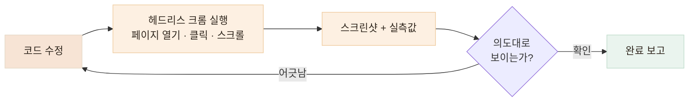

# 에이전트에게 브라우저를 쥐여주다 — 보이는 것까지 검증시키기

> 코드가 바뀌었다고 화면이 맞는 것은 아니라서, 에이전트가 직접 열어 보고, 재고, 결과를 보고합니다

## 한눈에

| | |
|---|---|
| **문제** | "수정했습니다"와 "실제로 그렇게 보입니다"는 다른 말입니다 |
| **방법** | 에이전트가 헤드리스 크롬(Playwright)으로 페이지를 열어 직접 확인 |
| **쓰임새** | 스크린샷 검증 · 렌더 크기/색 실측 · 첫 로딩 성능 분석 |
| **실례** | 이 포트폴리오의 모든 카드와 모달이 이 루프로 검증됐습니다 |

## 고치면, 바로 열어서 확인합니다

UI를 바꾸는 모든 작업의 마지막 단계는 코드 저장이 아니라 **브라우저 확인**입니다. 사람이 매번 열어 볼 필요 없이, 에이전트가 스스로 페이지를 열고 스크린샷을 찍어 결과를 보고합니다.



스크립트는 이 정도로 단순합니다. 페이지를 열고, 사람이 하듯 카드를 클릭해 펼치고, 찍습니다.

```js
const page = await browser.newPage({ viewport: { width: 1280, height: 1100 } });
await page.goto("http://localhost:3000");
await page.getByRole("button", { name: /돈가스 지도/ }).click();   // 카드 펼치기
await page.getByRole("heading", { name: "개발 비하인드" }).click(); // 아코디언 열기
await page.screenshot({ path: "result.png" });                     // 결과 확인
```

## 눈대중이 아니라 숫자로 잽니다

스크린샷으로 부족할 때는 렌더된 값을 직접 꺼내 봅니다. "사진이 좀 큰 것 같은데"가 아니라 정확한 수치로 판단합니다.

| 재는 것 | 방법 | 실제로 이렇게 썼습니다 |
|---|---|---|
| 이미지 렌더 크기 | boundingBox | 사진 크기 조정 요청마다 "175×380px"로 결과 보고 |
| 색상 적용 여부 | getComputedStyle | 아코디언 테두리가 초록으로 바뀌었는지 `rgb(0, 198, 118)` 확인 |
| 강조가 실제로 걸렸는지 | strong 텍스트 추출 | 볼드 처리된 구절 목록을 뽑아 의도한 곳과 대조 |
| 요소 사이 간격 | 좌표 차 계산 | "사진과 텍스트 간격 10px" 실측 후 조정 |

이 방식의 장점은 **말이 아니라 증거로 대화하게 된다**는 것입니다. "바꿨습니다"가 아니라 "바꿨고, 실측 결과 이렇습니다"가 됩니다.

## 성능도 같은 방식으로 분석합니다

"첫 진입이 왜 느리지?"라는 질문에도 추측 대신 측정으로 답합니다. 에이전트가 네트워크 응답을 전부 캡처해 요청별 용량을 분해했습니다.


이 실측으로 "정적 파일을 S3로 옮겨야 하나?"라는 처음 가설이 틀렸다는 것이 드러났습니다. 위치의 문제가 아니라 **서브셋 없는 한글 폰트(10.5MB)와 원본 그대로 나가는 이미지·파비콘**이 원인이었고, 개선 방향이 "옮기기"에서 "줄이기"로 바뀌었습니다.

## 원인이 나왔으니, 고치고 다시 쟀습니다

측정이 원인을 짚어줬으니 조치는 순서대로였습니다. 고친 뒤 **같은 스크립트로 다시 재서** 효과를 숫자로 닫았습니다.

| 원인 | 조치 | 결과 |
|---|---|---|
| 한글 폰트 TTF 2종 10.5MB | 사용 글자만 남기는 서브셋 + woff2 변환 | **0.7MB** — 화면은 동일 |
| 파비콘이 1024px 원본 1.9MB | 실제 표시 크기(16·32px)로 리사이즈 | **3KB** |
| 스크린샷 원본이 그대로 전송 | 대용량 33장을 표시 크기 기준으로 리사이즈 | 50.6MB → 30.9MB |


고치기 전과 후를 같은 잣대로 재는 것까지가 한 사이클입니다. 재측정에서 남은 큰 덩어리(사진성 PNG, GIF)가 그대로 드러났고, 그것이 다음 개선의 우선순위가 됩니다.

## 결론 — 추측은 방향을 만들고, 측정은 순서를 만듭니다

처음 질문은 "S3로 옮겨야 하나?"였지만, 측정은 전혀 다른 답을 내놨습니다. 에이전트에게 브라우저를 쥐여주면 이런 질문에 **추측 대신 30초짜리 실측**으로 답할 수 있고, 고친 뒤에도 같은 방법으로 효과를 증명할 수 있습니다. 검증과 분석이 같은 도구, 같은 루프 안에서 돌아갑니다.

## 이 포트폴리오가 그 결과물입니다

지금 보고 계신 이 사이트의 카드 배치, 문서 모달, mermaid 다이어그램 렌더링은 전부 이 루프로 만들어졌습니다. 수정할 때마다 에이전트가 데스크톱·모바일 화면을 열어 확인했고, 어긋난 것은 스크린샷에서 발견되어 그 자리에서 고쳐졌습니다.
