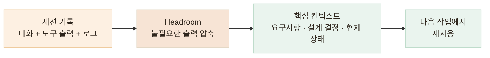
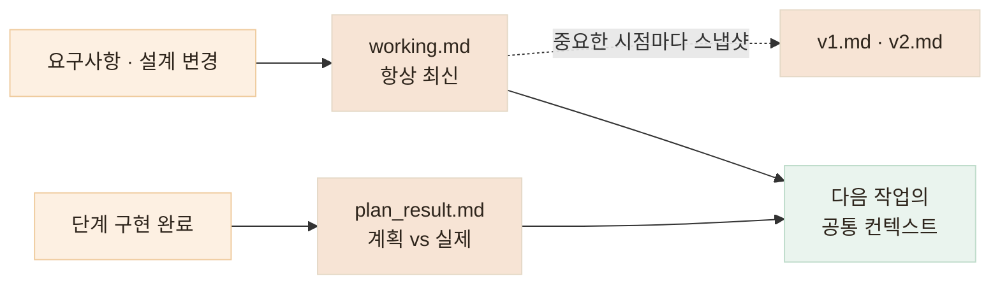

# 맥락과 작업 범위 관리하기 — 기억은 유지하고, 행동은 제한합니다

> 에이전트가 "무엇을 알고 있어야 하는가"와 "어디까지 행동할 수 있는가"는 결국 같은 관리 문제입니다

<!-- 사진 자리: 실제 CLAUDE.md 파일의 규칙 부분 캡처, 또는 Headroom이 컨텍스트를 압축한 로그 캡처 -->

## 한눈에

| | |
|---|---|
| **Context** | Headroom — 불필요한 로그 압축, 핵심 맥락 유지 |
| **Memory** | working.md · v1/v2.md · plan_result.md |
| **Guardrail** | CLAUDE.md — 수정 범위와 금지선 |
| **추적** | Prompt / Tool Logging — 블랙박스로 두지 않기 |

## Headroom — 긴 작업에서 맥락을 잃지 않기

세션이 길어질수록 도구 출력과 로그가 컨텍스트를 채우고, 정작 중요한 요구사항과 설계 결정이 밀려납니다. 매번 같은 구조를 다시 설명하거나 다시 탐색시키는 비용도 쌓입니다.

Headroom으로 불필요한 도구 출력과 로그를 압축하고, 필요한 정보만 유지해서 넘깁니다.



- 긴 세션에서도 작업 기준이 흔들리지 않습니다
- 같은 구조를 반복해서 읽히는 토큰 비용이 줄어듭니다

## 문서 세 종류로 나누는 프로젝트 기억

코드 밖의 결정들 — 요구사항, 설계 변경, 계획과 결과의 차이 — 은 문서로 남겨야 다음 세션의 에이전트가 이어받을 수 있습니다. 역할이 다른 세 종류로 나눕니다.

| 문서 | 역할 |
|---|---|
| **working.md** | 지금 기준이 되는 최신 요구사항·설계. 수시로 바뀌는 내용은 전부 여기로 |
| **v1.md · v2.md** | 중요한 시점의 설계 스냅샷. 예전 설계로 되돌아가 확인할 수 있습니다 |
| **plan_result.md** | 계획과 실제 구현 결과의 차이 기록 |



수시로 변하는 요구사항은 working.md 한곳에서만 움직이니, 에이전트에게 "지금 기준이 뭐지?"를 매번 다시 설명할 필요가 없습니다.

## CLAUDE.md — 운영 데이터를 잃고 세운 금지선

과거 AI에 작업을 과도하게 맡겼다가 **운영 DB 데이터를 잃은 적이 있습니다.** 그 뒤로 운영 환경과 테스트 환경을 분리하고, 에이전트가 넘지 말아야 할 선을 CLAUDE.md에 명시합니다.

```markdown
# CLAUDE.md (예시)

## 수정 금지
- .env* · 마이그레이션 완료 파일 · 배포 설정
- 기존 API 응답 포맷 — 변경이 필요하면 중단하고 사전 확인

## DB
- 운영 DB 변경은 에이전트가 직접 실행하지 않는다
- 스키마 변경은 계획 단계에서 사전 확인 후 진행

## 완료 조건
- 테스트 · 린트 · 타입 체크 통과 없이 완료 보고 금지

## 역할
- Reviewer는 코드를 수정하지 않는다 — 지적 사항만 회신
```

운영 DB 변경은 에이전트가 직접 수행하지 않고, 제가 결과를 검토한 뒤 수동으로 반영합니다.

## Prompt / Tool Logging — 블랙박스로 두지 않습니다

프롬프트와 도구 사용 로그를 남깁니다. 단순 기록용이 아닙니다.

| 확보하는 것 | 어떻게 |
|---|---|
| **원인 추적** | 문제가 생겼을 때 어떤 지시로 어떤 변경이 일어났는지 되짚을 수 있습니다 |
| **재현성** | 같은 작업을 다시 시킬 때 같은 조건을 만들 수 있습니다 |
| **디버깅 가능성** | "AI가 그렇게 했다"가 아니라 로그로 확인합니다 |
