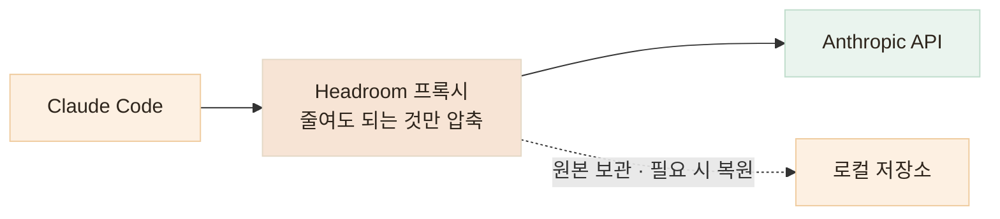
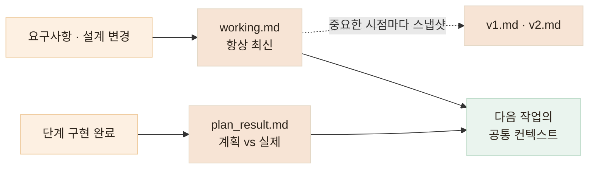

# 맥락과 작업 범위 관리하기 — 기억은 유지하고, 행동 범위는 제한합니다

> 에이전트가 "무엇을 알고 있어야 하는가"와 "어디까지 행동할 수 있는가"는 결국 같은 관리 문제입니다

## 한눈에

| | |
|---|---|
| **Context** | Headroom 프록시 — 줄여도 되는 정보만 압축, 필요한 맥락은 유지 (요청당 약 1.6만 토큰 절감 실측) |
| **Memory** | working.md · v1/v2.md · plan_result.md |
| **Guardrail** | CLAUDE.md — 수정 범위와 금지선 |
| **강제** | settings.json — 권한 allow/deny로 못 박기 |

## Headroom — 긴 작업에서도 필요한 맥락을 남기기

AI 에이전트와 오래 작업하다 보면 대화보다 먼저 쌓이는 것이 **파일 내용, 검색 결과, 로그, JSON 같은 도구 출력**입니다. 컨텍스트가 이런 정보로 가득 차면 정작 중요한 요구사항과 설계 결정이 밀려나고, 같은 내용을 다시 설명해야 하는 경우도 생깁니다.

그래서 지금은 [**Headroom**](https://github.com/headroomlabs-ai/headroom)(오픈소스)을 Claude Code 앞단에 두고 사용합니다. 에이전트가 모델에 보내는 요청을 중간에서 받아, **줄여도 되는 정보는 압축하고 중요한 맥락은 그대로 유지하는 로컬 프록시**입니다. 단순히 대화를 요약하는 것이 아니라, 모델에 전달되기 직전의 컨텍스트 자체를 관리합니다.

> 에이전트에게 더 많은 것을 기억시키는 것보다, **필요한 것만 남기는 방법**을 고민했습니다.


### 어떻게 동작하나

평소처럼 Claude Code를 실행하는 대신 `headroom wrap claude`로 세션을 시작합니다. 이후 Claude Code의 요청은 바로 API로 전달되지 않고 **Headroom 로컬 프록시를 한 번 거칩니다.**



Headroom은 요청 안의 내용을 살펴보고 JSON, 코드, 오래된 도구 출력처럼 **압축하기 적합한 정보만 골라 줄입니다.** 압축했을 때 의미가 달라질 가능성이 있는 내용은 그대로 통과시키고, 원본도 버리지 않고 로컬에 보관해 세부 내용이 다시 필요하면 복원할 수 있습니다.

### 실제로는 이렇게 사용합니다

사용할 때마다 별도의 압축 작업을 직접 하는 것은 아닙니다. 세션을 `headroom wrap claude`로 시작하면 이후의 압축과 라우팅은 자동으로 처리됩니다. 대시보드에서는 **현재 컨텍스트 사용량과 모델 사용량을 함께 확인**하며, 긴 작업이 어느 정도까지 진행됐는지 살펴봅니다.


실제 작업 세션의 프록시 로그를 확인해 보니, 사용하지 않는 도구 스키마와 오래된 출력이 요청에서 제외되면서 **한 요청에서 약 1.6만 토큰이 줄어든 경우도 있었습니다.** 이미 캐시된 대화는 그대로 유지해, 컨텍스트를 줄이면서도 기존 프롬프트 캐시가 불필요하게 깨지지 않도록 동작했습니다.

직접 데이터를 넣어 확인했을 때도 모든 내용을 무조건 줄이지 않았습니다.

- 반복 구조가 많은 JSON → 압축
- 이미 정보 밀도가 높은 텍스트 → 그대로 통과
- 사용하지 않는 도구 스키마 → 요청에서 제외
- 이전에 읽은 뒤 다시 읽힌 파일 → 오래된 결과 정리

제가 Headroom을 사용하는 이유도 여기에 있습니다. **무조건 많이 기억하게 만드는 것이 아니라, 지금 작업에 필요한 정보가 오래 남도록 컨텍스트를 관리하기 위해서입니다.**

## 컨텍스트는 줄이고, 결정은 문서에 남깁니다

Headroom이 **모델에 들어가는 컨텍스트의 양**을 관리한다면, 프로젝트에서 계속 기억해야 하는 결정 — 요구사항, 설계 변경, 계획과 결과의 차이 — 은 별도의 문서로 관리합니다. 역할이 다른 세 종류로 나눕니다.

| 문서 | 역할 |
|---|---|
| **working.md** | 지금 기준이 되는 최신 요구사항·설계. 수시로 바뀌는 내용은 전부 여기로 |
| **v1.md · v2.md** | 중요한 시점의 설계 스냅샷. 예전 설계로 되돌아가 확인할 수 있습니다 |
| **plan_result.md** | 계획과 실제 구현 결과의 차이 기록 |



수시로 변하는 요구사항은 working.md 한곳에서만 움직이니, 에이전트에게 "지금 기준이 뭐지?"를 매번 다시 설명할 필요가 없습니다.

끼니톡 백엔드에서는 API 명세가 이 구조로 관리됩니다. `docs/api/working.md`(1,340줄)가 항상 최신 기준이고, 확정 시점의 스냅샷이 `v1.md`(624줄)로 남아 있습니다. Task 파일들이 "API 명세: working.md 5.5절 · 7.4절"처럼 절 번호로 이 문서를 참조하기 때문에, 에이전트는 매번 설명을 다시 듣는 대신 문서의 해당 절을 읽고 시작합니다.

Headroom으로 **불필요한 기억은 줄이고**, 문서로 **반드시 남아야 할 기억은 명시적으로 관리**하는 방식입니다.

## CLAUDE.md — 운영 데이터를 잃고 세운 금지선

과거 AI에 작업을 과도하게 맡겼다가 **운영 DB 데이터를 잃은 적이 있습니다.** 그 뒤로 운영 환경과 테스트 환경을 분리하고, 에이전트가 넘지 말아야 할 선을 CLAUDE.md에 명시합니다.

아래는 돈가스 지도에서 실제로 쓰고 있는 CLAUDE.md의 발췌입니다 (전체 202줄). 실사용자가 있는 서비스라 최우선 규칙이 "기존 앱 사용자 보호"입니다.

```markdown
## 최우선 규칙: 기존 앱 사용자 보호

서버 기능을 수정하거나 추가할 때 기존 앱 사용자의 동작을 깨뜨리지 않는 것을
최우선 요구사항으로 취급한다. 편의상 생략하거나 추정해서는 안 된다.

### API 호환성 규칙
- 기존 API의 필드를 삭제하거나 이름·타입·의미를 바꾸지 않는다.
- 새 응답 필드는 원칙적으로 추가만 한다.
- 기존에 성공하던 요청을 새 validation 때문에 거부하지 않는다.

### DB 및 Prisma 호환성 규칙
- 운영 데이터가 존재한다고 가정한다.
- 파괴적 마이그레이션이나 운영 DB 명령은 명시적 승인 없이 실행하지 않는다.

## 서버 테스트 하네스
- 테스트 없이 서버 기능 변경을 완료했다고 보고하지 않는다.
- 실행하지 못한 테스트는 통과한 것처럼 말하지 말고, 미실행 이유와 남은 위험을
  완료 보고에 적는다.
- 테스트를 통과시키기 위해 기존 테스트를 삭제하거나 assertion을 약화하지 않는다.
```

끼니톡 AI 서버의 CLAUDE.md에는 같은 방식으로 **절대 불변 원칙**이 적혀 있습니다 — 무상태(DB·파일 쓰기 금지), 영양소 키 이름 고정, portion 배율 고정, 의료 고지 문구는 LLM이 아닌 코드 상수로 삽입. 에이전트가 "저장이 필요해 보이는" 기능을 요청받아도 백엔드 몫이라고 문서가 먼저 선을 긋습니다.

운영 DB 변경은 에이전트가 직접 수행하지 않고, 제가 결과를 검토한 뒤 수동으로 반영합니다.

## settings.json — 규칙은 문서로, 강제는 권한으로

CLAUDE.md가 "하지 말라"고 적는 문서라면, `settings.json`은 **아예 할 수 없게** 만드는 장치입니다. 에이전트의 도구 권한을 allow/deny 목록으로 못 박습니다. 아래는 끼니톡 백엔드의 실제 설정 발췌입니다.

```json
{
  "permissions": {
    "allow": [
      "Bash(git *)", "Bash(npm *)", "Read(**)",
      "Write(backend/**)", "Write(app/**)", "Write(docs/**)"
    ],
    "deny": [
      "Bash(git push --force*)", "Bash(git reset --hard*)",
      "Bash(git clean -f*)", "Bash(rm -rf /*)",
      "Write(**/.env)", "Write(**/*.key)", "Write(**/*.pem)",
      "Write(**/secrets*)", "Write(**/credentials*)"
    ]
  }
}
```

- **쓰기는 화이트리스트** — 허용된 디렉토리 밖은 수정 자체가 막힙니다
- **되돌릴 수 없는 명령은 블랙리스트** — force push, hard reset, rm -rf는 시도해도 거부됩니다
- **비밀값은 이중 방어** — CLAUDE.md의 "노출 금지" 규칙에 더해 .env·키 파일은 쓰기 권한 자체가 없습니다

문서 규칙은 에이전트가 실수로 어길 수 있지만, 권한 게이트는 어길 수 없습니다. 둘을 겹쳐 써야 "믿는다"가 아니라 "막혀 있다"가 됩니다.
