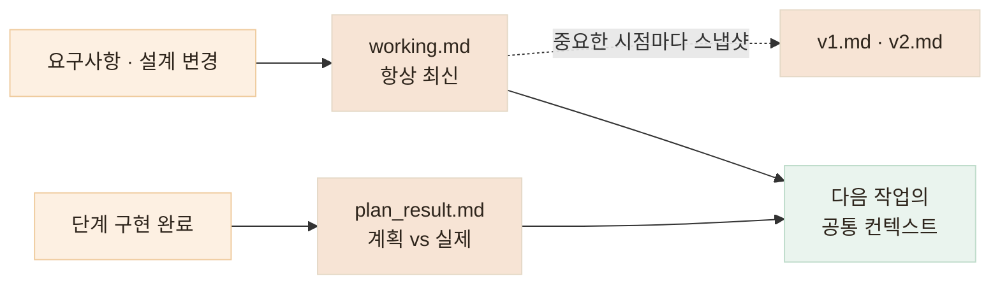

# 맥락과 작업 범위 관리하기 — 기억은 유지하고, 행동 범위는 제한합니다

> 에이전트가 "무엇을 알고 있어야 하는가"와 "어디까지 행동할 수 있는가"는 결국 같은 관리 문제입니다

<!-- 사진 자리: 실제 CLAUDE.md 파일의 규칙 부분 캡처, 또는 Headroom이 컨텍스트를 압축한 로그 캡처 -->

## 한눈에

| | |
|---|---|
| **Context** | Headroom — 불필요한 로그 압축, 핵심 맥락 유지 |
| **Memory** | working.md · v1/v2.md · plan_result.md |
| **Guardrail** | CLAUDE.md — 수정 범위와 금지선 |
| **추적** | Prompt / Tool Logging — 블랙박스로 두지 않기 |

## Headroom — 긴 작업에서 맥락을 잃지 않기

세션이 길어질수록 도구 출력과 로그가 컨텍스트를 채우고, 정작 중요한 요구사항과 설계 결정이 밀려납니다. 매번 같은 구조를 다시 설명하거나 다시 탐색시키는 비용도 쌓입니다.

Headroom으로 불필요한 도구 출력과 로그를 압축하고, 필요한 정보만 유지해서 넘깁니다.


- 긴 세션에서도 작업 기준이 흔들리지 않습니다
- 같은 구조를 반복해서 읽히는 토큰 비용이 줄어듭니다

## 문서 세 종류로 나누는 프로젝트 기억

코드 밖의 결정들 — 요구사항, 설계 변경, 계획과 결과의 차이 — 은 문서로 남겨야 다음 세션의 에이전트가 이어받을 수 있습니다. 역할이 다른 세 종류로 나눕니다.

| 문서 | 역할 |
|---|---|
| **working.md** | 지금 기준이 되는 최신 요구사항·설계. 수시로 바뀌는 내용은 전부 여기로 |
| **v1.md · v2.md** | 중요한 시점의 설계 스냅샷. 예전 설계로 되돌아가 확인할 수 있습니다 |
| **plan_result.md** | 계획과 실제 구현 결과의 차이 기록 |



수시로 변하는 요구사항은 working.md 한곳에서만 움직이니, 에이전트에게 "지금 기준이 뭐지?"를 매번 다시 설명할 필요가 없습니다.

끼니톡 백엔드에서는 API 명세가 이 구조로 관리됩니다. `docs/api/working.md`(1,340줄)가 항상 최신 기준이고, 확정 시점의 스냅샷이 `v1.md`(624줄)로 남아 있습니다. Task 파일들이 "API 명세: working.md §5.5 · §7.4"처럼 절 번호로 이 문서를 참조하기 때문에, 에이전트는 매번 설명을 다시 듣는 대신 문서의 해당 절을 읽고 시작합니다.

## CLAUDE.md — 운영 데이터를 잃고 세운 금지선

과거 AI에 작업을 과도하게 맡겼다가 **운영 DB 데이터를 잃은 적이 있습니다.** 그 뒤로 운영 환경과 테스트 환경을 분리하고, 에이전트가 넘지 말아야 할 선을 CLAUDE.md에 명시합니다.

아래는 돈가스 지도에서 실제로 쓰고 있는 CLAUDE.md의 발췌입니다 (전체 202줄). 실사용자가 있는 서비스라 최우선 규칙이 "기존 앱 사용자 보호"입니다.

```markdown
## 최우선 규칙: 기존 앱 사용자 보호

서버 기능을 수정하거나 추가할 때 기존 앱 사용자의 동작을 깨뜨리지 않는 것을
최우선 요구사항으로 취급한다. 편의상 생략하거나 추정해서는 안 된다.

### API 호환성 규칙
- 기존 API의 필드를 삭제하거나 이름·타입·의미를 바꾸지 않는다.
- 새 응답 필드는 원칙적으로 추가만 한다.
- 기존에 성공하던 요청을 새 validation 때문에 거부하지 않는다.

### DB 및 Prisma 호환성 규칙
- 운영 데이터가 존재한다고 가정한다.
- 파괴적 마이그레이션이나 운영 DB 명령은 명시적 승인 없이 실행하지 않는다.

## 서버 테스트 하네스
- 테스트 없이 서버 기능 변경을 완료했다고 보고하지 않는다.
- 실행하지 못한 테스트는 통과한 것처럼 말하지 말고, 미실행 이유와 남은 위험을
  완료 보고에 적는다.
- 테스트를 통과시키기 위해 기존 테스트를 삭제하거나 assertion을 약화하지 않는다.
```

끼니톡 AI 서버의 CLAUDE.md에는 같은 방식으로 **절대 불변 원칙**이 적혀 있습니다 — 무상태(DB·파일 쓰기 금지), 영양소 키 이름 고정, portion 배율 고정, 의료 고지 문구는 LLM이 아닌 코드 상수로 삽입. 에이전트가 "저장이 필요해 보이는" 기능을 요청받아도 백엔드 몫이라고 문서가 먼저 선을 긋습니다.

운영 DB 변경은 에이전트가 직접 수행하지 않고, 제가 결과를 검토한 뒤 수동으로 반영합니다.

## settings.json — 규칙은 문서로, 강제는 권한으로

CLAUDE.md가 "하지 말라"고 적는 문서라면, `settings.json`은 **아예 할 수 없게** 만드는 장치입니다. 에이전트의 도구 권한을 allow/deny 목록으로 못 박습니다. 아래는 끼니톡 백엔드의 실제 설정 발췌입니다.

```json
{
  "permissions": {
    "allow": [
      "Bash(git *)", "Bash(npm *)", "Read(**)",
      "Write(backend/**)", "Write(app/**)", "Write(docs/**)"
    ],
    "deny": [
      "Bash(git push --force*)", "Bash(git reset --hard*)",
      "Bash(git clean -f*)", "Bash(rm -rf /*)",
      "Write(**/.env)", "Write(**/*.key)", "Write(**/*.pem)",
      "Write(**/secrets*)", "Write(**/credentials*)"
    ]
  }
}
```

- **쓰기는 화이트리스트** — 허용된 디렉토리 밖은 수정 자체가 막힙니다
- **되돌릴 수 없는 명령은 블랙리스트** — force push, hard reset, rm -rf는 시도해도 거부됩니다
- **비밀값은 이중 방어** — CLAUDE.md의 "노출 금지" 규칙에 더해 .env·키 파일은 쓰기 권한 자체가 없습니다

문서 규칙은 에이전트가 실수로 어길 수 있지만, 권한 게이트는 어길 수 없습니다. 둘을 겹쳐 써야 "믿는다"가 아니라 "막혀 있다"가 됩니다.

## Prompt / Tool Logging — 블랙박스로 두지 않습니다

프롬프트와 도구 사용 로그를 남깁니다. 단순 기록용이 아닙니다.

| 확보하는 것 | 어떻게 |
|---|---|
| **원인 추적** | 문제가 생겼을 때 어떤 지시로 어떤 변경이 일어났는지 되짚을 수 있습니다 |
| **재현성** | 같은 작업을 다시 시킬 때 같은 조건을 만들 수 있습니다 |
| **디버깅 가능성** | "AI가 그렇게 했다"가 아니라 로그로 확인합니다 |
