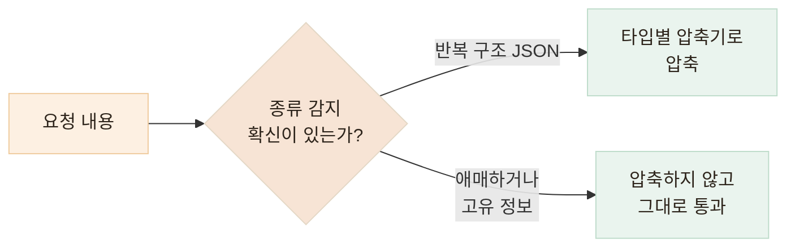

# Headroom 딥다이브 — "줄여도 되는 정보"는 어떻게 판별하나

> 내용을 이해해서 판별하는 것이 아니라, 판별이 틀려도 복구되도록 설계하고 보수적으로 줄입니다

## 한눈에

| | |
|---|---|
| **판별 기준** | "중요한가?"가 아니라 **"중복인가?"** — 구조적 중복만 줄입니다 |
| **애매하면** | 압축하지 않고 그대로 통과시킵니다 |
| **틀리면** | 원본이 로컬에 보관되어 있어 복원 도구로 되찾습니다 |
| **근거** | [공식 문서](https://headroomlabs-ai.github.io/headroom/) · [저장소의 벤치마크](https://github.com/headroomlabs-ai/headroom#proof) |

## 1. 먼저 내용의 종류를 분류합니다

[공식 문서](https://headroomlabs-ai.github.io/headroom/)에 따르면 Headroom의 첫 단계는 압축이 아니라 **분류**입니다. 요청 안의 블록이 JSON인지, 코드인지, 로그·산문인지 감지한 뒤 종류별로 다른 압축기에 보냅니다. 종류마다 "안전하게 줄이는 방법"이 다르기 때문입니다.

| 종류 | 줄이는 방법 | 안전한 이유 |
|---|---|---|
| **JSON** | 비슷한 객체가 반복되면 구조 + 대표 샘플 + 통계만 남김 | 반복 구조 자체가 "중복"이라는 증거입니다 |
| **코드** | 텍스트가 아니라 구문 트리(AST)로 파싱해 구조는 유지, 본문만 접음 | 문법을 알고 자르니 의미가 깨지지 않습니다 |
| **산문·로그** | 전용 압축 모델이 담당 | 가장 위험한 영역이라 가장 보수적으로 다룹니다 |

## 2. 확신이 없으면 줄이지 않습니다

직접 실측했을 때 이 동작이 그대로 보였습니다. 같은 도구에 두 데이터를 넣었는데 반응이 달랐습니다.

| 넣어 본 것 | 판정 |
|---|---|
| `package-lock.json` — 반복 구조 JSON | 압축기로 라우팅 (신뢰도 0.80) — **16.8% 절감** |
| `git log` 출력 — 한 줄 한 줄이 고유 정보 | **판정: 압축 부적합 — 손대지 않고 통과** |

커밋 로그는 반복 구조도 아니고 각 줄이 고유한 정보라 "줄이면 잃는다"고 판정된 것입니다. 판별 기준이 "중요한가?"가 아니라 **"중복인가?"**에 가깝다는 것을 보여줍니다.

## 3. 문맥에서의 위치도 봅니다

내용만 보는 것이 아닙니다. 같은 내용이라도 대화에서 어디에 있는지에 따라 다르게 다룹니다.

- 방금 나온 도구 출력 — 지금 추론에 쓰이는 중이므로 **건드리지 않습니다**
- 여러 턴 지난 오래된 출력 — 압축 대상이 됩니다
- 같은 파일을 다시 읽은 경우 — 이전 읽기 결과는 낡은 정보이므로 정리합니다
- 이미 캐시된 대화 앞부분 — 동결합니다. 캐시된 구간을 수정하면 절감분보다 캐시 재작성 비용이 더 커지기 때문입니다

## 4. 그래도 틀리면 — 복원

최종 안전장치는 판별기가 아니라 **가역성**입니다. 압축 전 원본은 로컬에 보관되고, 모델이 세부 내용이 필요해지면 복원 도구(`headroom_retrieve`)로 원본을 되찾아 옵니다.

그래서 판별기가 완벽할 필요가 없습니다 — 잘못 줄여도 잃는 것은 정보가 아니라 **왕복 한 번**입니다.

## 공식 벤치마크가 말하는 것

[저장소의 Proof 섹션](https://github.com/headroomlabs-ai/headroom#proof)은 이 보수성 + 가역성 조합의 결과를 수치로 공개하고 있습니다.

| 벤치마크 | 결과 |
|---|---|
| 수학·사실성 벤치마크 (GSM8K 등) | 압축 전후 **정답률 동일** |
| 코드 검색 결과 (반복 구조 多) | 최대 **92% 절감** |
| 코딩 에이전트 일반 워크로드 | 15~20% 절감 |

줄일 수 있는 정도는 내용의 중복도에 따라 크게 다르지만, 어느 경우든 답이 달라지지 않는 선까지만 줄인다는 것이 설계의 핵심입니다.
