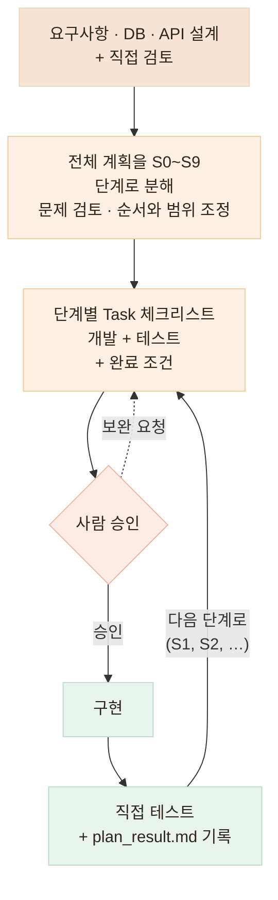
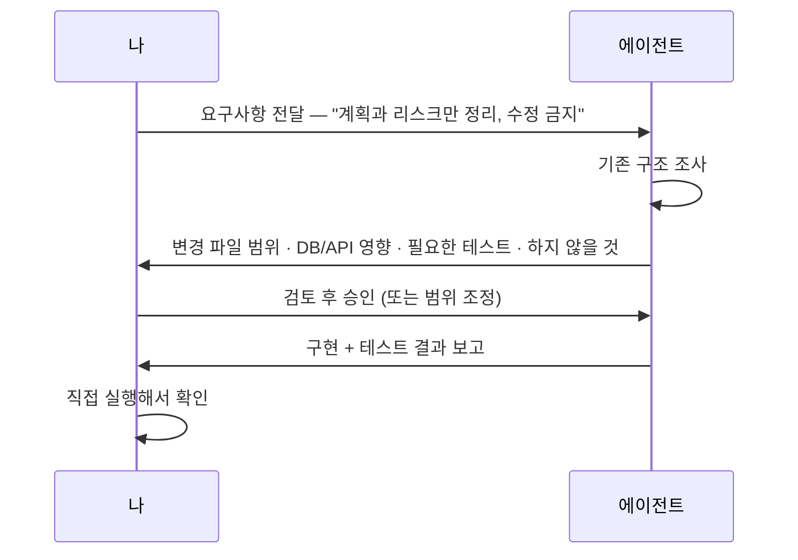

# 계획하고 개발하기 — 바로 구현시키지 않고, 전체 흐름부터 잡습니다

> AI에게 구현을 맡기기 전에, 무엇을 · 어디까지 · 어떤 기준으로 만들지 먼저 고정합니다

## 한눈에

| | |
|---|---|
| **문제** | AI가 코드를 바로 수정하면 변경 범위를 통제할 수 없습니다 |
| **방법** | 계획 → 사람 승인 → 구현 → 직접 확인 → 기록의 사이클 |
| **도구** | S0~S9 단계 계획 · Task 체크리스트 · plan_result.md |
| **원칙** | 승인 전에는 파일을 수정하지 않습니다 |

## 바로 구현시키지 않는 이유

AI는 빠르게 코드를 만들 수 있지만, 여러 기능이 연결된 서비스에서는 작은 변경도 예상치 못한 영향을 만들 수 있습니다.

| 바로 구현시켰을 때 생기는 일 | 무엇이 문제인가 |
|---|---|
| 생각지 못한 파일까지 수정 | 변경 범위를 추적할 수 없고, 리뷰에서 빠집니다 |
| 기존 API 응답 포맷 변경 | 그 API를 쓰는 다른 코드가 조용히 깨집니다 |
| 테스트 없이 구현부터 | "동작하는 것처럼 보이는" 코드가 쌓입니다 |

그래서 구현을 요청하기 전에 네 가지를 먼저 적게 합니다. **어떤 파일이 바뀌는지 · DB나 API에 영향은 없는지 · 어떤 테스트가 필요한지 · 이번 작업에서 하지 말아야 할 것은 무엇인지.**

## 전체 흐름

요구사항과 설계를 먼저 고정하고, 전체 계획을 작은 단계로 쪼갠 뒤 한 단계씩 승인 → 구현 → 확인 → 기록을 반복합니다.



## 승인 게이트 — 계획 없이는 파일을 만지지 않습니다

에이전트에게 처음 시키는 일은 구현이 아니라 조사입니다. "기존 구조를 파악한 뒤 작업 계획과 리스크만 정리해라. 승인하기 전까지 파일을 수정하지 마라."



이 한 번의 왕복으로, "구현이 끝난 뒤에야 무엇이 바뀌었는지 알게 되는" 상황이 사라집니다.

실제로 에이전트가 올리는 계획 보고는 이렇게 생겼습니다. 변경 파일 범위 · 영향 분석 · 필요한 테스트 · 하지 않을 것이 먼저 오고, 승인 전까지 파일을 만지지 않습니다.


## 실제로는 이렇게 시킵니다

돈가스 지도에 필드 하나를 추가할 때의 대화를 예시로 재구성하면 이렇습니다.

```text
나> 시식 기록에 "재방문 의사" 필드를 추가하려고 해.
    바로 구현하지 말고, 기존 구조를 파악한 뒤 계획과 리스크만 정리해줘.
    내가 승인하기 전까지 파일 수정 금지.

에이전트> [계획 보고]
    - 변경 파일 3개: 기록 스키마 · 기록 폼 · 기록 API
    - DB 영향: 컬럼 1개 추가 — additive, 기존 행은 비워둠 (구버전 앱 안 깨짐)
    - API 영향: 응답에 필드 추가만, 기존 필드는 그대로
    - 테스트: 신규 2건(저장·미입력) + 기존 스위트 전체
    - 하지 않을 것: 목록 API 응답 포맷 변경

나> 승인. 진행해줘.
```

구현보다 먼저 받아보는 것은 코드가 아니라 **이 다섯 줄짜리 계획**입니다. 여기서 이상하면 코드가 한 줄도 바뀌기 전에 바로잡을 수 있습니다.

| | 바로 시켰을 때 | 계획을 먼저 받을 때 |
|---|---|---|
| 변경 범위 | 구현이 끝나야 알 수 있습니다 | 시작 전에 합의됩니다 |
| 리뷰 | 수백 줄 diff를 통째로 봅니다 | 계획 대비 달라진 부분만 봅니다 |
| 사고 | 배포 후에 발견됩니다 | 계획 단계에서 걸러집니다 |

## 계획은 채팅이 아니라 파일로 남습니다

대화로만 계획하면 세션이 끝날 때 같이 사라집니다. 그래서 계획·작업·결과가 전부 레포 안의 파일로 존재합니다. 아래는 끼니톡 백엔드의 실제 `.claude/` 작업 공간입니다.


| 파일 | 역할 |
|---|---|
| `plan/hole_plan.md` | S0~S9 전체 계획. "스키마는 지금 확정, 기능은 나중" · "AI 연동은 fake 우선" 같은 계획 원칙부터 명시 |
| `tasks/rules.md` + `task1~11.md` | 단계별 작업 체크리스트 — 아래 형식 규칙을 따릅니다 |
| `plan/plan_result.md` | 단계 완료 결과 누적 — 아래 표 |
| `plan/notice.md` | 다음 개발이 알아야 할 함정과 변경 여지 |
| `CLAUDE.md` · `settings.json` | 프로젝트 규약과 에이전트 권한 — "맥락과 작업 범위 관리하기" 카드에서 다룹니다 |

notice.md에는 겪고 나서야 알게 되는 함정이 기록됩니다. 새 세션의 에이전트가 같은 곳에서 다시 넘어지지 않게 하는 장치입니다.

```markdown
## 함정 — 모르면 조용히 깨진다 (notice.md 실제 발췌)

| 출처 | 내용 |
|---|---|
| PLAN-FEAT-004 (S3) | prisma migrate dev 가 보강 SQL 객체를 지운다. 실제로
  GIN 인덱스가 삭제됐다 → 마이그레이션 직후 항상 npm run db:supplemental |
| PLAN-FEAT-002 (S1) | 기기A 로그아웃 후 회전 시도가 기기B 세션까지 날린다(실서버 확인) |
```

## Task 체크리스트 — 형식이 규칙을 지켜 줍니다

단계를 시작할 때마다 정해진 형식의 Task를 만듭니다. 완료 조건과 필수 훅을 형식에 미리 넣어 두면, 에이전트가 규칙에 어긋난 행동을 하거나 테스트를 소홀히 하는 것을 형식 자체가 막아 줍니다.

아래는 끼니톡 백엔드에서 실제로 쓰는 Task 형식 규칙입니다 (`.claude/tasks/rules.md` 원문).

```markdown
task 형태
## TASK-{TYPE}-{번호}: 작업 내용 한 줄 요약 (# 이슈 번호)
> PLAN.NO:  ← PLAN-{TYPE}-{번호}
> TYPE: {FEAT | TASK | FIX | CR-ADD | CR-MOD | CR-DEL | CR-SCO}
> STATUS: {TODO | IN_PROGRESS | DONE}

### Phase n: {phase에서 진행할 작업 내용}
- [ ] {대상 (파일 경로 또는 변경 대상)} — {간략한 설명}

### 완료 조건
- [ ] {동작 검증 완료 — 테스트 조건 또는 검증 방법 기술}
- [ ] {.claude/plan/plan_result.md에 결과 요약}
```

실제 Task에는 이 형식 위에 배경·계약("임의 변경 금지 — 문제가 보이면 스펙 변경 제안으로 보고")·에이전트가 하지 말아야 할 것까지 함께 적습니다. 완료 조건에 plan_result.md 기록이 들어 있어서, 기록을 빼먹으면 Task가 끝나지 않습니다.

## plan_result.md — 계획과 결과의 차이를 남깁니다

한 단계가 끝나면 결과를 짧게 기록하게 합니다. 계획과 실제 구현 사이의 차이를 남겨 두면, 다음 단계에서 에이전트가 "왜 여기가 계획과 다르지?"를 스스로 파악할 수 있습니다.

아래는 끼니톡 백엔드의 실제 `plan_result.md` 누적 현황 일부입니다. 단계마다 API·테스트 수가 쌓이고, 계획과 달라진 것은 각주로 남습니다.

```markdown
## 누적 현황

| 스테이지 | API | 단위 | e2e | 앱 연결 검증 | 상태 |
|---|---|---|---|---|---|
| S0 기본 환경·스키마 | #69 | 60 | 16 | health | 완료 |
| S1 인증 | #1 2 5 6 7 8 | 75 | 41 | smoke:auth 35 | 완료 |
| S3 어르신 온보딩·홈·체크인 | #14 15 16 17 43 44 | 124 | 125 | smoke:elderly 46 | 완료 |
| S4 업로드·식사·영양·AI | #23 24 ... 78 | 181 | 196 | smoke:meals 43 | 완료 |

> S4 에서 API 3개가 늘었다 — AI 서버가 이미 제공하는데 백엔드 명세에
> 대응 API 가 없던 것 2개와, 스토리지 타깃 확정으로 필요해진 것 1개다.
```

계획 사이에 버그나 변경사항이 생기면 규모와 결합도에 따라 원래 계획 문서를 수정하거나 별도로 처리합니다. 이때의 문서 관리 방식은 "맥락과 작업 범위 관리하기" 카드에서 이어집니다.
