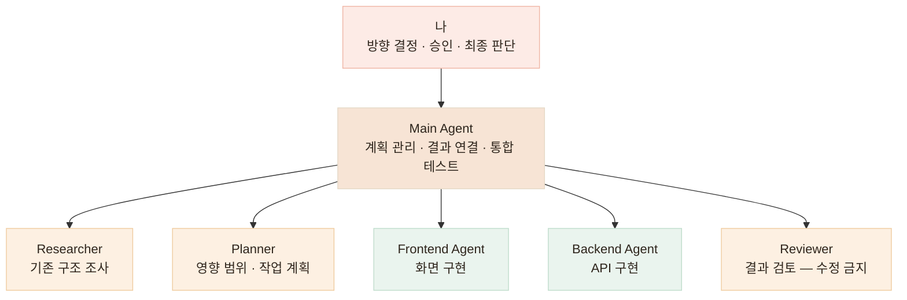
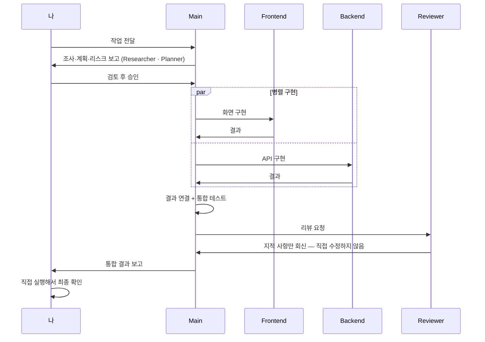

# 역할을 나눠 개발하기 — 한 에이전트에게 계획·구현·검증을 모두 맡기지 않습니다

> 한 에이전트에게 계획·구현·검증을 모두 맡기면, 자기가 만든 코드를 자기가 채점하게 됩니다

<!-- 사진 자리: 서브 에이전트 여러 개가 병렬로 실행 중인 세션 캡처 — 프론트/백 작업이 동시에 진행되는 화면 -->

## 한눈에

| | |
|---|---|
| **문제** | 한 에이전트가 다 하면 구현한 쪽이 검증까지 하게 됩니다 |
| **방법** | 역할별 에이전트 분리, 통합 판단은 한곳 |
| **구성** | Main · Frontend · Backend · Researcher · Planner · Reviewer |
| **원칙** | 리뷰어는 코드를 직접 고치지 않습니다 |

## 역할 분담

| 역할 | 맡는 일 | 하지 않는 일 |
|---|---|---|
| **Main Agent** | 전체 계획 관리 · 프론트/백 결과 연결 · 통합 테스트 | 경계가 분명한 세부 구현 |
| **Frontend Agent** | 프론트 구현 | 백엔드 · 공통 계약 변경 |
| **Backend Agent** | 백엔드 구현 | 프론트 · 공통 계약 변경 |
| **Researcher** | 기존 구조 조사 | 코드 수정 |
| **Planner** | 영향 범위 분석 · 작업 계획 | 코드 수정 |
| **Reviewer** | 구현 결과 검토 | **코드 수정 — 고치는 순간 또 하나의 구현자가 되기 때문** |



## 한 작업이 흘러가는 순서

조사와 계획이 먼저, 승인 뒤에 병렬 구현, 통합과 리뷰를 거쳐 마지막은 직접 확인으로 끝납니다.



## 리뷰어가 코드를 고치지 않는 이유

리뷰어에게 수정 권한을 주면 편합니다. 지적하고 바로 고치면 되니까요. 하지만 고치는 순간 리뷰어는 **또 하나의 구현자**가 되고, 그 수정을 검증할 사람이 사라집니다.

그래서 리뷰어의 출력은 지적 사항까지입니다. 고칠지 말지, 어떻게 고칠지는 구현 쪽과 제가 판단합니다. 구현과 검증이 분리되어 있어야 검증이 검증으로 남습니다.

리뷰어를 부를 때의 지시도 그 경계가 드러나게 씁니다.

```text
나> 방금 구현된 "재방문 의사" 필드 변경을 리뷰해줘.
    - 코드는 수정하지 말 것. 지적 사항만 심각도 순으로 목록화
    - 확인할 것: 기존 API 응답 포맷 유지 여부, 마이그레이션이 additive인지,
      테스트가 실패 케이스까지 덮는지

리뷰어> [지적 2건]
    1. (높음) 기록 폼이 비관적 업데이트라 저장 실패 시 입력값이 사라짐
    2. (낮음) 신규 테스트가 null 저장 케이스를 안 덮음
    — 수정은 하지 않았습니다. 판단 부탁드립니다.
```

받은 지적을 구현 에이전트에게 넘길지, 직접 고칠지, 무시할지는 제가 정합니다.

## 나누기 전에 경계부터 정합니다

역할을 나누는 것보다 중요한 것은 경계입니다. 프론트와 백이 같은 API를 서로 다르게 이해한 채 병렬로 달리면, 합칠 때 비용이 더 커집니다. 그래서 나누기 전에 셋을 먼저 고정합니다.

| 먼저 정하는 것 | 이유 |
|---|---|
| **공통 타입** | 양쪽이 같은 데이터 구조를 보고 일하도록 |
| **API 계약** | 엔드포인트 · 요청/응답 형태를 서로 다르게 이해하지 않도록 |
| **완료 조건** | 각자 무엇을 통과해야 끝나는지 명확하도록 |

작업은 분산하지만, **전체 방향과 통합 판단은 Main Agent와 저, 한곳에서 관리합니다.**
