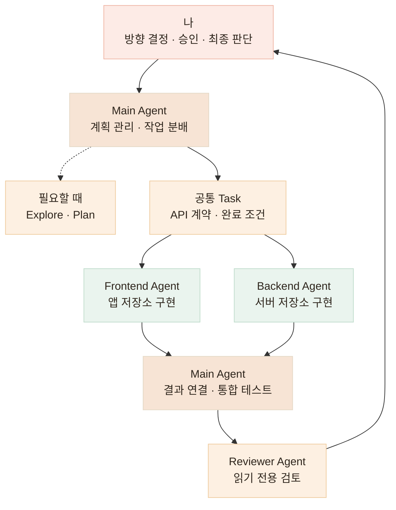
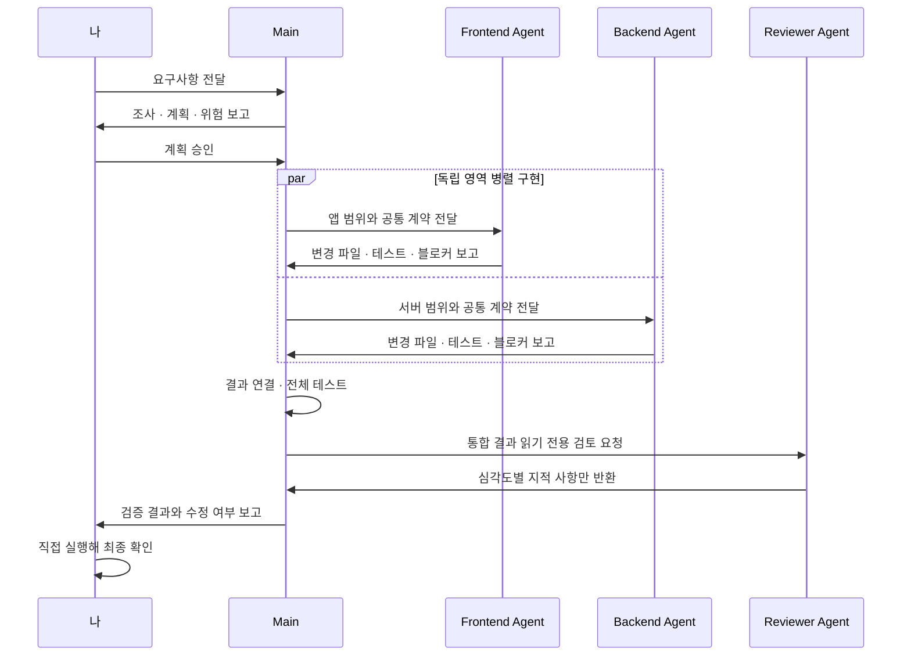

# 역할을 나눠 개발하기 — 멀티 에이전트 구성 · 구현과 검증 분리 · .claude/agents

> 독립적으로 진행할 수 있는 작업은 병렬로 나누고, 결과 연결과 최종 검증은 한곳에서 수행합니다

## 한눈에

| | |
|---|---|
| **문제** | 한 에이전트가 계획·구현·검증을 모두 맡으면 자신의 판단을 스스로 확정하게 됩니다 |
| **실제 구성** | Main Agent + Frontend / Backend Subagent |
| **정의 방식** | Claude Code 내장 서브 에이전트 — 저장소의 `.claude/agents/*.md` 파일로 역할·도구 권한 고정 |
| **보조 역할** | 필요할 때 Explore · Plan Agent 호출 |
| **검증** | 파일 수정 권한이 없는 Reviewer Agent가 지적 사항만 반환 |
| **최종 판단** | Main Agent가 결과를 연결하고, 제가 직접 확인한 뒤 결정 |

## 실제로 사용한 구조

끼니톡은 앱과 백엔드가 별도 저장소로 나뉘어 있습니다. 두 영역의 계약을 먼저 고정한 뒤, 서로 독립적으로 진행할 수 있는 구현은 **Frontend Agent와 Backend Agent를 동시에 호출해 병렬로 진행**했습니다.

항상 여러 에이전트를 띄우는 것은 아닙니다. 기존 구조를 넓게 조사해야 할 때는 Explore Agent, 영향 범위와 작업 순서를 먼저 정해야 할 때는 Plan Agent를 호출합니다. 구현 범위가 작거나 같은 파일을 함께 수정해야 한다면 Main Agent가 직접 처리합니다.



## 역할은 지시문이 아니라 파일로 고정합니다 — .claude/agents

역할 분리를 매번 프롬프트로 설명하지 않습니다. Claude Code에 내장된 서브 에이전트 기능으로, 각 역할을 저장소 안의 `.claude/agents/*.md` 파일 하나로 정의합니다. 별도 확장이나 외부 도구가 아니라 **프로젝트 설정**이라서, 에이전트 구성도 코드처럼 저장소에서 함께 버전 관리됩니다. 아래는 끼니톡 백엔드 저장소의 실제 구조입니다.

```text
kkini-talk-be/
├── CLAUDE.md                        # 에이전트 호출 규칙 — 어떤 작업에서 누구를 부르는지
└── .claude/
    ├── settings.json                # 도구 권한 allow/deny · 앱 저장소 접근 범위
    └── agents/
        ├── backend-implementer.md   # 구현 — 서버 저장소만 수정
        ├── frontend-implementer.md  # 구현 — 앱 저장소만 수정
        └── code-reviewer.md         # 검증 — 읽기 전용, 지적만 반환
```

각 파일 상단의 frontmatter가 그 역할이 쓸 수 있는 도구를 못 박습니다. 구현 에이전트에는 수정 도구를 주고, Reviewer에는 읽기 도구만 남깁니다.

| 에이전트 | tools | permissionMode |
|---|---|---|
| backend / frontend-implementer | Read, Grep, Glob, **Edit, Write, Bash** | acceptEdits |
| code-reviewer | Read, Grep, Glob | plan — 읽기 전용 |

`settings.json`에는 백엔드 저장소 세션에서 앱 저장소까지 다룰 수 있도록 `additionalDirectories`를 열고, 반대로 **에이전트가 자신의 규약과 권한 설정을 고치는 길은 deny로 막았습니다.** 역할 정의를 바꾸는 것은 사람의 몫으로 남깁니다.

```json
"deny": [
  "Edit(AGENTS.md)",
  "Edit(.claude/agents/**)",
  "Edit(.claude/settings.json)",
  "Edit(.claude/CLAUDE.md)"
]
```

## 끼니톡에서 실제로 나눈 작업

다미케어 체크인과 영양 피드백을 연결하는 작업에서는 하나의 Task를 다음처럼 분리했습니다.

| 역할 | 담당 범위 | 작업 경계 |
|---|---|---|
| **Backend Agent** | 체크인 API · 벤더 연동 · 저장 · 서버 테스트 | `kkini-talk-be`만 수정 |
| **Frontend Agent** | 체크인 화면 · 동의 후 복귀 흐름 · 홈 상태 연결 | `kkini-talk-app`만 수정 |
| **Main Agent** | 공통 계약 확정 · 결과 연결 · 전체 테스트 · 커밋 | 두 결과를 직접 재검증 |

두 에이전트는 같은 Task 문서와 API 계약을 읽지만, 서로의 저장소는 수정하지 않습니다. API가 아직 완성되지 않았더라도 Frontend Agent는 계약 기준 mock으로 연결부까지 구현하고, 실제 연결 전환은 Main Agent의 통합 검증 단계에서 진행합니다.

## 병렬 작업 전에 경계부터 고정합니다

에이전트 수를 늘리는 것보다 중요한 것은 **서로 같은 계약을 보고, 같은 파일을 건드리지 않게 만드는 것**입니다.

| 먼저 정하는 것 | 정하는 이유 |
|---|---|
| **담당 Task 범위** | 다른 에이전트의 작업을 선점하지 않도록 |
| **소유 저장소·디렉터리** | 같은 파일을 동시에 수정해 충돌하지 않도록 |
| **공통 타입·API 계약** | 프론트와 백엔드가 요청·응답을 다르게 해석하지 않도록 |
| **완료 조건** | 테스트 범위와 완료 기준을 각자 추정하지 않도록 |
| **금지 사항** | 커밋·마이그레이션·환경 변경을 Main의 검증 전에 실행하지 않도록 |

실제 프로젝트 규칙에는 두 에이전트를 동시에 호출하는 방법과 작업 권한을 다음처럼 명시했습니다.

```markdown
- 두 에이전트는 한 메시지에서 동시에 호출한다.
- 위임 프롬프트에 담당 task 번호와 소유 디렉터리를 명시한다.
- API 명세와 공유 타입을 단일 진실로 사용한다.
- 서브 에이전트는 commit·push·migration·dev server 실행을 하지 않는다.
- 완료 시 변경 파일·검증 결과·미완 항목·스펙 변경 제안을 보고한다.
- Main Agent가 통합 검증을 마친 뒤 체크리스트 갱신과 커밋을 진행한다.
```

## 한 작업이 흘러가는 순서



## Main은 서브 에이전트의 보고를 그대로 믿지 않습니다

병렬 작업에서는 속도만큼 **결과를 다시 확인하는 주체**가 중요했습니다. 실제 작업에서도 에이전트가 문제를 찾아낸 경우와 잘못 판단한 경우가 모두 있었습니다.

| 실제 사례 | Main에서 한 일 |
|---|---|
| BE Agent가 Prisma 오류의 `meta`에 인덱스 이름이 없다는 것을 세 제약 조건으로 실측 | 계약의 오류 처리 기준을 컬럼 집합 기반으로 수정 |
| FE Agent가 하나의 `204` 응답이 서로 다른 두 상태를 표현한다는 문제 발견 | 조회 API를 분리해 화면이 상태를 구분하도록 수정 |
| 서브 에이전트가 202초 걸리던 e2e의 열린 소켓 원인 발견 | 전체 테스트로 수정 전후 시간을 재검증 |
| 서브 에이전트가 “AI 서버에 해당 엔드포인트가 없다”고 잘못 보고 | Main이 실제 AI 서버 코드를 다시 확인해 계약을 바로잡음 |

작업을 나누더라도 사실 확인과 통합 판단까지 분산하지 않습니다. **Main Agent는 보고를 출발점으로 사용하고, 테스트와 실제 코드로 다시 검증합니다.**

## Reviewer는 코드를 수정할 수 없습니다

구현한 에이전트가 자신의 결과까지 확정하면 놓친 가정을 다시 발견하기 어렵습니다. 그래서 통합이 끝난 뒤에는 별도의 Reviewer Agent가 하위호환성·테스트 누락·보안·운영 위험을 검토합니다.

Reviewer에는 `Read`, `Grep`, `Glob`처럼 읽기에 필요한 도구만 허용합니다. `Write`, `Edit`, `Bash`를 제공하지 않기 때문에 코드와 실행 환경을 바꿀 수 없습니다. 아래는 `.claude/agents/code-reviewer.md`의 실제 frontmatter입니다.

```yaml
---
name: code-reviewer
description: 구현이 끝난 변경을 읽기 전용으로 검토한다.
  하위호환성·계약·테스트·보안·운영 위험을 찾을 때 사용한다.
tools: Read, Grep, Glob
model: sonnet
permissionMode: plan
---
```

호출할 때도 역할을 명확히 제한합니다.

```text
이번 변경을 읽기 전용으로 검토해.

- 코드를 수정하지 말 것
- 기존 API 계약과 하위호환성 확인
- 파괴적인 DB 변경 여부 확인
- 빠진 실패·경계 테스트 확인
- 문제를 심각도 순으로 정리하고 근거 파일과 위치를 함께 보고
```

Reviewer의 출력은 지적 사항까지입니다. 지적을 구현 에이전트에게 다시 맡길지, 직접 수정할지, 반영하지 않을지는 Main Agent와 제가 결정합니다. **리뷰어가 고치는 순간 다시 구현자가 되기 때문에 구현과 검증의 권한을 분리했습니다.**

## 이 구성 자체도 문서로 두지 않고 실제로 검증했습니다

에이전트 정의와 권한 설정을 만든 뒤, 실제 세션에서 의도대로 동작하는지 하나씩 확인했습니다.

| 확인한 것 | 방법 | 결과 |
|---|---|---|
| 에이전트 인식 | 새 세션에서 호출 가능한 서브 에이전트 목록 확인 | 3종 모두 인식 |
| Reviewer 실호출 | 이 권한 구성 변경 자체를 읽기 전용으로 검토시킴 | 심각도 순 지적 5건 반환 |
| Reviewer 무수정 | 리뷰 전후 `git diff` 해시 비교 | 해시 동일 — 파일 수정 없음 |
| 자기 규약 수정 차단 | 구현 에이전트에게 규약 파일 수정을 직접 지시 | 수정 거부 — 전후 파일 해시 동일 |

Reviewer의 지적도 그대로 받아들이지 않았습니다. **권한 범위를 좁히라는 지적은 반영**해 위의 deny 규칙이 추가됐고, 커밋·마이그레이션까지 권한으로 막으라는 지적은 Main Agent의 전담 작업까지 막혀 부작용이 더 크다는 근거를 규약 문서에 남기고 **기각**했습니다. 반영을 마친 뒤 Reviewer를 다시 호출해 해소를 확인하는 것까지가 한 사이클입니다.

## 작업은 분산하고, 판단은 한곳에 모읍니다

멀티 에이전트의 목적은 많은 에이전트를 사용하는 것이 아니라, **경계가 명확한 작업을 동시에 진행하면서도 전체 품질의 책임 소재를 흐리지 않는 것**입니다.

Frontend와 Backend Agent는 정해진 범위를 구현하고, Explore와 Plan Agent는 필요할 때 조사와 계획을 보조합니다. Reviewer는 수정 권한 없이 결과를 검토합니다. 최종적으로 결과를 연결하고 테스트하며 배포 여부를 판단하는 책임은 Main Agent와 저에게 남겨 둡니다.
