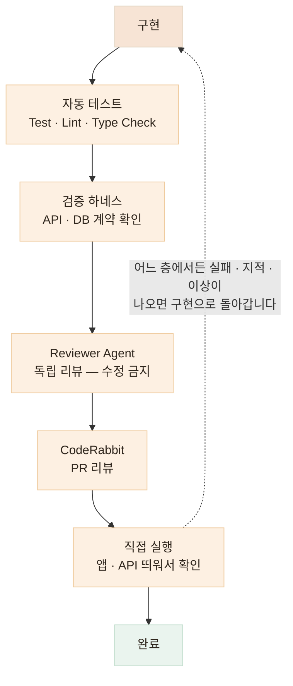

# 여러 번 검증하기 — AI가 만들었다고 완료로 보지 않습니다

> 하나의 AI 판단을 다른 AI 판단으로 덮는 것이 아니라, 자동화된 기준 · 독립 리뷰 · 직접 실행을 함께 사용합니다

<!-- 사진 자리: CodeRabbit이 PR에 남긴 리뷰 코멘트 캡처, 또는 검증 하네스 실행 결과(PASS/FAIL 목록) 터미널 캡처 -->

## 한눈에

| | |
|---|---|
| **원칙** | 테스트는 구현 후가 아니라 Task 작성 시점에 완료 조건으로 들어갑니다 |
| **층** | 자동 테스트 → 검증 하네스 → Reviewer Agent → CodeRabbit → 직접 실행 |
| **규칙** | 어느 층에서든 실패하면 이전 단계로 돌아갑니다 |

## 검증 파이프라인



## 각 층이 잡는 것이 다릅니다

한 층으로 다 잡을 수 있으면 층을 늘릴 이유가 없습니다. 층마다 잘 잡는 결함이 다르기 때문에 겹쳐 씁니다.

| 층 | 잘 잡는 것 |
|---|---|
| **자동 테스트** | 회귀 — 이번 변경이 기존 동작을 깨는 경우 |
| **검증 하네스** | 계약 위반 — 응답 형태·필드가 약속과 달라지는 경우 |
| **Reviewer Agent** | 설계 문제 · 빠뜨린 엣지 케이스 |
| **CodeRabbit** | 사람이 지나치기 쉬운 관례 · 보안 패턴 |
| **직접 실행** | 테스트가 표현하지 못한 실사용 흐름 |

## 검증 하네스 — 감이 아니라 기준으로

하네스는 떠 있는 서버에 밖에서 실제 요청을 보내, 응답이 계약대로인지 확인하는 독립 스크립트입니다. 핵심은 **구현 코드와 상수를 공유하지 않는 것.** 구현이 바뀌어도 하네스의 기준은 그대로라서, "구현과 함께 틀려지는 테스트"가 되지 않습니다.

```python
# contract_harness.py (예시) — 표준 라이브러리만 사용, 구현과 독립
EXPECTED_KEYS = {"calories", "carbs", "protein", "fat", "sodium"}  # 계약 사본

def check_meal_analysis():
    res = post("/api/v1/meals/analyze", SAMPLE_IMAGE)
    assert res.status == 200, f"FAIL: status {res.status}"
    for food in res.json()["foods"]:
        missing = EXPECTED_KEYS - set(food["nutrition"])
        assert not missing, f"FAIL: 계약 필드 누락 {missing}"
    print("PASS: 응답이 계약대로다")
```

하네스가 실패하면 하네스를 고치는 것이 아니라 서버를 고칩니다. 끼니톡에서는 이 방식으로 **계약 · AI 출력 · 지표 · 부하** 4종의 하네스를 만들어, 비결정적인 LLM 응답과 실제 외부 API 동작을 검증했습니다.

## 테스트는 Task에서 시작됩니다

검증을 구현 뒤에 붙이면 밀립니다. 그래서 Task를 만들 때부터 완료 조건에 테스트를 넣습니다.

```markdown
### 완료 조건 (Task 예시)
- [ ] 신규 테스트 통과 — 정상 1 · 실패 2 케이스
- [ ] 기존 테스트 전체 통과
- [ ] 하네스 통과 — 응답 계약 확인
```

이렇게 하면 "구현은 끝났는데 테스트는 나중에"라는 상태 자체가 생기지 않습니다. 그리고 모든 층을 통과해도 마지막은 같습니다 — **앱을 직접 띄워서, 사용자가 밟을 흐름을 제 손으로 확인합니다.**
