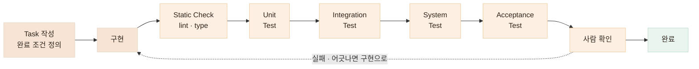
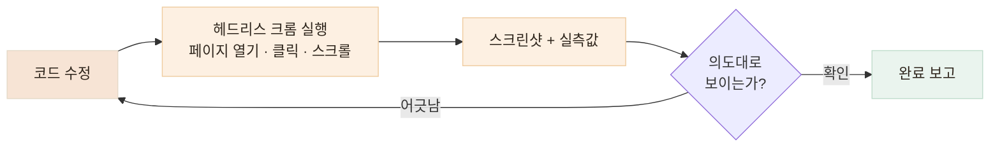

# AI가 만들었다고 완료로 보지 않습니다

> **Unit부터 인수 테스트까지 자동화해 AI 작업의 완료 조건으로 사용합니다.** 하나의 AI 판단을 다른 AI 판단으로 덮는 것이 아니라, 자동화된 테스트 · 독립 리뷰 · 직접 확인이 완료를 결정합니다

## 한눈에

| | |
|---|---|
| **원칙** | 테스트는 구현 후가 아니라 Task 작성 시점에 완료 조건으로 들어갑니다 |
| **단계** | Static Check → Unit → Integration → System → Acceptance → 사람 확인 |
| **별도 검증** | AI 기능은 계약·안전·성능·부하를 따로 검증하고, 코드 변경은 Reviewer Agent·CodeRabbit으로 독립 리뷰합니다 |
| **규칙** | 어느 단계에서든 실패하면 구현으로 돌아갑니다 |

## 테스트 파이프라인



**AI 기능에는 별도의 검증을 추가하고, 코드 변경은 Reviewer Agent와 CodeRabbit으로 독립 리뷰합니다.** 테스트 파이프라인과 리뷰는 역할이 달라 분리해서 운용합니다.

## 단계마다 잡는 결함이 다릅니다

한 단계로 다 잡을 수 있으면 단계를 늘릴 이유가 없습니다. 단계마다 잘 잡는 결함이 다르기 때문에 겹쳐 씁니다.

| 단계 | 확인하는 것 | 실제 자동화 |
|---|---|---|
| **Static Check** | 문법·타입 오류 | lint · type check |
| **Unit Test** | 개별 로직·경계값 | 초대 코드 · KST 날짜 |
| **Integration Test** | 여러 구성요소의 연결 | API 처리와 DB 상태를 함께 확인 |
| **System Test** | 실행된 서버 전체 동작 | HTTP 검증 하네스 |
| **Acceptance Test** | 실제 사용자 흐름 | Playwright |
| **AI 검증** | 출력 계약·안전·성능·부하 | 별도 하네스 4종 |
| **독립 리뷰** | 테스트에 정의하지 못한 문제 | Reviewer Agent · CodeRabbit |

## 작은 로직부터 실제 서비스까지 단계적으로 자동 검증합니다

테스트 자체는 특별하지 않습니다. 중요한 것은 **구현 후 자동으로 실행되고, 정해둔 기준을 통과해야 다음 단계로 넘어간다**는 점입니다. **에이전트의 변경이 기존 동작을 조용히 깨뜨리는 회귀**도 이 과정에서 빠르게 확인합니다. 운용 방식은 세 단계입니다.

| 언제 | 무엇을 |
|---|---|
| **구현 전** | 무엇을 테스트할지 Task 체크리스트에 먼저 적습니다 — "DB에 실제로 남는지 확인"·"기존 e2e 전체 통과"까지 완료 조건으로 |
| **구현 후** | 새 테스트와 기존 테스트 **전체**를 돌립니다. 삭제·assertion 약화로 통과시키는 것은 규약으로 금지 |
| **빈틈 발견** | 리뷰·실행에서 계획에 없던 케이스가 드러나면 그 자리에서 추가 — 그렇게 끼니톡에서 **단위 60→181개, e2e 16→196개**로 누적 |

### Unit Test — 함수 하나의 로직과 경계값

테스트 이름은 계약 문장 그 자체라서, 목록만 읽어도 스펙이 보입니다. 실제 파일에서 가져온 예시입니다.

```ts
// 초대 코드 — 보호자·어르신 연결에 쓰는 6자리 코드 (invite-code.spec.ts)
it('혼동 문자 0 O 1 I 가 하나도 없다')          // 어르신이 헷갈릴 글자는 아예 금지
it('항상 길이 6이고 알파벳 안의 문자만 쓴다')

// 서비스 날짜 — "오늘"은 언제까지인가 (service-date.spec.ts)
it('KST 자정 직후는 그날로 계산한다')            // 경계는 반드시 양쪽에서
it('KST 자정 1분 전은 전날로 계산한다')
```

세팅 기준은 간단합니다. **정상 하나에 실패·경계 케이스를 여럿** — 경계는 자정 직전·직후처럼 양쪽 다 확인합니다.

### Integration Test — 연결된 동작까지 확인합니다

개별 함수가 맞는 것에서 끝내지 않고, 여러 구성요소가 함께 동작하는 경우에는 **응답뿐 아니라 처리 후 실제 데이터 상태까지 확인**합니다.

## System Test — 실행 중인 서버를 하네스로 검증합니다

단위 테스트만 통과했다고 실제 서비스가 정상이라는 보장은 없습니다. 그래서 끼니톡에서는 이 단계를 반복 실행하기 위해 **실행 중인 서버에 실제 요청을 보내고, 응답이 정해둔 계약을 지키는지 확인하는 별도의 검증 스크립트**(하네스)를 만들었습니다.

쉽게 말하면 — **단위 테스트**는 코드 내부의 함수와 로직을 검사하고, **검증 하네스**는 실제 사용자처럼 API를 호출해 **서버 전체가 올바르게 동작하는지** 확인합니다.

### 어떻게 검증하나

예를 들어 식단 분석 API에는 이런 계약이 있습니다.

- 사진 없이 요청하면 → **422 오류**
- 응답에는 → **정해진 5개 영양소 키가 모두 존재**
- 전체 영양소 값은 → **각 음식 영양소의 합과 일치**
- 내부 네트워크 주소를 사진 URL로 보내면 → **SSRF 방어로 차단**

하네스는 실행할 때마다 실제 서버에 이 요청들을 보내고, 응답을 보고 직접 PASS/FAIL을 판정합니다.

```text
$ python kkinitalk_ai_harness.py

  [PASS] 영양소 5개 키 존재
  [PASS] totalNutrients = 각 음식 영양소의 합
  [PASS] photoUrl 누락 = 422
  [PASS] 내부 네트워크 주소 → 접근 차단

  34 checks passed
```

즉, **"코드가 돌아간다"가 아니라 "서비스가 우리가 정한 계약대로 동작한다"를 확인하는 테스트**입니다.

개발 에이전트에게도 완료 조건으로 하네스 실행을 요구합니다. **구현 → 하네스 실행 → FAIL 확인 → 서버 수정 → 다시 실행 → 전체 PASS 후 완료.** 하네스가 판정 기준을 가지고 있기 때문에, 에이전트가 구현을 마쳤다고 **말하는 것만으로는 완료로 처리하지 않습니다.** 마지막에는 저도 같은 명령을 직접 실행해 결과를 다시 확인합니다.

### AI 기능은 출력 문자열이 아니라 지켜야 할 조건을 검증합니다

일반 기능은 입력과 기대 결과를 비교할 수 있지만, **AI 출력은 매번 표현이 달라질 수 있습니다.** 그래서 응답 구조·안전 조건·성능·부하처럼 **서비스에서 반드시 지켜야 할 조건을 따로 검증했습니다.** 끼니톡에서는 이 방식으로 **API 계약 · AI 출력 · 성능 지표 · 부하**를 각각 검증하는 하네스 4종을 만들어 사용했습니다. 아래는 계약 하네스를 작성하던 당시의 실행 결과입니다.


## 독립 리뷰 — 테스트에 정의하지 못한 문제를 한 번 더 봅니다

자동 테스트는 결국 제가 정의한 조건을 기준으로 동작합니다. 그래서 PR을 올린 뒤 바로 병합하지 않고, 별도 세션의 Reviewer Agent와 외부 리뷰어인 [**CodeRabbit**](https://coderabbit.ai/)으로 **테스트 기준에서 빠진 설계·변경 영향·계약 차이**를 확인합니다.

실제로 알바로그 PR에서는 CodeRabbit이 **DTO와 컨트롤러 사이의 요청 파라미터 불일치**를 발견했습니다. 기능 자체는 동작하더라도 놓칠 수 있는 계약상의 차이를 PR 단계에서 잡았고, 함께 제공되는 "Prompt for AI Agents"로 지적을 에이전트가 바로 실행할 수 있는 프롬프트로 받아 **수정 작업까지 연결**했습니다.


## Acceptance Test(인수 테스트) — 실제 사용자 흐름으로 최종 확인합니다

모든 단계를 통과해도 "수정했습니다"와 "실제로 그렇게 보입니다"는 다른 말입니다. 그래서 에이전트가 헤드리스 크롬(Playwright)으로 **사용자가 실제로 수행하는 흐름을 브라우저에서 재현**하며, 클릭·스크롤하고 스크린샷과 실측값으로 결과를 보고합니다. 여기까지는 자동화된 검증이고, 마지막에 제가 그 결과를 직접 확인합니다.



```js
const page = await browser.newPage({ viewport: { width: 1280, height: 1100 } });
await page.goto("http://localhost:3000");
await page.getByRole("button", { name: /돈가스 지도/ }).click();   // 카드 펼치기
await page.getByRole("heading", { name: "개발 비하인드" }).click(); // 아코디언 열기
await page.screenshot({ path: "result.png" });                     // 결과 확인
```

스크린샷으로 부족할 때는 렌더된 값을 직접 꺼내 봅니다. "사진이 좀 큰 것 같은데"가 아니라 정확한 수치로 판단합니다.

| 재는 것 | 방법 | 실제로 이렇게 썼습니다 |
|---|---|---|
| 이미지 렌더 크기 | boundingBox | 사진 크기 조정 요청마다 "175×380px"로 결과 보고 |
| 색상 적용 여부 | getComputedStyle | 테두리 색이 바뀌었는지 `rgb(0, 198, 118)` 확인 |
| 강조가 실제로 걸렸는지 | strong 텍스트 추출 | 볼드 처리된 구절 목록을 뽑아 의도한 곳과 대조 |
| 요소 사이 간격 | 좌표 차 계산 | "사진과 텍스트 간격 10px" 실측 후 조정 |

### 같은 자동화 도구를 성능 검증에도 사용했습니다

네트워크 요청을 자동 수집해 첫 진입 **31.8MB**의 원인을 분해했고, 원인별로 수정한 뒤 같은 스크립트로 다시 측정해 **19.8MB**를 확인했습니다.


| 원인 | 조치 | 결과 |
|---|---|---|
| 한글 폰트 TTF 2종 10.5MB | 사용 글자만 남기는 서브셋 + woff2 변환 | **0.7MB** — 화면은 동일 |
| 파비콘이 1024px 원본 1.9MB | 실제 표시 크기(16·32px)로 리사이즈 | **3KB** |
| 스크린샷 원본이 그대로 전송 | 대용량 33장을 표시 크기 기준으로 리사이즈 | 50.6MB → 30.9MB |


## 결론 — AI가 구현했다고 말하는 것이 완료 조건은 아닙니다

구현 전에 완료 조건을 정하고, **Static Check부터 Unit → Integration → System → Acceptance Test까지 단계적으로 자동 실행**합니다. AI 기능은 별도의 계약·안전·성능 기준으로 검증하고, 테스트 밖의 문제는 독립 리뷰에서 다시 확인합니다.

어느 단계에서든 실패하면 구현으로 돌아갑니다. **에이전트의 판단이 아니라 테스트 결과와 실제 실행 결과가 완료 여부를 결정하도록** 개발하고 있습니다.
