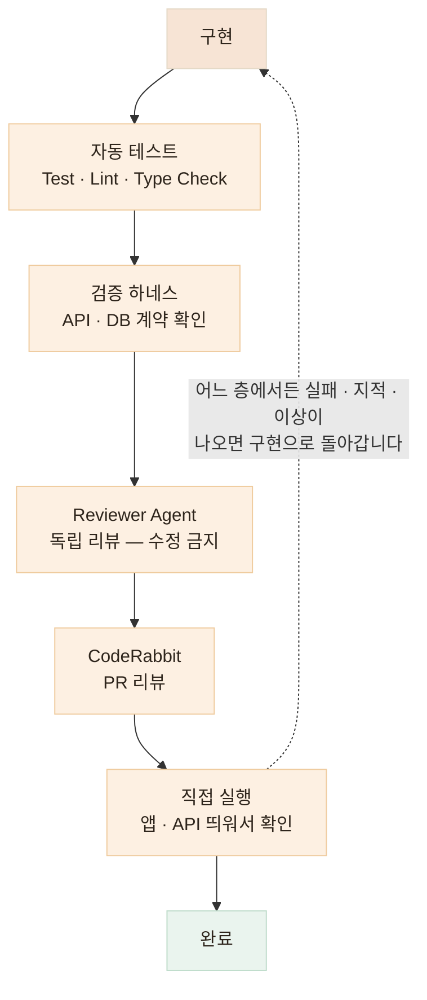
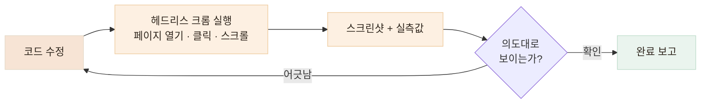

# 여러 번 검증하기 — AI가 만들었다고 완료로 보지 않습니다

> 하나의 AI 판단을 다른 AI 판단으로 덮는 것이 아니라, 자동화된 기준 · 독립 리뷰 · 직접 실행을 함께 사용합니다

## 한눈에

| | |
|---|---|
| **원칙** | 테스트는 구현 후가 아니라 Task 작성 시점에 완료 조건으로 들어갑니다 |
| **층** | 자동 테스트 → 검증 하네스 → Reviewer Agent → CodeRabbit → 직접 실행 |
| **규칙** | 어느 층에서든 실패하면 이전 단계로 돌아갑니다 |
| **직접 실행** | 에이전트가 헤드리스 크롬으로 화면·성능까지 직접 확인합니다 |

## 검증 파이프라인



## 각 층이 잡는 것이 다릅니다

한 층으로 다 잡을 수 있으면 층을 늘릴 이유가 없습니다. 층마다 잘 잡는 결함이 다르기 때문에 겹쳐 씁니다.

| 층 | 잘 잡는 것 |
|---|---|
| **자동 테스트** | 회귀 — 이번 변경이 기존 동작을 깨는 경우 |
| **검증 하네스** | 계약 위반 — 응답 형태·필드가 약속과 달라지는 경우 |
| **Reviewer Agent** | 설계 문제 · 빠뜨린 엣지 케이스 |
| **CodeRabbit** | 사람이 지나치기 쉬운 관례 · 보안 패턴 |
| **직접 실행** | 테스트가 표현하지 못한 실사용 흐름 |

## 검증 하네스 — 감이 아니라 기준으로

하네스는 떠 있는 서버에 밖에서 실제 요청을 보내, 응답이 계약대로인지 확인하는 독립 스크립트입니다. 핵심은 **구현 코드와 상수를 공유하지 않는 것.** 구현이 바뀌어도 하네스의 기준은 그대로라서, "구현과 함께 틀려지는 테스트"가 되지 않습니다.

```python
# contract_harness.py (예시) — 표준 라이브러리만 사용, 구현과 독립
EXPECTED_KEYS = {"calories", "carbs", "protein", "fat", "sodium"}  # 계약 사본

def check_meal_analysis():
    res = post("/api/v1/meals/analyze", SAMPLE_IMAGE)
    assert res.status == 200, f"FAIL: status {res.status}"
    for food in res.json()["foods"]:
        missing = EXPECTED_KEYS - set(food["nutrition"])
        assert not missing, f"FAIL: 계약 필드 누락 {missing}"
    print("PASS: 응답이 계약대로다")
```

돌리면 이런 결과가 나옵니다. FAIL이 나왔을 때가 중요합니다.

```text
$ python contract_harness.py http://localhost:8000

[PASS] 응답 스키마 — 필수 키 5종 존재
[PASS] 에러 형태 — 잘못된 입력에 422
[FAIL] 배율 경계 — 0.8을 small로 판정 (계약: regular)

→ 하네스가 틀린 게 아니라 서버가 계약을 어긴 것.
  하네스를 고치지 말고 서버를 고칩니다.
```

AI에게 "테스트가 실패한다"고 알려주면 테스트 쪽을 고쳐서 통과시키려는 경우가 있습니다. 하네스는 구현과 상수를 공유하지 않는 독립 스크립트이기 때문에, 이 규칙을 어기지 않았는지 사람이 바로 확인할 수 있습니다.

끼니톡에서는 이 방식으로 **계약 · AI 출력 · 지표 · 부하** 4종의 하네스를 만들어, 비결정적인 LLM 응답과 실제 외부 API 동작을 검증했습니다. 아래는 실제 계약 하네스의 실행 결과입니다.


## 테스트는 Task에서 시작됩니다

검증을 구현 뒤에 붙이면 밀립니다. 그래서 Task를 만들 때부터 완료 조건에 테스트를 넣습니다.

```markdown
### 완료 조건 (Task 예시)
- [ ] 신규 테스트 통과 — 정상 1 · 실패 2 케이스
- [ ] 기존 테스트 전체 통과
- [ ] 하네스 통과 — 응답 계약 확인
```

이렇게 하면 "구현은 끝났는데 테스트는 나중에"라는 상태 자체가 생기지 않습니다.

## 마지막 층, 직접 실행 — 코드가 아니라 화면으로 확인합니다

모든 층을 통과해도 "수정했습니다"와 "실제로 그렇게 보입니다"는 다른 말입니다. 그래서 마지막 층에서는 에이전트가 헤드리스 크롬(Playwright)으로 페이지를 직접 열어, 사람이 하듯 클릭하고 스크린샷과 실측값으로 결과를 보고합니다.



```js
const page = await browser.newPage({ viewport: { width: 1280, height: 1100 } });
await page.goto("http://localhost:3000");
await page.getByRole("button", { name: /돈가스 지도/ }).click();   // 카드 펼치기
await page.getByRole("heading", { name: "개발 비하인드" }).click(); // 아코디언 열기
await page.screenshot({ path: "result.png" });                     // 결과 확인
```

스크린샷으로 부족할 때는 렌더된 값을 직접 꺼내 봅니다. "사진이 좀 큰 것 같은데"가 아니라 정확한 수치로 판단합니다.

| 재는 것 | 방법 | 실제로 이렇게 썼습니다 |
|---|---|---|
| 이미지 렌더 크기 | boundingBox | 사진 크기 조정 요청마다 "175×380px"로 결과 보고 |
| 색상 적용 여부 | getComputedStyle | 테두리 색이 바뀌었는지 `rgb(0, 198, 118)` 확인 |
| 강조가 실제로 걸렸는지 | strong 텍스트 추출 | 볼드 처리된 구절 목록을 뽑아 의도한 곳과 대조 |
| 요소 사이 간격 | 좌표 차 계산 | "사진과 텍스트 간격 10px" 실측 후 조정 |

## 성능도 같은 방식으로 분석합니다

"첫 진입이 왜 느리지?"라는 질문에도 추측 대신 측정으로 답합니다. 에이전트가 네트워크 응답을 전부 캡처해 요청별 용량을 분해했습니다.


이 실측으로 "정적 파일을 S3로 옮겨야 하나?"라는 처음 가설이 틀렸다는 것이 드러났습니다. 위치의 문제가 아니라 **서브셋 없는 한글 폰트(10.5MB)와 원본 그대로 나가는 이미지·파비콘**이 원인이었고, 개선 방향이 "옮기기"에서 "줄이기"로 바뀌었습니다.

측정이 원인을 짚어줬으니 조치는 순서대로였습니다. 고친 뒤 **같은 스크립트로 다시 재서** 효과를 숫자로 닫았습니다.

| 원인 | 조치 | 결과 |
|---|---|---|
| 한글 폰트 TTF 2종 10.5MB | 사용 글자만 남기는 서브셋 + woff2 변환 | **0.7MB** — 화면은 동일 |
| 파비콘이 1024px 원본 1.9MB | 실제 표시 크기(16·32px)로 리사이즈 | **3KB** |
| 스크린샷 원본이 그대로 전송 | 대용량 33장을 표시 크기 기준으로 리사이즈 | 50.6MB → 30.9MB |


## 결론 — 추측은 방향을 만들고, 측정은 순서를 만듭니다

하나의 층이 놓친 것을 다음 층이 잡고, 마지막에는 사람이 쓰는 방식 그대로 실행해서 확인합니다. 검증과 분석이 같은 도구, 같은 루프 안에서 돌아가고 — 지금 보고 계신 이 포트폴리오의 카드·모달·다이어그램이 전부 이 루프로 만들어진 결과물입니다.
