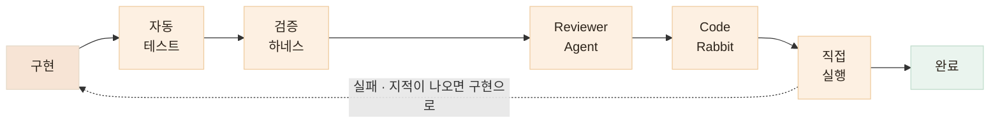
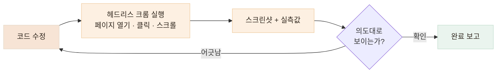

# 여러 단계로 테스트하기 — AI가 만들었다고 완료로 보지 않습니다

> 하나의 AI 판단을 다른 AI 판단으로 덮는 것이 아니라, 자동화된 기준 · 독립 리뷰 · 직접 실행을 함께 사용합니다

## 한눈에

| | |
|---|---|
| **원칙** | 테스트는 구현 후가 아니라 Task 작성 시점에 완료 조건으로 들어갑니다 |
| **층** | 자동 테스트 → 검증 하네스 → Reviewer Agent → CodeRabbit → 직접 실행 |
| **규칙** | 어느 층에서든 실패하면 이전 단계로 돌아갑니다 |
| **직접 실행** | 에이전트가 헤드리스 크롬으로 화면·성능까지 직접 확인합니다 |

## 검증 파이프라인



## 각 층이 잡는 것이 다릅니다

한 층으로 다 잡을 수 있으면 층을 늘릴 이유가 없습니다. 층마다 잘 잡는 결함이 다르기 때문에 겹쳐 씁니다.

| 층 | 잘 잡는 것 |
|---|---|
| **자동 테스트** | 회귀 — 이번 변경이 기존 동작을 깨는 경우 |
| **검증 하네스** | 계약 위반 — 응답 형태·필드가 약속과 달라지는 경우 |
| **Reviewer Agent** | 설계 문제 · 빠뜨린 엣지 케이스 |
| **CodeRabbit** | 사람이 지나치기 쉬운 관례 · 보안 패턴 |
| **직접 실행** | 테스트가 표현하지 못한 실사용 흐름 |

## 첫 층, 자동 테스트 — 회귀를 가장 싸게 잡는 기본기

단위·e2e 테스트, 린트, 타입 체크. 평범해 보이지만 AI 개발에서는 역할이 더 큽니다 — **에이전트의 변경이 기존 동작을 조용히 깨뜨리는 회귀**를 가장 싸고 빠르게 잡는 층입니다. 운용 방식은 세 단계입니다.

| 언제 | 무엇을 |
|---|---|
| **구현 전** | 무엇을 테스트할지 Task 체크리스트에 먼저 적습니다 — "DB에 실제로 남는지 확인"·"기존 e2e 전체 통과"까지 완료 조건으로 |
| **구현 후** | 새 테스트와 기존 테스트 **전체**를 돌립니다. 삭제·assertion 약화로 통과시키는 것은 규약으로 금지 |
| **빈틈 발견** | 리뷰·실행에서 계획에 없던 케이스가 드러나면 그 자리에서 추가 — 그렇게 **단위 60→181개, e2e 16→196개**로 누적 |

테스트 이름은 계약 문장 그 자체라서, 목록만 읽어도 스펙이 보입니다. 실제 파일에서 가져온 예시입니다.

```ts
// 초대 코드 — 보호자·어르신 연결에 쓰는 6자리 코드 (invite-code.spec.ts)
it('혼동 문자 0 O 1 I 가 하나도 없다')          // 어르신이 헷갈릴 글자는 아예 금지
it('항상 길이 6이고 알파벳 안의 문자만 쓴다')

// 서비스 날짜 — "오늘"은 언제까지인가 (service-date.spec.ts)
it('KST 자정 직후는 그날로 계산한다')            // 경계는 반드시 양쪽에서
it('KST 자정 1분 전은 전날로 계산한다')
```

세팅 기준은 간단합니다. **정상 하나에 실패·경계 케이스를 여럿** — 경계는 자정 직전·직후처럼 양쪽 다 확인하고, 응답만 보지 않고 DB에 실제로 남았는지까지 봅니다.

## 검증 하네스 — 실제 서버에 요청해 직접 확인합니다

단위 테스트만 통과했다고 실제 서비스가 정상이라는 보장은 없습니다. 그래서 끼니톡에서는 **실행 중인 서버에 실제 요청을 보내고, 응답이 정해둔 계약을 지키는지 확인하는 별도의 검증 스크립트**(하네스)를 만들었습니다.

쉽게 말하면 — **단위 테스트**는 코드 내부의 함수와 로직을 검사하고, **검증 하네스**는 실제 사용자처럼 API를 호출해 **서버 전체가 올바르게 동작하는지** 확인합니다.

### 어떻게 검증하나

예를 들어 식단 분석 API에는 이런 계약이 있습니다.

- 사진 없이 요청하면 → **422 오류**
- 응답에는 → **정해진 5개 영양소 키가 모두 존재**
- 전체 영양소 값은 → **각 음식 영양소의 합과 일치**
- 내부 네트워크 주소를 사진 URL로 보내면 → **SSRF 방어로 차단**

하네스는 실행할 때마다 실제 서버에 이 요청들을 보내고, 응답을 보고 직접 PASS/FAIL을 판정합니다.

```text
$ python kkinitalk_ai_harness.py

  [PASS] 영양소 5개 키 존재
  [PASS] totalNutrients = 각 음식 영양소의 합
  [PASS] photoUrl 누락 = 422
  [PASS] 내부 네트워크 주소 → 접근 차단

  34 checks passed
```

즉, **"코드가 돌아간다"가 아니라 "서비스가 우리가 정한 계약대로 동작한다"를 확인하는 테스트**입니다.

### AI 에이전트와는 이렇게 사용합니다

개발 에이전트에게도 완료 조건으로 하네스 실행을 요구합니다.

**구현 → 하네스 실행 → FAIL 확인 → 서버 수정 → 다시 실행 → 전체 PASS 후 완료**

하네스가 판정 기준을 가지고 있기 때문에, 에이전트가 구현을 마쳤다고 **말하는 것만으로는 완료로 처리하지 않습니다.** 마지막에는 저도 같은 명령을 직접 실행해 결과를 다시 확인합니다.

끼니톡에서는 이 방식으로 **API 계약 · AI 출력 · 성능 지표 · 부하**를 각각 검증하는 하네스 4종을 만들어 사용했습니다. 아래는 실제 계약 하네스의 실행 결과입니다.


## CodeRabbit — 우리 맥락 밖에서 보는 외부 리뷰어

하네스와 Reviewer Agent는 강력하지만 한계가 있습니다 — **제가 세운 기준 안에서 돕니다.** 기준 자체에 구멍이 있거나 팀 전체가 같은 가정을 공유하고 있으면, 내부 검증으로는 잡히지 않습니다.

PR을 올린 뒤 바로 병합하지 않고, [**CodeRabbit**](https://coderabbit.ai/)을 통해 **변경 요약과 코드 리뷰를 한 차례 더 확인**합니다. 백엔드 개발자가 여러 명이었던 알바로그에서는 서로 다른 작업이 맞물리는 부분에서 **놓친 예외와 변경 영향을 확인하는 보조 리뷰어**로 활용했습니다.

아래는 실제 리뷰 사례입니다.


실제 알바로그 PR에서는 CodeRabbit이 **DTO와 컨트롤러 사이의 요청 파라미터 불일치**를 발견했습니다. 기능 자체는 동작하더라도 놓칠 수 있는 **계약상의 차이**를 PR 단계에서 다시 확인할 수 있었습니다.

리뷰 결과에는 CodeRabbit이 함께 제공하는 "Prompt for AI Agents"도 붙습니다. 지적의 맥락과 권장 수정 방향을 에이전트가 바로 실행할 수 있는 프롬프트로 정리해 주기 때문에, 리뷰를 읽고 끝내는 것이 아니라 **수정 작업까지 바로 연결**합니다.

## 마지막 층, 직접 실행 — 코드가 아니라 화면으로 확인합니다

모든 층을 통과해도 "수정했습니다"와 "실제로 그렇게 보입니다"는 다른 말입니다. 그래서 마지막 층에서는 에이전트가 헤드리스 크롬(Playwright)으로 페이지를 직접 열어, 사람이 하듯 클릭하고 스크린샷과 실측값으로 결과를 보고합니다.



```js
const page = await browser.newPage({ viewport: { width: 1280, height: 1100 } });
await page.goto("http://localhost:3000");
await page.getByRole("button", { name: /돈가스 지도/ }).click();   // 카드 펼치기
await page.getByRole("heading", { name: "개발 비하인드" }).click(); // 아코디언 열기
await page.screenshot({ path: "result.png" });                     // 결과 확인
```

스크린샷으로 부족할 때는 렌더된 값을 직접 꺼내 봅니다. "사진이 좀 큰 것 같은데"가 아니라 정확한 수치로 판단합니다.

| 재는 것 | 방법 | 실제로 이렇게 썼습니다 |
|---|---|---|
| 이미지 렌더 크기 | boundingBox | 사진 크기 조정 요청마다 "175×380px"로 결과 보고 |
| 색상 적용 여부 | getComputedStyle | 테두리 색이 바뀌었는지 `rgb(0, 198, 118)` 확인 |
| 강조가 실제로 걸렸는지 | strong 텍스트 추출 | 볼드 처리된 구절 목록을 뽑아 의도한 곳과 대조 |
| 요소 사이 간격 | 좌표 차 계산 | "사진과 텍스트 간격 10px" 실측 후 조정 |

## 성능도 같은 방식으로 분석합니다

"첫 진입이 왜 느리지?"라는 질문에도 추측 대신 측정으로 답합니다. 에이전트가 네트워크 응답을 전부 캡처해 요청별 용량을 분해했습니다.


이 실측을 통해 처음 세웠던 **“정적 파일을 S3로 옮겨야 한다”는 가설이 틀렸다는 것**을 확인했습니다. 문제는 위치가 아니라 **서브셋되지 않은 한글 폰트와 원본 크기로 전달되는 이미지·파비콘**이었습니다.

그래서 개선 방향도 **“옮기기”가 아니라 “줄이기”로 바뀌었습니다.** 원인을 확인한 뒤 순서대로 조치하고, **같은 스크립트로 다시 측정해 실제 개선 효과를 검증했습니다.**

| 원인 | 조치 | 결과 |
|---|---|---|
| 한글 폰트 TTF 2종 10.5MB | 사용 글자만 남기는 서브셋 + woff2 변환 | **0.7MB** — 화면은 동일 |
| 파비콘이 1024px 원본 1.9MB | 실제 표시 크기(16·32px)로 리사이즈 | **3KB** |
| 스크린샷 원본이 그대로 전송 | 대용량 33장을 표시 크기 기준으로 리사이즈 | 50.6MB → 30.9MB |


## 결론 — 추측은 방향을 만들고, 측정은 순서를 만듭니다

하나의 층이 놓친 것을 다음 층이 잡고, 마지막에는 사람이 쓰는 방식 그대로 실행해서 확인합니다. 검증과 분석이 같은 도구, 같은 루프 안에서 돌아가고 — 지금 보고 계신 이 포트폴리오의 카드·모달·다이어그램이 전부 이 루프로 만들어진 결과물입니다.
