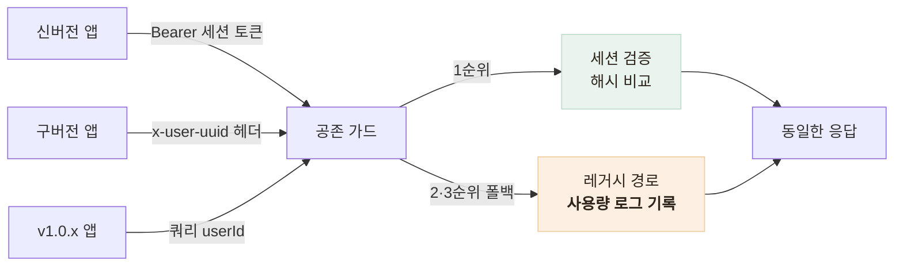

# 구버전 앱을 끊지 않고 인증 체계를 통째로 교체했다

> 이미 스토어에 배포된 앱들이 옛 방식으로 호출하는 상태에서, 취약한 UUID 인증을 세션 토큰으로 무중단 전환한 기록

## 한눈에

| | |
|---|---|
| **문제** | UUID를 요청에 그대로 실어 보내는 구조 — 값이 노출되면 타인 계정 조작 가능 |
| **제약** | 서버만 바꾸면 업데이트 안 한 기존 사용자 전원이 로그아웃된다 |
| **해법** | 신·구 인증을 동시에 받는 **공존 가드** + 레거시 사용량 로그로 제거 시점 판단 |
| **결과** | 전환 기간 포함 인증 장애 0건, 레거시 코드는 추적 후 계획적으로 제거 |

## 무엇이 위험했나

돈가스 지도는 가입 마찰을 없애려고 **비로그인 UUID 회원제**로 출시했다. 문제는 이 UUID를 요청 body와 쿼리에 그대로 실어 보냈다는 것 — UUID는 사실상 비밀번호인데 평문 식별자처럼 다뤄지고 있었다.

| 취약점 | 가능한 공격 |
|---|---|
| userId를 쿼리로 신뢰 | 남의 즐겨찾기 삭제·조회 |
| UUID 노출 시 | 계정 통째로 탈취 |
| 세션 개념 부재 | 만료·강제 로그아웃 불가 |

## 왜 그냥 바꾸면 안 됐나

서버가 새 인증만 받도록 바꾸는 것은 코드 몇 줄이다. 하지만 앱은 강제 업데이트가 없다 — 배포된 구버전 앱들은 계속 옛 방식으로 호출한다. **서버 계약을 바꾸는 순간 업데이트 안 한 전원이 끊긴다.**

## 선택 — 공존 가드

| 후보 | 판단 |
|---|---|
| 일괄 교체 + 강제 업데이트 | 기존 사용자 전원 차단 — 기각 |
| JWT | 서버가 발급 후 강제로 무효화할 수 없다 — 기각 |
| **세션 토큰 + 공존 가드** | 즉시 무효화 가능, 구버전은 폴백으로 수용 — **채택** |

토큰은 `crypto.randomBytes(32)`(256비트)로 만들고 DB에는 **SHA-256 해시만** 저장했다. 유출돼도 원본을 복구할 수 없고, 비교는 타이밍 공격을 막는 `timingSafeEqual`로 한다.

핵심은 폴백 경로에 남긴 **`[LEGACY AUTH]` 사용량 로그**다. "레거시를 언제 제거해도 되는가"를 감이 아니라 로그 수치로 판단할 수 있게 했고, 취약한 경로를 한시적으로 열어두는 대가를 추적 가능성으로 상쇄했다.

## 전환 중에 배운 것 — 필드는 지우는 게 아니었다

전환 작업 중 DTO에서 userId 필드를 제거했다가, 그 필드를 여전히 보내는 구버전 요청이 거부될 수 있음을 확인하고 같은 날 **optional로 복원**했다. 이 실수에서 나온 원칙이 이후 프로젝트 전체의 규칙이 됐다:

> 기존 요청 필드는 제거가 아니라 optional 유지. 기존에 성공하던 요청은 새 검증 때문에 실패하면 안 된다.

## 이후의 진화

| 시점 | 변화 |
|---|---|
| 출시 초기 | 만료 없는 세션 (`expiresAt: null`) |
| 보안 하드닝 | 절대 만료 180일 + 유휴 만료 90일 이중 정책 |
| 알림 중복 수정 | 유저당 세션 1개로 단일화 |

앱 쪽에는 세션이 만료돼도 사용자가 모르게 지나가도록 **401 자동 복구**를 넣었다 — 동시에 여러 요청이 401을 받아도 재발급은 단 한 번만 일어나게(single-flight) 모듈 레벨 promise로 합치고, 재시도 루프는 3중 가드로 차단했다.

## 남은 한계

- UUID 기반 익명 모델 자체(로컬 값 소실 = 계정 소실)는 유지 — 이 한계는 이후 카카오 계정 백업·복구로 보완했다
- 설계 문서의 단계적 제거 로드맵보다 이르게 레거시를 제거했다 — 출시 2주 차로 사용자가 적던 시점이지만, 판단 근거 로그를 남기지 않은 점은 아쉬움으로 기록
