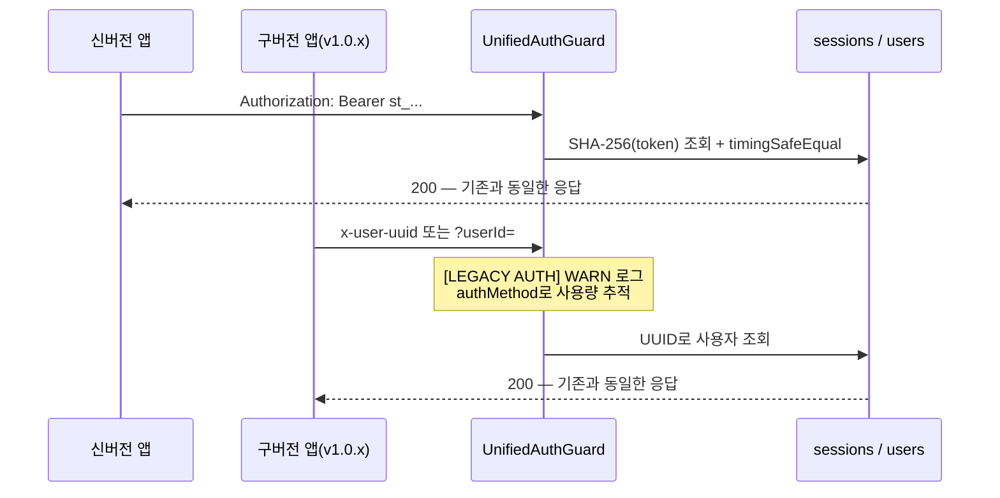

# 구버전 앱을 유지하며 인증 체계를 교체했습니다

> 이미 스토어에 배포된 앱들이 옛 방식으로 호출하는 상태에서, 취약한 UUID 인증을 세션 토큰으로 무중단 전환한 기록입니다.

## 한눈에

|          |                                                                               |
| -------- | ----------------------------------------------------------------------------- |
| **문제** | UUID를 요청에 그대로 실어 보내는 구조 — 값이 노출되면 타인 계정 조작 가능     |
| **제약** | 서버만 바꾸면 업데이트하지 않은 기존 사용자 전원의 로그인 상태가 끊길 수 있음 |
| **해법** | 신·구 인증을 동시에 받는 **공존 가드** + 레거시 사용량 로그로 제거 시점 판단  |
| **검증** | 전환 기간을 포함해 6개월 이상 운영 시점까지 서버 기인 장애 0건                |

## 무엇이 위험했나

돈가스 지도는 가입 마찰을 없애기 위해 **비로그인 UUID 회원제**, 즉 로그인 없이 계정을 만드는 **게스트 로그인 방식**으로 출시했습니다. UUID를 최초 한 번 생성해 AsyncStorage에 보관하고, 이후 동일 사용자를 식별하는 데 활용했습니다.

문제는 이 UUID를 요청 body와 쿼리에 그대로 실어 보냈다는 점이었습니다. 초기 구조에서는 이 값이 사실상 인증 수단 역할을 했는데, 비밀번호처럼 보호해야 할 값을 평문 식별자처럼 다루고 있었습니다.

실제 피해가 발생한 뒤 대응한 사례가 아니라, 타인 데이터 조작·UUID 노출 시 계정 탈취·세션 무효화 불가라는 구조적 위험을 사고 전에 제거한 전환입니다.

| 취약점               | 가능한 공격             |
| -------------------- | ----------------------- |
| userId를 쿼리로 신뢰 | 남의 즐겨찾기 삭제·조회 |
| UUID 노출 시         | 계정 통째로 탈취        |
| 세션 개념 부재       | 만료·강제 로그아웃 불가 |

## 왜 바로 바꾸면 안 됐나

서버가 새 인증만 받도록 바꾸는 일은 코드 몇 줄로 가능합니다. 하지만 앱은 강제 업데이트가 없습니다. 배포된 구버전 앱들은 계속 옛 방식으로 호출하므로, **서버 계약을 바꾸는 순간 업데이트하지 않은 사용자 전원이 끊길 수 있습니다.**

## 선택 — 공존 가드

| 후보                      | 판단                                                                    |
| ------------------------- | ----------------------------------------------------------------------- |
| 일괄 교체 + 강제 업데이트 | 기존 사용자 전원을 차단하므로 기각했습니다                              |
| JWT                       | 서버가 발급 후 강제로 무효화할 수 없어 기각했습니다                     |
| **세션 토큰 + 공존 가드** | 즉시 무효화할 수 있고 구버전은 폴백으로 수용할 수 있어 **채택했습니다** |

세션을 서버에서 관리하면서 **접속 환경과 만료·최근 사용 시각도 함께 기록해 세션 상태를 추적할 수 있다는 점**도 선택 이유였습니다.

토큰은 `crypto.randomBytes(32)`(256비트)로 만들고 DB에는 **SHA-256 해시만** 저장했습니다. 유출돼도 원본을 복구할 수 없으며, 비교에는 타이밍 공격을 막는 `timingSafeEqual`를 사용했습니다.

## 전환 구조

핵심은 폴백 경로에 남긴 **`[LEGACY AUTH]` 사용량 로그**였습니다. 레거시 사용률을 확인해 제거 시점을 판단하도록 설계했고, 취약한 경로를 한시적으로 열어두는 대가를 추적 가능성으로 상쇄하려 했습니다.

## 검증 결과

배포 체크리스트에는 `POST /session/init`으로 세션 토큰을 발급한 뒤 Bearer 요청을 확인하고, 같은 API를 `x-user-uuid` 레거시 경로로도 호출해 `[LEGACY AUTH]` 경고 로그까지 확인하는 절차를 넣었습니다. 신·구 경로가 모두 동작하는 것이 배포 조건이었습니다.

전환 기간을 포함해 6개월 이상 운영한 시점까지 **서버 기인 장애는 0건**이었습니다. 구버전과 신버전이 같은 응답 계약을 유지한 채 인증 방식을 바꾼 결과입니다.

이후에는 이런 변경에서도 **제거 전 사용량을 먼저 측정하고 근거를 남기는 것**이 필요하다는 점을 배웠습니다.

## 전환 중에 배운 것 — 삭제보다 공존

전환 작업 중 DTO에서 userId 필드를 제거했다가, 그 필드를 여전히 보내는 구버전 요청이 거부될 수 있음을 확인하고 같은 날 **optional로 복원**했습니다. 이 경험에서 나온 원칙은 이후 프로젝트 전체의 규칙이 되었습니다.

> 기존 요청 필드는 제거하기보다 optional로 유지합니다. 기존에 성공하던 요청은 새 검증 때문에 실패하면 안 됩니다.

## 운영하며 세션 구조를 계속 보완했습니다

초기에는 단순한 익명 세션으로 시작했지만, 실제 운영에서 발견한 문제에 맞춰 인증 구조도 계속 보완했습니다.

| 시점              | 변화                                                |
| ----------------- | --------------------------------------------------- |
| **출시 초기**     | 만료 없는 세션 (`expiresAt: null`)                  |
| **보안 강화**     | 절대 만료 180일 + 유휴 만료 90일 적용               |
| **알림 중복 대응** | 사용자당 세션 1개로 단일화                          |
| **계정 복구**     | 로컬 UUID 소실 문제를 카카오 계정 백업·복구로 보완 |

세션이 만료되더라도 사용 흐름이 끊기지 않도록 앱에는 **401 자동 복구**를 적용했습니다. 여러 요청이 동시에 401을 받아도 **세션 재발급은 한 번만 수행하고, 나머지 요청은 그 결과를 기다리도록 처리했습니다.**

초기 UUID 방식은 별도 가입 없이 시작할 수 있다는 장점이 있었지만, **앱의 로컬 데이터가 사라지면 기존 사용자를 복구하기 어렵다는 한계**가 있었습니다. 이후 카카오 계정 연동을 추가해 기존 데이터를 다시 찾을 수 있도록 보완했습니다.
