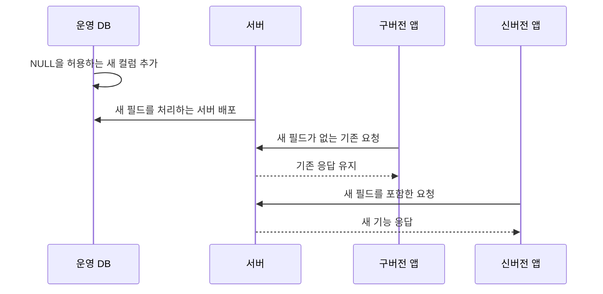

# 운영 중에도 기존 앱을 깨뜨리지 않는 DB 변경

> 마이그레이션 **25건**, 기존 컬럼 삭제·이름 변경·타입 축소 **0건**

돈가스 지도에는 이미 저장된 사용자 데이터가 있었고, 업데이트하지 않은 **구버전 앱도 계속 서버를 사용하고 있었습니다.**

그래서 프로필 사진·재방문 의사·웨이팅처럼 새로운 필드를 추가할 때도 DB 컬럼만 바꾸는 것으로 끝낼 수 없었습니다. **기존 데이터와 API 요청·응답이 그대로 동작하는지까지 함께 확인**하며 변경했습니다.

## 한눈에

| | |
|---|---|
| **상황** | 서비스 운영 중 새로운 필드를 계속 추가해야 했습니다. |
| **문제** | 기존 데이터와 업데이트하지 않은 구버전 앱이 함께 존재했습니다. |
| **기준** | 기존 구조의 의미를 바꾸지 않고 새 필드와 동작을 추가했습니다. |
| **결과** | 마이그레이션 25건 중 컬럼 삭제·이름 변경·타입 축소가 0건이었습니다. |

## 필드를 추가할 때 지킨 4가지 기준

예를 들어 프로필 사진 기능을 추가할 때, 이미 저장된 사용자 데이터와 구버전 앱을 함께 보호하기 위해 다음 네 가지 기준을 적용했습니다. 이후 재방문 의사와 웨이팅 기능에도 같은 방식을 사용했습니다.

| | 기준 | 이유 |
|---|---|---|
| **1** | 새 컬럼은 **`NULL`을 허용** | 기존 데이터에 값을 강제로 채우지 않아도 됩니다. |
| **2** | 기존 응답 필드는 **변경하지 않음** | 구버전 앱이 기존 응답을 그대로 사용할 수 있습니다. |
| **3** | 새 요청 필드는 **선택값으로 추가** | 새 필드를 보내지 않는 구버전 요청도 계속 성공합니다. |
| **4** | **기존 형태의 요청도 테스트** | 변경 후에도 이전 요청이 그대로 동작하는지 확인합니다. |

프로필 사진처럼 새로운 동작이 필요한 기능은 기존 API의 의미를 바꾸지 않고 `POST /users/me/profile-photo`를 별도로 추가했습니다.

당시 `users` 테이블에는 이미 **1,813행**이 저장되어 있었습니다. 새 컬럼이 `NULL`을 허용하도록 만들어 기존 데이터는 별도로 수정하지 않고 유지했습니다.

## 이 기준을 25번의 DB 변경에 적용했습니다

서비스 운영 중 25번의 마이그레이션을 진행하면서, **기존 컬럼을 삭제하거나 이름을 바꾸지 않았습니다.** 새 기능은 기존 데이터와 구버전 앱에 영향을 줄 가능성을 줄이기 위해 필요한 필드나 테이블을 추가하는 방식으로 확장했습니다.

| 기능 | 추가한 항목 | 기존 구조를 유지한 방법 |
|---|---|---|
| **프로필 사진** | `users` 테이블에 `profile_photo_url` 컬럼 추가 | `NULL`을 허용해 기존 사용자 데이터는 수정하지 않았습니다. |
| **웨이팅·재방문 의사** | `tasting_notes` 테이블에 `waiting`, `revisit` 컬럼 추가 | 두 컬럼을 선택값으로 두어 구버전 요청도 그대로 저장됐습니다. |
| **영업시간·메뉴** | `restaurant_hours`, `restaurant_menus` 테이블 추가 | 기존 `restaurants` 테이블을 바꾸지 않고 별도 테이블로 분리했습니다. |
| **푸시 알림** | `user_push_tokens`, `user_notification_settings` 테이블 추가 | 기존 `users` 테이블을 바꾸지 않고 토큰과 알림 설정을 별도로 관리했습니다. |

## DB → 서버 → 앱 순서로 배포했습니다

새 필드가 없어도 기존 서비스가 계속 동작하도록 만든 뒤, 다음 순서로 배포했습니다.

**DB에 새 컬럼 추가 → 새 필드를 처리하는 서버 배포 → 신버전 앱 출시** 순서로 진행했습니다. 이 과정에서도 서버는 새 필드를 보내지 않는 구버전 요청을 계속 받아들였습니다.

## 때로는 DB 제약을 추가하지 않는 쪽을 선택했습니다

닉네임 중복 방지도 같은 기준으로 판단했습니다.

DB에 유일값 제약을 추가하는 것이 가장 확실했지만, 당시 운영 데이터에는 이미 중복 닉네임이 있었습니다. 바로 제약을 추가하면 마이그레이션이 실패하거나 기존 사용자의 데이터를 임의로 수정해야 했습니다.

그래서 기존 데이터는 유지하고, **닉네임을 새로 변경하는 시점부터 서버에서 중복 여부를 확인하는 방식**을 선택했습니다.

완전한 해결은 아니었습니다. 동시에 같은 닉네임을 저장하는 요청까지 DB 수준에서 막을 수는 없었기 때문에, 기존 중복을 정리한 뒤 DB 제약을 추가하는 것을 다음 단계로 남겼습니다.

## 마이그레이션이 실제 운영 DB에 적용됐는지도 확인합니다

푸시 발송 진행률 기능을 배포한 직후 상태 조회 API가 `500`을 반환하며 진행 바가 0%에서 멈췄습니다.

확인해보니 **마이그레이션 파일은 만들어져 있었지만, 실제 배포 설정에는 이를 실행하는 단계가 없었습니다.** 문서에는 서버 시작 시 적용한다고 적혀 있었지만 Dockerfile은 `node dist/main.js`만 실행하고 있어, 새로 만든 `push_dispatches` 테이블이 운영 DB에는 존재하지 않았습니다.

`prisma migrate status`로 기존 25건은 모두 적용됐고 **신규 1건만 대기 중인 상태**임을 확인한 뒤 적용했고, API가 다시 `200`을 반환하는 것까지 확인했습니다.

이후에는 DB 변경 파일만 확인하지 않고, **배포 전후 실제 운영 DB의 적용 상태와 관련 API 응답까지 함께 확인**하고 있습니다.

## 구버전 요청이 계속 동작하는지 자동으로 확인합니다

| 기능 | 구버전과 같은 조건 | 확인 내용 |
|---|---|---|
| **웨이팅·재방문 의사 생성** | 새 필드를 보내지 않음 | 요청이 정상적으로 성공하는지 확인합니다. |
| **웨이팅·재방문 의사 수정** | 새 필드를 보내지 않음 | 기존 값이 의도치 않게 바뀌지 않는지 확인합니다. |
| **프로필 사진 조회** | 기존 사용자의 값이 `NULL` | `profilePhotoUrl: null`로 정상 응답하는지 확인합니다. |

현재는 **구버전과 같은 형태의 요청을 서버에 보내 요청·응답 호환성을 자동으로 확인**하고 있습니다. 실제 이전 버전의 앱 자체를 실행하는 수준까지 자동화하지는 못했지만, **기존에 성공하던 요청은 계속 성공해야 한다는 기준**은 테스트로 남겨두었습니다.
