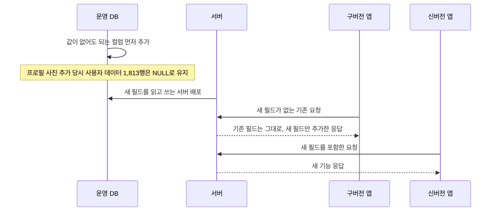

# "컬럼 하나 추가"가 한 줄이 아닌 이유 — 하위 호환 4원칙으로 마이그레이션 25건 파괴적 변경 0건

> 운영 DB와 업데이트하지 않은 구버전 앱이 공존하는 서비스에서, 기존 데이터를 깨뜨리지 않는 필드 추가 절차를 만들고 마이그레이션 25건을 파괴적 변경 없이 유지한 기록입니다.

## 한눈에

| | |
|---|---|
| **상황** | 프로필 사진·재방문 의사·웨이팅처럼 필드를 추가하는 요구가 반복됐습니다 |
| **문제** | SQL은 한 줄이지만 프로필 사진 추가 당시 사용자 데이터 1,813행과 구버전 앱의 요청·응답을 함께 보호해야 했습니다 |
| **해법** | 값이 없어도 되는 컬럼 추가 → 기존 응답 유지 → 새 요청 필드는 선택값 → 구버전 요청 테스트의 4원칙을 적용했습니다 |
| **검증** | 마이그레이션 25건을 전수 확인한 결과 DROP·이름 변경·타입 축소가 0건이었습니다 |

## 한 줄을 쓰기 전에 정해야 하는 것들

`ALTER TABLE ... ADD COLUMN` 자체는 한 줄입니다. 하지만 운영 DB에 컬럼을 추가하기 전에는 이미 저장된 데이터에 어떤 값이 들어갈지, 기존 API와 화면이 새 필드를 어떻게 받아들일지, 새 필드를 보내지 않는 구버전 앱이 계속 동작할지를 먼저 결정해야 합니다.

이 질문에 매번 새로 답하지 않도록 프로필 사진 기능을 만들면서 절차를 정했고, 이후 재방문 의사와 웨이팅 필드를 추가할 때도 같은 기준을 적용했습니다.

## 기존 데이터와 구버전 앱을 지키는 4원칙

| # | 원칙 | 이유 |
|---|---|---|
| 1 | DB에는 **값이 없어도 되는 컬럼**만 추가 | 기존 행은 별도 값 채우기 없이 `NULL` 상태로 유지할 수 있습니다 |
| 2 | 응답은 **기존 필드를 바꾸지 않고 새 필드만 추가** | 구버전 앱은 모르는 필드를 무시하고 기존 응답을 그대로 사용할 수 있습니다 |
| 3 | 새 요청 필드는 **선택값으로 처리** | 새 필드를 보내지 않는 구버전 요청도 이전과 동일하게 성공합니다 |
| 4 | **구버전 요청 테스트**를 함께 추가 | 필드가 없는 요청이 계속 성공하는지 자동으로 확인합니다 |

프로필 사진처럼 새로운 동작이 필요한 경우에는 기존 API의 의미를 바꾸지 않고 `POST /users/me/profile-photo`를 별도로 추가했습니다. 값이 없어도 되는 컬럼을 선택한 대신, 이 필드를 읽는 코드에서는 값이 없는 경우를 항상 처리해야 한다는 비용도 감수했습니다.

배포 순서도 **컬럼 먼저 적용 → 서버 배포 → 앱 출시**로 정했습니다. 새 컬럼은 값이 없어도 되므로 기존 서버가 동작하는 동안 먼저 적용할 수 있고, 서버는 구버전 요청을 계속 받으면서 새 필드를 추가로 응답합니다.

## 신버전과 구버전이 공존하는 배포 흐름

구버전 요청에서는 **새 필드 없이도 성공하는지**, 기존 사용자의 새 컬럼은 **`NULL`로 조회되는지**, 수정 요청에서 새 필드를 보내지 않으면 **기존 값이 바뀌지 않는지**를 반복해서 확인했습니다.

## 원칙이 ‘하지 않기’를 고르게 한 사례 — 닉네임 중복

닉네임 중복 확인을 추가할 때 가장 간단한 방법은 DB에 유일값 제약을 거는 것이었습니다. 하지만 운영 DB에는 이미 중복 닉네임이 있어, 제약을 바로 적용하면 마이그레이션이 실패하거나 기존 사용자의 데이터를 임의로 바꿔야 했습니다.

| 후보 | 판단 |
|---|---|
| DB 유일값 제약 즉시 적용 | 기존 중복 데이터 때문에 적용할 수 없어 기각했습니다 |
| 기존 중복 닉네임을 강제로 변경한 뒤 적용 | 사용자 데이터를 임의로 바꾸게 되어 기각했습니다 |
| **닉네임 변경 시점에만 서버에서 중복 확인** | 기존 데이터는 유지하고 새로운 중복만 차단할 수 있어 **채택했습니다** |

이 방식은 두 사용자가 같은 닉네임을 동시에 저장하면 둘 다 통과할 수 있다는 한계가 있습니다. 기존 중복을 정리한 뒤 컬럼을 확장하고, 데이터를 채운 다음 DB 제약을 적용하는 순서를 후속 계획으로 남겼습니다.

## 검증 결과와 남은 한계

- `prisma/migrations` 25건을 전수 확인한 결과, 기존 컬럼을 삭제하거나 이름을 바꾸고 타입을 축소한 변경은 **0건**이었습니다.
- 인덱스는 운영 테이블이 오래 잠기는 것을 줄이기 위해 `CREATE INDEX CONCURRENTLY`로 추가했습니다.
- 마이그레이션 SQL에는 기존 데이터와 구버전 앱에 영향을 주지 않는다는 변경 의도를 주석으로 남겼습니다.

다만 안전한 변경 파일을 만드는 것과 운영 DB에 빠짐없이 적용하는 것은 별개의 문제였습니다. 이후 발송 진행 기록 테이블을 추가했을 때 배포 과정에서 마이그레이션이 누락되어 진행 조회가 **4회 연속 500**을 반환했습니다. `prisma migrate status`로 기존 25건은 적용됐고 신규 1건만 빠졌음을 확인한 뒤 해당 변경만 적용해 정상 응답으로 복구했습니다.

이 경험 이후에는 변경 내용뿐 아니라 **배포 전후에 실제 DB 적용 상태까지 확인해야 한다**는 점을 함께 기록했습니다. 필드 추가로 인한 구버전 장애를 별도로 집계한 자료는 없으며, 구버전 요청 검증도 단위 테스트에 의존하고 있어 실제 구버전 요청 전체를 실행하는 테스트는 앞으로 보완해야 합니다.
