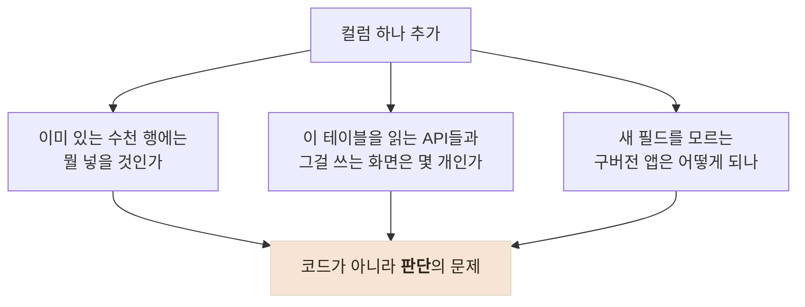

# "컬럼 하나 추가"가 한 줄이 아닌 이유

> 운영 DB와 업데이트 안 한 구버전 앱이 공존하는 서비스에서, 필드 추가의 표준 절차를 만들어 마이그레이션 25건을 파괴적 변경 0건으로 유지한 기록

## 한눈에

| | |
|---|---|
| **상황** | 프로필 사진·재방문 의사·웨이팅 등 "필드 하나만 추가" 요구가 반복 |
| **문제** | 컬럼 추가 자체는 SQL 한 줄이지만, 기존 행과 구버전 앱의 계약이 걸려 있다 |
| **해법** | nullable 컬럼 → additive 응답 → optional 요청 → 구버전 payload 회귀 테스트 **4원칙** |
| **결과** | 마이그레이션 **25건 전부 additive** — DROP·rename·타입 변경 0건, 필드 추가로 인한 구버전 장애 0건 |

## 한 줄을 쓰기 전에 정해야 하는 것들

`ALTER TABLE ... ADD COLUMN`은 정말 한 줄이다. 문제는 그 한 줄 앞의 질문들이다.

이 질문에 매번 새로 답하는 대신, 프로필 사진 기능을 만들며 절차로 굳혔다.

## 4원칙

| # | 원칙 | 이유 |
|---|---|---|
| 1 | DB는 **nullable 컬럼만** 추가 | NULL 자체가 "값 없음"의 의미 — 기존 행 백필 불필요 |
| 2 | 응답은 **필드 추가만** | 구버전 앱은 모르는 필드를 무시한다. 기존 필드는 절대 불변 |
| 3 | 새 요청 필드는 **optional** | 필드 없는 구버전 요청도 이전과 똑같이 성공해야 한다 |
| 4 | **구버전 payload 회귀 테스트** 동반 | "새 필드를 안 보내는 요청이 성공한다"를 테스트로 고정 |

배포 순서도 원칙에 포함된다: **컬럼 선적용 → 서버 배포 → 앱 릴리즈.** nullable이라 기존 서버는 새 컬럼을 읽지 않으므로 어느 시점에 끼어들어도 안전하다.

이 절차는 재방문 의사(revisit)·웨이팅(waiting) 필드 추가에서 같은 테스트 세트("필드 없는 요청 성공 / 기존 유저는 null / update에 미포함 시 무건드림")로 반복되며 패턴으로 정착했다.

## 원칙이 "하지 않기"를 고르게 한 사례 — 닉네임 중복

닉네임 중복 확인을 넣을 때 가장 쉬운 답은 DB 유니크 제약이었다. 하지만 **운영 DB에 이미 중복 닉네임이 존재**했다 — 제약을 걸면 마이그레이션이 실패하거나 기존 데이터가 깨진다.

| 후보 | 판단 |
|---|---|
| `@@unique` 제약 즉시 도입 | 기존 중복 행에서 실패 — 기각 |
| 기존 중복 강제 정리 후 제약 | 사용자 닉네임을 임의로 바꾸게 됨 — 기각 |
| **변경 시점에만 앱 레벨 검사** | 기존 데이터 무접촉, 신규 중복만 차단 — **채택** |

동시에 같은 닉네임을 저장하는 극단적 동시 요청은 이론상 통과할 수 있다는 **race condition을 문서에 인정**하고, "기존 중복 정리 → 확장 → 백필 → 제약"의 단계적 도입 계획을 남겼다. 완벽한 해법보다, 지금 데이터를 깨뜨리지 않는 해법을 골랐다.

## 검증

- `prisma/migrations` 25건 전수: CREATE TABLE 또는 nullable ADD COLUMN뿐 — DROP·rename·타입 축소 0건
- 인덱스 추가는 운영 테이블 잠금을 피해 `CREATE INDEX CONCURRENTLY`
- 마이그레이션 SQL마다 의도 주석: "기존 행/구버전 앱에 영향 없음", "Additive-only"

## 남은 한계

- 호환성 검증이 단위 테스트에 의존 — 구버전 payload E2E 스위트는 규약만 있고 자산이 적다
- 닉네임 기존 중복은 의도적으로 미정리 상태 — 단계적 도입 계획만 존재
