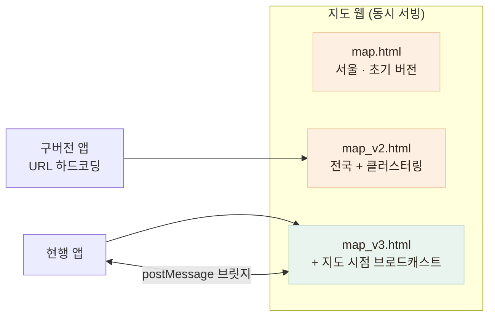

# 지도를 세 버전 동시에 서빙하는 이유

> 핵심 화면인 지도를 WebView + 별도 배포 웹으로 분리하고, 앱 바이너리에 URL이 박힌 구버전 사용자를 위해 HTML 세 개를 함께 서빙하는 구조

## 한눈에

| | |
|---|---|
| **구조** | 지도는 앱이 아니라 별도 배포되는 Kakao 지도 웹 — 앱은 WebView로 로드 |
| **문제** | 배포된 앱 바이너리에 지도 URL이 하드코딩 — 기존 HTML을 고치면 구버전 화면이 예고 없이 바뀐다 |
| **해법** | 동작이 바뀌는 변경은 항상 **새 파일**(map → v2 → v3), 세 파일 동시 서빙 |
| **결과** | 전국 확장·클러스터링 같은 지도 개선을 **앱 심사 없이** 배포하면서 구버전 화면 회귀 0건 |

## 왜 지도를 웹으로 분리했나

지도는 이 서비스의 핵심 화면이고, 개선 주기가 가장 짧다. 앱에 내장하면 수정 하나마다 스토어 심사를 기다려야 한다. Kakao 지도의 RN 공식 SDK 부재라는 제약도 있어, JS SDK를 쓰는 정적 웹으로 만들고 앱이 WebView로 감싸는 구조를 선택했다 — **지도 수정이 웹 배포만으로 반영**된다.

## 분리의 대가 — 버전을 지울 수 없다

배포된 앱 바이너리에는 지도 URL이 문자열로 박혀 있다. 구버전 앱은 여전히 `map_v2.html`을 로드한다. 즉 **기존 HTML을 고치는 순간, 업데이트 안 한 사용자의 지도가 예고 없이 바뀐다.**

| 후보 | 판단 |
|---|---|
| 기존 HTML을 계속 수정 | 구버전 사용자 화면이 통제 없이 변함 — 기각 |
| 리다이렉트로 최신만 서빙 | 구버전 앱 브릿지 계약과 어긋나면 화면 깨짐 — 기각 |
| **동작 변경마다 새 파일 추가** | 구버전 화면 동결, 유지보수 비용은 감수 — **채택** |

이 원칙의 직접 증거가 커밋에 남아 있다: 클러스터링 기준을 바꾸는 커밋이 **v3만 수정하고 v2는 건드리지 않았다.** 서버의 하위호환 원칙(additive-only)이 정적 웹에서는 "파일 버전 분리"라는 형태로 나타난 것이다.

## 앱 ↔ 지도 웹 통신

| 방향 | 메시지 | 용도 |
|---|---|---|
| 앱 → 웹 | UPDATE_RESTAURANTS | 필터링된 전국 핀 + 즐겨찾기 표시 |
| 앱 → 웹 | PAN_TO (yOffset 포함) | 바텀시트 높이만큼 핀 시점 보정 |
| 웹 → 앱 | SHOW_DIRECTIONS | 핀 탭 → 가게 상세 모달 |
| 웹 → 앱 | MAP_CENTER_CHANGED | "현 지도에서 검색" 버튼 노출 판단 |

초기화 타이밍 문제(지도가 뜨기 전에 앱이 메시지를 보내는 레이스)는 웹 쪽에서 **도착 메시지를 큐에 쌓았다가 지도 준비 후 재생**하는 방식으로 해결했다. 지도 HTML 캐시는 URL 버전 쿼리로 무효화한다.

## 남은 한계

- 세 HTML 간 공통 코드 중복 — 공통 버그는 여러 파일에 반영해야 한다
- 핀 갱신 시 마커 전체 재생성 비용은 우선순위 판단으로 의도적으로 보류 (기록만 남김)
