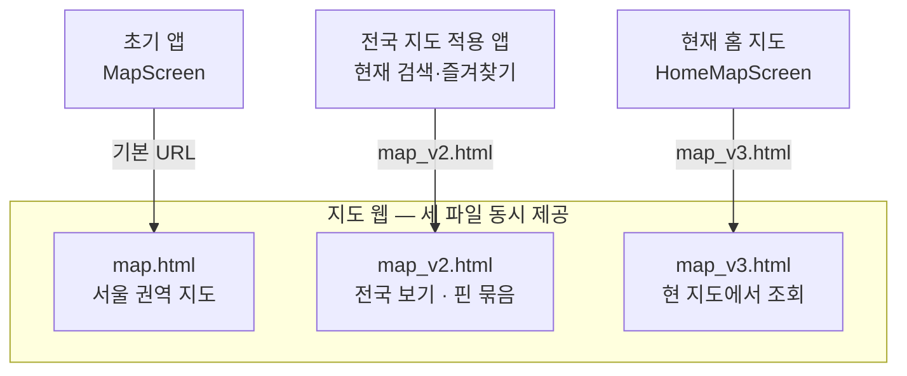
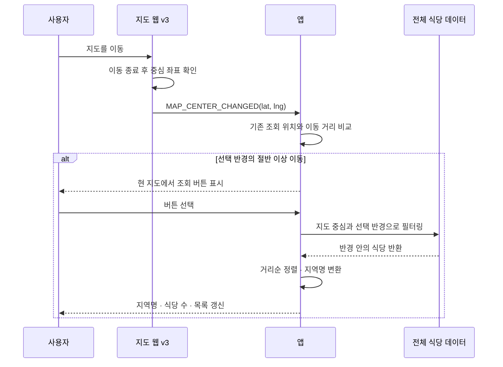

# 구버전 앱의 지도를 유지하며 새 지도 기능을 배포했습니다

> 앱에서 사용하는 지도 화면을 별도 웹으로 분리하고, **구버전 앱이 기존 지도를 계속 사용할 수 있도록 지도 파일을 버전별로 나눠 운영한 과정**입니다.

## 한눈에

| | |
|---|---|
| **구조** | 앱은 별도 배포되는 Kakao 지도 웹을 WebView로 불러옵니다 |
| **문제** | 기존 HTML을 바꾸면 업데이트하지 않은 앱의 지도까지 예고 없이 달라집니다 |
| **해법** | 지도 동작이 달라질 때 기존 파일을 수정하지 않고 새 버전 파일을 추가했습니다 |
| **결과** | 새 지도 기능을 추가하면서도 구버전 앱의 지도 화면은 그대로 유지했습니다 |

## 왜 지도만 웹으로 분리했나

지도는 핀·클러스터링·검색 범위처럼 개선이 잦은 핵심 화면입니다. 실제 구현은 Kakao JavaScript SDK를 정적 웹에서 실행하고 앱이 WebView로 감싸는 구조이며, 지도 수정은 웹만 다시 배포해 반영할 수 있습니다.

대신 **각 앱 버전은 배포 당시 정해진 지도 파일을 계속 불러옵니다.** 초기 앱의 `MapScreen`은 기본 경로의 `map.html`을 사용했고, 전국 지도를 적용하면서 `map_v2.html`로 바뀌었습니다.

새로 만든 홈 지도인 `HomeMapScreen`은 `map_v3.html`을 사용합니다. 현재 앱에서도 검색·즐겨찾기 지도는 기존 `MapScreen`을 재사용하기 때문에 `v2`를 함께 유지하고 있습니다.

## 지도 기능이 달라질 때 새 파일을 추가했습니다

| 지도 파일 | 달라진 기능 | 연결된 화면 |
|---|---|---|
| **`map.html`** | 서울 권역과 구 경계, 개별 식당 핀을 보여주는 초기 지도 | 초기 앱의 `MapScreen` |
| **`map_v2.html`** | 전국 보기와 핀 클러스터링 추가, 초기화 전 메시지 보관 | 전국 지도 적용 앱과 현재 검색·즐겨찾기의 `MapScreen` |
| **`map_v3.html`** | 지도 중심 좌표를 앱에 전달해 **현 지도에서 조회** 기능 지원 | 현재 홈의 `HomeMapScreen` |

| 후보 | 판단 |
|---|---|
| 기존 HTML을 계속 수정 | 업데이트하지 않은 앱의 지도까지 함께 바뀌어 제외했습니다. |
| 구버전 앱도 최신 지도 파일을 사용 | 앱과 지도 사이의 통신 방식이 달라질 경우 기존 화면이 깨질 수 있어 제외했습니다. |
| **기능 변화가 클 때 새 지도 파일 추가** | **기존 앱의 화면을 유지할 수 있어 채택했습니다.** 대신 버전별 파일을 함께 관리해야 합니다. |

실제로 클러스터링 기준을 변경할 때도 **`v3`만 수정하고 기존 앱과 검색·즐겨찾기 화면이 사용하는 `v2`는 그대로 유지했습니다.**

## 앱과 지도 웹은 메시지를 주고받습니다

앱과 지도 웹은 `postMessage`로 식당·즐겨찾기 정보와 지도 위치 등을 주고받습니다.

지도가 아직 준비되지 않은 상태에서 메시지가 도착하면 **바로 처리하지 않고 임시로 보관했다가, 초기화가 끝난 뒤 도착한 순서대로 처리**했습니다.

### 예: ‘현 지도에서 조회’ 기능

`v3`에서는 사용자가 지도를 움직인 뒤 손을 떼면, 지도 웹이 **현재 중심 좌표를 앱으로 전달**합니다.

앱에서는 기존 조회 위치와 새 중심점 사이의 거리를 비교해, **선택한 검색 반경의 절반 이상 이동했을 때만 `현 지도에서 조회` 버튼을 표시**했습니다. 지도를 조금 움직일 때마다 목록이 계속 바뀌는 것을 막기 위해서입니다.

사용자가 버튼을 누르면 새 중심 좌표를 조회 기준으로 바꾸고, 이미 불러온 식당 중 **선택한 반경 안에 있는 식당만 다시 골라 거리순으로 정렬**합니다. 이후 지역명과 식당 수, 목록도 함께 갱신합니다.

## 운영하면서 남은 과제

큰 구조 변화에는 새 지도 파일과 앱 버전이 필요했지만, 한 번 연결된 뒤에는 **웹 내부 수정만으로 빠르게 개선**할 수 있었습니다. 대신 버전별 HTML을 함께 관리해야 하는 비용이 생겼습니다.

- 버전별 HTML에 공통 코드가 중복되어 **같은 수정이 여러 파일에 필요할 수 있습니다.**
- 오래된 지도 파일에는 **현재 사용하지 않는 코드가 일부 남아 있습니다.**
- **구버전 앱까지 자동으로 확인하는 테스트는 아직 마련하지 못했습니다.**
