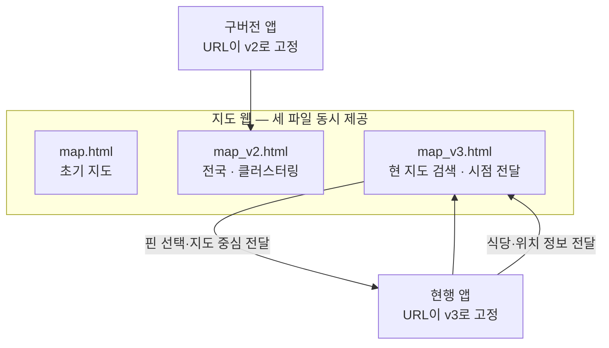

# 구버전 앱의 지도를 유지하며 새 지도 기능을 배포했습니다

> 지도 화면을 별도 웹으로 분리하고, 앱에 지도 URL이 고정된 구버전 사용자를 위해 `map.html`·`map_v2.html`·`map_v3.html`을 함께 제공한 기록입니다.

## 한눈에

| | |
|---|---|
| **구조** | 앱은 별도 배포되는 Kakao 지도 웹을 WebView로 불러옵니다 |
| **문제** | 기존 HTML을 바꾸면 업데이트하지 않은 앱의 지도까지 예고 없이 달라집니다 |
| **해법** | 지도 동작이 달라질 때 기존 파일을 수정하지 않고 새 버전 파일을 추가했습니다 |
| **결과** | 전국 확장·클러스터링·현 지도 검색 기능을 앱 심사 없이 배포하면서 구버전 화면을 그대로 유지했습니다 |

## 왜 지도만 웹으로 분리했나

지도는 핀·클러스터링·검색 범위처럼 개선이 잦은 핵심 화면입니다. 실제 구현은 Kakao JavaScript SDK를 정적 웹에서 실행하고 앱이 WebView로 감싸는 구조이며, 지도 수정은 웹만 다시 배포해 반영할 수 있습니다.

대신 배포된 앱에는 지도 파일의 URL이 문자열로 들어갑니다. 구버전 `MapScreen`은 `map_v2.html`, 현행 `HomeMapScreen`은 `map_v3.html`을 계속 요청하므로, 기존 파일을 바꾸면 업데이트하지 않은 사용자의 화면도 함께 바뀝니다.

## 앱 버전별로 지도 파일을 분리했습니다

| 후보 | 판단 |
|---|---|
| 기존 HTML을 계속 수정 | 구버전 화면까지 통제 없이 바뀌므로 기각했습니다 |
| 구버전 요청을 최신 파일로 이동 | 앱과 웹 사이의 메시지 형식이 다르면 화면이 깨질 수 있어 기각했습니다 |
| **동작이 달라질 때 새 파일 추가** | 구버전 화면을 유지할 수 있어 **채택했습니다**. 대신 세 파일의 유지 비용을 감수했습니다 |

클러스터링 시작 기준을 바꾼 실제 커밋에서도 `v3`만 수정하고 `v2`는 그대로 두었습니다. 구버전 보호가 문서상의 원칙이 아니라 파일 변경 범위로 지켜진 사례입니다.

## 앱과 지도 웹은 메시지로 통신합니다

| 방향 | 실제 동작 |
|---|---|
| 앱 → 지도 | 필터링된 식당과 즐겨찾기 정보 전달, 특정 위치로 이동, 내 위치 표시 |
| 지도 → 앱 | 선택한 식당 열기, 현재 지도 중심 좌표 전달 |

지도가 준비되기 전에 앱의 메시지가 도착하면 웹에서 잠시 보관했다가 초기화가 끝난 뒤 순서대로 처리했습니다. 앱은 지도 아래 바텀시트 높이를 함께 보내 선택한 핀이 가려지지 않도록 화면 중심도 보정했습니다.

## 확인된 결과와 남은 한계

전국 지도·클러스터링·현 지도에서 검색 기능은 앱 심사 없이 웹 배포로 반영했습니다. 다만 구버전 지도에서 문제가 발생하지 않았다는 별도 집계는 없어 **회귀 0건이라고 단정하지 않았습니다.**

- 세 HTML에 공통 코드가 중복되어 같은 버그를 여러 파일에서 고쳐야 합니다.
- 식당 핀을 갱신할 때 마커를 전부 다시 만드는 비용은 아직 측정하지 않았습니다.
- 초기 `v1` 파일에는 현재 사용하지 않는 코드가 일부 남아 있습니다.
