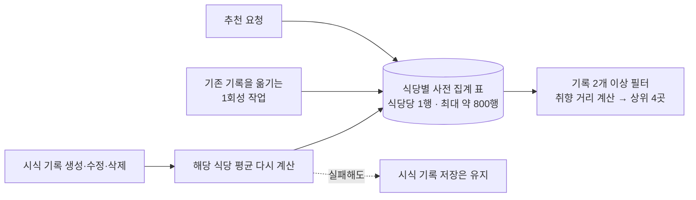

# 시식 기록을 바탕으로 취향에 맞는 식당을 추천했습니다

> 시식 기록 약 350건의 취향 데이터를 추천에 사용하면서, 요청마다 전체 기록을 계산하지 않도록 식당별 사전 집계 표와 기록 저장 시 갱신 방식을 선택한 과정입니다.

## 한눈에

| | |
|---|---|
| **요구** | 풍미·부드러움·육즙·바삭함·두께감으로 홈 화면의 식당 4곳을 추천합니다 |
| **규모** | 식당 약 800곳, 시식 기록 약 350건이었습니다 |
| **해법** | 식당별 평균을 미리 저장하고 기록이 바뀔 때 해당 식당 값만 다시 계산합니다 |
| **검증** | 추천 요청은 800행 이하의 표만 읽도록 바뀌었고 추천 단위 테스트 7건을 통과했습니다 |

## 다섯 개 대안을 비교했습니다

| 대안 | 판단 |
|---|---|
| 요청할 때마다 전체 시식 기록 집계 | 홈 화면을 열 때마다 같은 계산이 반복되어 기각했습니다 |
| **식당별 사전 집계 + 기록 변경 시 갱신** | 조회 범위가 식당당 1행으로 작고 변경 내용을 바로 반영할 수 있어 **채택했습니다** |
| 일정 시간마다 전체 집계 | 다음 실행 전까지 최신 기록이 반영되지 않아 보류했습니다 |
| `pgvector`와 벡터 인덱스 | 약 800개 식당에는 구조가 과하다고 판단해 수만 행 규모의 후보로 남겼습니다 |
| 사용자별 추천 결과 캐시 | 현재 규모에서는 계산이 수 ms라는 문서 기록을 근거로 보류했습니다 |

추천 거리는 유클리드·맨해튼·코사인을 비교해 유클리드를 선택했습니다. 기록이 1개뿐이면 평균이 크게 흔들릴 수 있어 최소 2개 기록이 있는 식당만 후보로 삼고, 선호 지역은 취향 점수를 뒤집지 않는 범위에서만 보조 점수로 사용했습니다.

## 기록 저장과 추천 조회를 분리했습니다

기존 기록은 읽기만 하고 새 표에 결과를 쓰는 1회성 작업으로 옮겼습니다. 이후에는 기록을 생성·수정·삭제할 때 해당 식당의 평균을 다시 계산하며, 기록의 식당이 바뀌면 이전 식당과 새 식당을 모두 갱신합니다.

## 추천 계산이 기록 저장을 막지 않게 했습니다

식당 평균 계산은 시식 기록 저장 뒤에 따라오는 작업입니다. 평균 계산에 실패해도 사용자의 기록 자체는 저장되도록 오류를 별도로 처리했고, **DB 계산이 실패해도 기록 저장 결과는 성공해야 한다**는 조건을 테스트로 남겼습니다.

구버전 앱은 새 추천 API를 호출하지 않으므로 기존 기능은 그대로 동작합니다.

## 확인된 결과와 남은 한계

- 요청 경로는 전체 시식 기록 집계에서 **800행 이하 사전 집계 표 조회**로 바뀌었습니다.
- 추천 계산 예시와 단위 테스트 7건은 확인했지만, 추천 API의 개선 전후 응답 시간은 측정하지 않았습니다.
- 기록이 2개 미만인 신규 식당은 추천 후보에서 제외됩니다.
- 식당 수가 수만 개로 늘어나면 `pgvector` 도입을 다시 검토해야 합니다.
