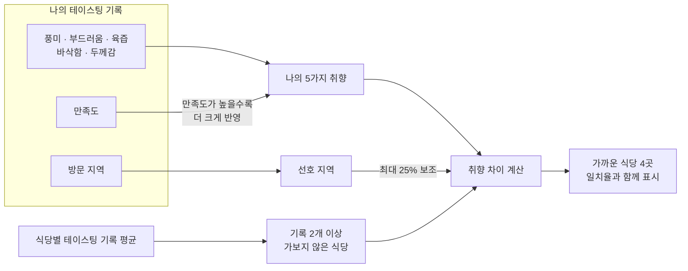
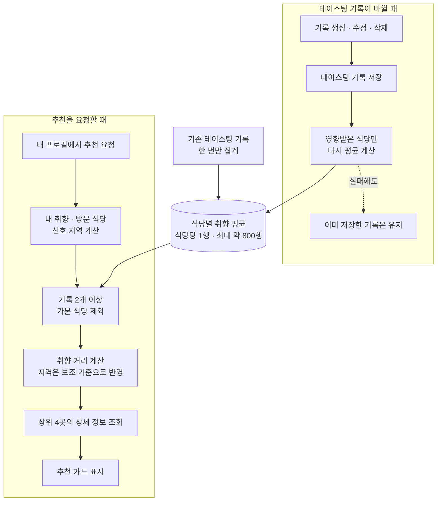

# 돈가스 테이스팅 기록을 바탕으로 취향에 맞는 식당을 추천하는 기능을 만들었습니다

> 사용자가 남긴 돈가스 테이스팅 기록에서 **돈가스 취향을 만들고, 아직 가보지 않은 식당 중 취향이 가까운 4곳을 추천**하는 기능을 구현했습니다. 추천을 요청할 때마다 전체 기록을 다시 집계하지 않도록 식당별 평균도 미리 관리했습니다.

## 한눈에

| | |
|---|---|
| **문제** | 테이스팅 기록은 쌓이고 있었지만, 이미 방문한 식당을 다시 보여주는 데 그쳤습니다 |
| **입력** | 풍미·부드러움·육즙·바삭함·두께감, 만족도, 방문 지역을 사용했습니다 |
| **추천 기준** | 기록이 2개 이상인 미방문 식당 중 취향이 가까운 곳을 찾고, 선호 지역을 보조 기준으로 반영했습니다 |
| **조회 구조** | 식당별 평균을 미리 저장해 전체 테이스팅 기록을 요청마다 다시 집계하지 않았습니다 |
| **결과** | 아직 방문하지 않은 식당 4곳을 취향 일치율과 함께 추천하도록 구현했습니다 |

## 쌓인 기록을 새로운 식당 발견으로 연결했습니다


기존 화면은 사용자의 테이스팅 기록을 평균 내어 취향 그래프로 보여주고, **이미 방문한 식당을 취향이 가까운 순서로 다시 정렬**했습니다. 사용자의 취향은 보여줬지만 새로운 식당을 발견하게 해주는 추천은 아니었습니다.

그래서 내 기록으로 만든 취향과 다른 사용자들이 남긴 식당별 평가를 비교해, **내가 아직 방문하지 않은 식당을 추천하는 흐름**으로 확장했습니다.



앱에서는 추천 결과를 **사진·식당명·지역·취향 일치율**이 담긴 카드로 보여줍니다. 추천할 수 있는 기록이 아직 없다면 억지로 인기 식당을 섞지 않고, 기록이 쌓이면 추천하겠다는 안내를 표시합니다.

## 만족도가 높은 기록을 취향에 더 크게 반영했습니다

모든 테이스팅 기록을 똑같이 평균 내면 만족하지 못한 식당의 특징까지 사용자의 선호로 해석될 수 있습니다. 그래서 만족도가 `0`보다 큰 기록만 사용하고, **만족도가 높은 기록일수록 취향 계산에 더 큰 비중**을 두었습니다. 만족도 `0`은 별점을 선택하지 않은 상태로 보고 추천 계산에서 제외했습니다.

| 기록 | 풍미 | 부드러움 | 육즙 | 바삭함 | 두께감 | 만족도 |
|---|---:|---:|---:|---:|---:|---:|
| **A** | 5 | 5 | 4 | 5 | 4 | **5** |
| **B** | 3 | 3 | 4 | 3 | 4 | **3** |

예를 들어 풍미는 단순 평균인 `4.0`이 아니라, 만족도를 반영한 `(5×5 + 3×3) ÷ (5+3) = 4.25`가 됩니다. 같은 방식으로 계산하면 이 사용자의 취향은 `[4.25, 4.25, 4.0, 4.25, 4.0]`이 됩니다.

식당은 여러 사용자가 남긴 유효한 기록의 5가지 점수를 평균 내어 표현했습니다. 표본 하나에 따라 평균이 크게 달라지는 것을 줄이기 위해 **기록이 2개 이상인 식당만 추천 후보**로 삼았습니다.

## 취향을 먼저 비교하고 지역은 보조로 사용했습니다

추천의 기본은 취향이고, 지역은 순서를 조금 조정하는 데만 사용했습니다.

사용자와 식당의 5가지 점수 차이는 **유클리드 거리**로 계산했습니다. 각 항목의 차이가 작을수록 두 취향이 가깝습니다.


```text
취향 거리 = √(풍미 차이² + 부드러움 차이² + 육즙 차이² + 바삭함 차이² + 두께감 차이²)

가능한 최대 거리 = √(5개 항목 × 5점²) = √125 ≈ 11.18

일치율 = max(0, round((1 - 취향 거리 ÷ √125) × 100))

최종 비교 점수 = 취향 거리 × (1 - 0.25 × 지역 선호도)
```

지역 선호도는 사용자가 자주 방문한 지역일수록 높아집니다. 다만 지역만 같다는 이유로 추천하지 않도록, **취향 거리를 기본으로 두고 지역은 거리를 최대 25% 낮추는 보조 기준**으로만 사용했습니다.

| 후보 | 식당 취향 | 취향 거리 | 지역 | 지역 반영 후 점수 | 일치율 |
|---|---|---:|---|---:|---:|
| **홍대 식당** | `[4, 4, 4, 4, 4]` | 0.433 | 미방문 지역 | 0.433 | 96% |
| **강남 식당** | `[4, 4, 4, 4, 4]` | 0.433 | 가장 자주 간 지역 | **0.325** | 96% |

두 식당의 취향이 같다면 자주 방문한 강남 식당이 먼저 노출됩니다. 화면에 표시하는 일치율은 지역 가점을 섞지 않고 **순수한 취향 차이만으로 계산**했습니다.

## 식당별 평균을 미리 저장해 추천할 때 다시 집계하지 않았습니다

구현 당시 식당은 약 800곳, 테이스팅 기록은 약 350건이었습니다. 계산식 자체보다 더 큰 문제는 내 프로필을 열 때마다 모든 사용자의 기록을 식당별로 다시 묶어 평균 내는 일이었습니다.

| 방법 | 판단 |
|---|---|
| 요청할 때마다 전체 테이스팅 기록 집계 | 같은 식당 평균을 매 요청마다 다시 계산해야 해 제외했습니다 |
| **식당별 평균 저장 + 기록이 바뀐 식당만 재계산** | 추천 요청은 작은 통계 표를 읽고, 변경 내용도 바로 반영할 수 있어 **채택했습니다** |
| 일정 시간마다 전체 평균 갱신 | 다음 갱신 전까지 새 기록이 추천에 반영되지 않아 보류했습니다 |
| `pgvector`와 벡터 인덱스 | 약 800곳을 비교하는 현재 규모에는 구조가 과해 보류했습니다 |
| 사용자별 추천 결과 저장 | 기록 변경 시 결과를 다시 관리해야 하는 비용이 커 현재는 적용하지 않았습니다 |

`restaurant_taste_stats` 표에는 식당마다 **5가지 취향 평균·평균 만족도·유효 기록 수를 한 행으로 저장**했습니다. 기존 약 350건은 한 번만 읽어 새 표를 채웠고, 이후에는 테이스팅 기록을 생성·수정·삭제할 때 영향받은 식당만 다시 평균 냈습니다.



수정 과정에서 기록의 식당이 바뀌면 **이전 식당과 새 식당을 모두 다시 계산**합니다. 통계 계산에 실패하더라도 이미 저장한 테이스팅 기록까지 실패로 처리하지 않도록 오류를 분리했습니다.

## 추천 기준을 테스트로 확인했습니다

추천 단위 테스트 7건을 다시 실행해 모두 통과했습니다.

| 확인한 조건 | 기대 결과 |
|---|---|
| 식당 기록을 다시 집계 | 5가지 평균·평균 만족도·유효 기록 수를 저장합니다 |
| 식당과 연결되지 않은 기록 | 식당 통계를 만들지 않습니다 |
| 통계 DB 계산 실패 | 오류를 기록 저장 결과로 전파하지 않습니다 |
| 내 유효 기록이 없음 | 빈 추천 목록을 반환합니다 |
| 후보 조회 | 기록 2개 이상이며 가보지 않은 식당만 남깁니다 |
| 취향이 다른 두 식당 | 내 취향과 가까운 식당을 먼저 반환하고 일치율을 포함합니다 |
| 취향 거리가 같음 | 자주 방문한 지역의 식당을 먼저 반환합니다 |

추천 요청은 여전히 **내 테이스팅 기록과 최종 선택된 식당 정보**를 읽습니다. 다만 모든 사용자의 테이스팅 기록을 매번 다시 집계하는 대신, 최대 약 800행인 식당별 통계에서 후보를 가져오도록 바뀌었습니다.

## 남은 과제

- 아직 기록이 없는 사용자와 평가가 충분히 쌓이지 않은 식당에는 **개인화 추천을 제공하기 어렵습니다.**
- 현재 가중치는 데이터와 계산 기준을 바탕으로 정했으며, 앞으로는 **추천 클릭·방문 같은 실제 사용자 반응을 바탕으로 추천 기준을 조정**하고 싶습니다.
