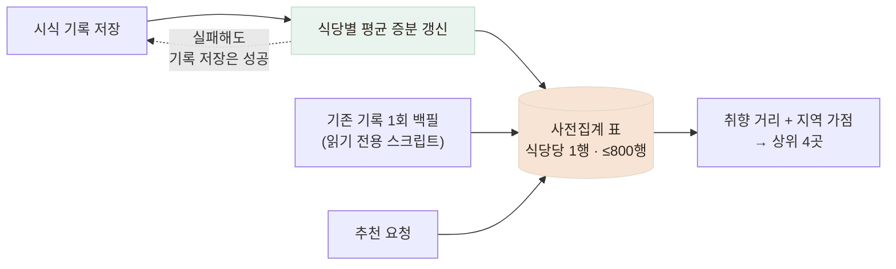

# 취향 추천 — 다섯 개 대안을 놓고 사전집계를 골랐다

> 시식 기록의 취향 5축 데이터로 개인화 추천을 만들며, 요청 시 집계·배치·pgvector 등 대안을 비교해 "사전집계 + 증분 갱신"을 선택한 기록

## 한눈에

| | |
|---|---|
| **요구** | 시식 기록에 쌓인 취향 데이터(풍미·부드러움·육즙·바삭함·두께감)로 홈 화면 추천 4칸 |
| **문제** | 요청 때마다 전체 기록을 집계하면 홈 로드마다 무거운 쿼리가 돈다 |
| **해법** | 식당별 **사전집계 테이블** + 기록 저장 시 **증분 갱신** — 추천 조회는 800행 이하 단일 테이블만 읽는다 |
| **안전장치** | 집계 실패가 기록 저장을 절대 깨뜨리지 않도록 이중 격리 + 회귀 테스트로 고정 |

## 다섯 개의 대안

규모(식당 약 800곳, 시식 기록 수백 건)를 먼저 쟀고, 그 규모가 선택을 결정했다.

| 대안 | 판단 |
|---|---|
| 요청 시 전체 집계 | 홈 로드마다 무거움 — 기각 |
| **사전집계 표 + 증분 갱신** | 조회는 식당당 1행, 쓰기 시 갱신이라 항상 최신 — **채택** |
| 주기적 배치 refresh | 증분보다 신선도 떨어짐 — 보류 |
| pgvector + 인덱스 | 800행에는 과투자 — 수만 행 도달 시 전환 기준만 명시하고 보류 |
| 유저별 결과 캐시 | 이 규모에선 계산이 수 ms — 불필요 |

거리 지표(유클리드 채택 vs 맨해튼 vs 코사인)와 튜닝 값(추천 후보 최소 기록 수 k=2 — 표본 1개는 평균이 튄다, 지역 가점 0.25 — 취향을 뒤집지 않는 선)까지 **선택의 이유를 전부 문서로** 남겼다.

## 데이터 흐름 — 쓰기와 읽기의 분리

기존 기록의 이관은 "확장(테이블 추가) → 백필(1회 스크립트) → 증분 전환" 순서 — 운영 데이터를 다루는 이 서비스의 표준 순서를 그대로 따랐다. 백필 스크립트는 기존 기록을 **읽기만** 하고 새 표에만 쓴다.

## 실패 격리 — 추천 때문에 기록이 죽으면 안 된다

증분 갱신은 시식 기록 저장의 부수 작업이다. 부수 작업의 실패가 본 작업을 깨뜨리면 주객전도다.

- 재계산 호출을 try/catch + `.catch()` **이중 보호**로 감쌌다
- "집계가 실패해도 기록 저장은 성공한다"를 **회귀 테스트로 고정** — 나중에 누가 고쳐도 이 성질은 깨지지 않는다
- 기록 수정으로 식당이 바뀌면 **이전 식당과 새 식당 둘 다** 재집계 (놓치기 쉬운 엣지)

구버전 앱은 이 엔드포인트를 아예 호출하지 않으므로 기존 동작에 영향이 없다.

## 남은 한계

- 기록 2건 미만 식당은 후보에서 제외 — 신규 식당 콜드스타트 문제
- 수만 식당 규모가 되면 pgvector 전환 필요 (전환 기준은 문서화됨)
- 추천 응답 시간의 운영 실측은 아직 없음 — 설계상 "전 기록 스캔 → 800행 단일 조회"로 바뀐 것까지가 검증된 사실
