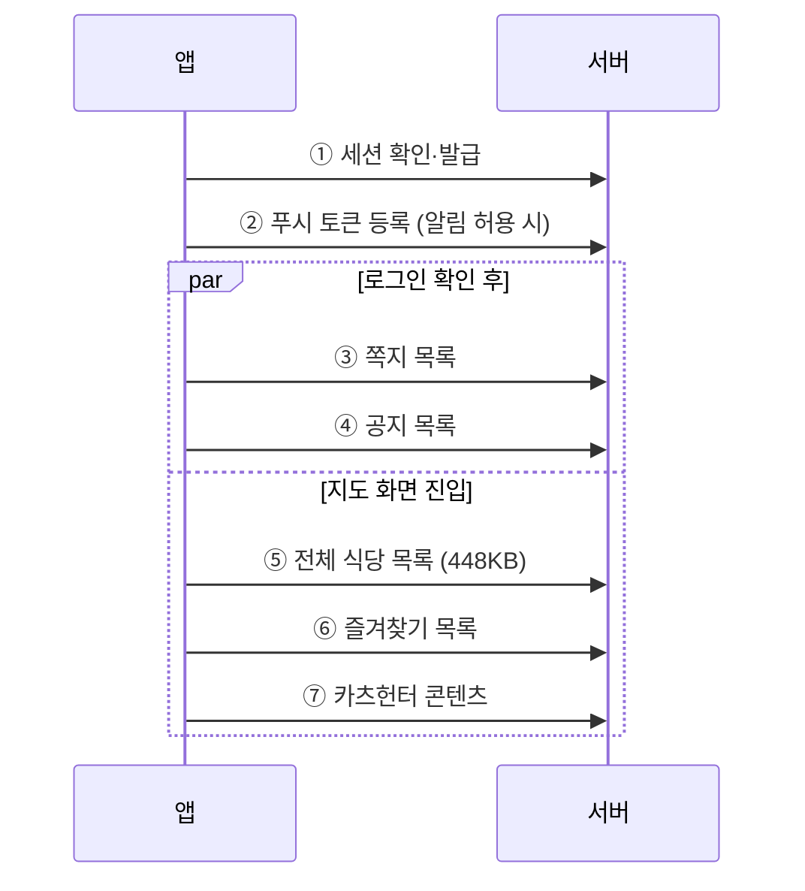
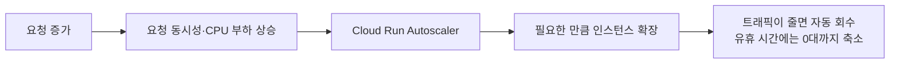
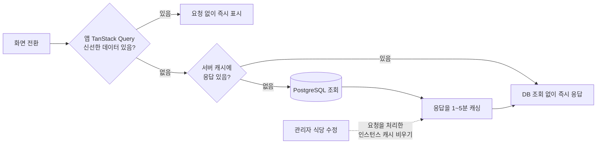

# 트래픽이 몰리는 점심·저녁 시간대에 대비해 서버와 캐시 구조를 구성했습니다

> Cloud Run 인스턴스당 최대 동시 요청 **80개로 설정** · 앱과 서버의 **2단계 캐시** 적용 — 캐시 적중 시 목록 응답 **253ms → 101ms**

돈가스 지도는 동시 접속이 항상 높은 서비스는 아닙니다. 누적 가입자 약 6,500명, 하루 평균 약 200명, 한 달 약 3,000명의 활성 유저가 꾸준히 사용하지만, **접속이 하루에 고르게 퍼지지 않고 점심·저녁 식사 시간에 몰립니다.**

그리고 유저 한 명이 앱을 열면 **약 7개의 API 요청이 짧은 구간에 집중되어** 서버로 갑니다. 그래서 "하루 사용자 수"뿐 아니라 **식사 시간대의 요청 집중 패턴**을 기준으로 서버를 구성했습니다.

## 한눈에

|          |                                                                                                                                                  |
| -------- | ------------------------------------------------------------------------------------------------------------------------------------------------ |
| **상황** | 접속이 점심·저녁 시간대에 몰리고, 앱을 한 번 열 때마다 약 7개의 요청이 짧은 순간에 발생합니다.                                                   |
| **문제** | 평소 기준으로만 서버를 두면, 몰리는 순간에 응답이 늦어지거나 요청이 거부될 수 있습니다.                                                          |
| **준비** | 요청·CPU 부하에 따라 Cloud Run이 자동 확장되도록 구성하고, 자주 조회되는 응답은 앱(TanStack Query)과 서버(인메모리 캐싱) 두 단계에서 줄였습니다. |
| **결과** | 캐시 적중 시 목록 253ms→101ms. 최근 운영 구간에서는 피크 시간에도 추가 용량 부족 징후가 나타나지 않았습니다.                                     |

## 트래픽이 언제 몰리는지부터 확인했습니다

맛집 지도라는 특성상 트래픽은 식사 시간에 몰립니다. 관리자 대시보드에 접속 시각을 시간대별로 집계하는 화면을 만들어 두고, 이 패턴을 계속 지켜보고 있습니다.

- 가장 붐비는 점심시간(12~13시)과 가장 한산한 새벽의 방문 수는 **10배 이상** 차이 납니다.
- 하루 평균 약 200명이 사용하지만, 많은 날은 **342명**까지 올라갑니다.

## 유저 한 명이 몇 개의 요청을 보내는지도 직접 세어봤습니다

"대략 많다"가 아니라 기준이 될 숫자가 필요해서, 앱 시작 코드를 따라가며 **앱을 처음 열 때 서버로 가는 요청을 하나씩 셌습니다.** 세션 확인부터 첫 화면 구성까지 **약 7개**(알림을 허용하지 않은 유저는 6개)입니다.

> **유저 1명 · 앱 실행 시 약 7개 요청**\
> **피크 시간에는 여러 사용자의 요청이 동시에 겹침**

세는 과정에서 **요청 수 자체를 줄이는 장치**도 함께 확인하고 유지하고 있습니다.

- 공지는 두 화면에서 쓰지만 **TanStack Query가 요청을 합쳐 한 번만** 조회합니다.
- 근처 맛집 필터링은 이미 받아둔 전체 목록을 기기에서 걸러내므로 추가 요청이 없습니다.

정리하면 점심 피크에 수십 명이 비슷한 시점에 앱을 열면 **짧은 구간에 수백 건의 요청이 집중될 수 있는 구조**입니다.

## 동시 요청이 늘어나면 자동으로 확장되도록 구성했습니다

서버는 Cloud Run에서 운영하며, **인스턴스당 최대 동시 요청은 80개로 설정**했습니다. 이 값은 부하 테스트로 검증한 처리 용량이 아니라 한 인스턴스에 전달할 수 있는 요청 동시성의 상한입니다. Cloud Run은 요청 동시성과 CPU 활용도를 함께 보고 필요한 만큼 인스턴스를 늘리고, 부하가 줄면 다시 줄입니다.

요청이 없으면 서버 인스턴스를 **0대까지 줄이는 서버리스 구성**으로 운영해 유휴 시간의 서버비를 아끼고 있습니다. 대신 꺼져 있던 서버가 다시 켜질 때 첫 요청에 콜드 스타트가 발생하지만, 현재는 길어야 **약 1~2초** 수준의 대기라는 트레이드오프를 감수하는 선택입니다.

### 실제 운영 지표로 확인했습니다

일주일 간의 Cloud Run 지표입니다. 왼쪽 위부터 요청 수, 서버 인스턴스 수, 최대 동시 요청 수, 요청 지연 시간입니다.

 

 

| 지표             | 실측                                 | 의미                                                                             |
| ---------------- | ------------------------------------ | -------------------------------------------------------------------------------- |
| 요청 수          | 식사 시간 피크·새벽 골 반복          | 예상한 시간대 집중 패턴이 서버 지표에서도 그대로 보입니다.                       |
| 서버 인스턴스 수 | 평소 1대, 순간적으로 2~3대           | 몰리는 순간에만 자동으로 늘었다가 바로 회수됩니다.                               |
| 최대 동시 요청   | 상위 99%도 10개 안팎                 | 설정한 최대 동시 요청보다 낮았고, 같은 시간대에 지연이 크게 상승하지 않았습니다. |
| 요청 지연        | 절반은 100ms 이내, 대부분 300ms 이내 | 피크 시간에도 지연이 튀지 않고 유지됩니다.                                       |

최근 운영 구간에서는 최대 동시 요청 지표가 설정한 최대 동시 요청보다 낮았고, 같은 시간대의 응답 지연도 크게 상승하지 않았습니다. **현재 관측된 트래픽에서는 추가 용량 부족 징후가 나타나지 않았습니다.**

## 서버까지 도달하는 반복 요청과 과도한 호출을 단계적으로 줄였습니다

사람들은 지도 → 가게 상세 → 커뮤니티 → 다시 지도처럼 **앱 이곳저곳을 오가며 같은 데이터를 반복해서 조회합니다.** 앱과 서버의 2단계 캐시로 반복 조회를 줄이고, 짧은 시간에 이어지는 과도한 요청은 Rate limit으로 제한했습니다.

### 1단계 · 앱 — TanStack Query로 서버까지 가는 왕복을 줄입니다

앱의 서버 데이터는 TanStack Query로 관리합니다. 한 번 받아온 데이터는 데이터 성격에 따라 설정한 `staleTime` 동안 **최신 상태로 간주해 재사용**하므로, 화면을 오갈 때마다 같은 요청이 반복되지 않습니다.

- 기본 데이터에는 1분, 공지에는 5분, 변경 빈도가 낮은 카츠헌터 콘텐츠에는 10분의 `staleTime`을 채택했습니다.
- 내 기록·즐겨찾기 수처럼 최신 상태가 중요한 값은 `staleTime`을 0으로 두어 **필요한 시점에 다시 조회하도록 했습니다.**
- 여러 화면이 같은 데이터를 요청하면 **TanStack Query가 요청을 하나로 합치고, 응답을 캐시에 저장해 재사용합니다.**

### 2단계 · 서버 — 도착한 요청은 인메모리 캐싱으로 DB 조회를 줄입니다

서버에 도착한 요청 중 **모두에게 같은 값을 보여주는 공개 조회 API는 응답을 캐싱**해 두고 재사용합니다. **데이터의 변경 빈도와 반복 조회 가능성에 따라 TTL을 다르게 두고, 처음에는 짧게 시작했습니다.**

| 대상 | 캐시 시간 | 이유 |
| --- | --- | --- |
| 전체 맛집 목록·인기·최신·권역별 목록 | **1분** | 조회가 많아 **짧은 TTL부터 적용**했습니다. |
| 가게 상세·영업시간·메뉴 | **2분** | 변경이 잦지 않고 **반복 조회될 가능성이 높습니다.** |
| 권역(지역 구분) 목록 | **5분** | 거의 변경되지 않는 데이터입니다. |
| 검색 | **캐싱 안 함** | 검색어 조합이 다양해 **같은 요청이 반복될 가능성이 낮습니다.** |

#### Redis 대신 인메모리 캐시를 선택했습니다

| | |
| --- | --- |
| **선택** | 현재 규모에서는 별도 Redis 없이 **인메모리 캐시** 사용 |
| **이유** | 별도 인프라 없이 반복 DB 조회를 줄이고, Redis의 **월 수만 원 수준의 상시 비용**과 운영 복잡도를 피할 수 있음 |
| **한계** | 캐시가 인스턴스별로 독립되어 **중복 DB 조회와 최대 TTL만큼의 데이터 차이**가 발생할 수 있음 |
| **전환 기준** | 여러 인스턴스를 상시 운영하고 **캐시 공유·즉시 일관성**이 중요해지면 Redis 같은 공유 캐시 도입 |

> 관리형 Redis는 사용량이 적어도 인스턴스를 유지하는 동안 계속 과금되므로, **현재 규모에서는 월 수만 원의 고정비를 추가할 필요가 없다고 판단했습니다.** 현재는 변경이 잦지 않은 공개 조회 데이터에만 **1~5분의 짧은 TTL**을 적용해 이 한계를 감수했습니다.

### 3단계 · 과도한 API 호출을 Rate limit으로 제한했습니다

정상적인 사용은 방해하지 않으면서, **앱 오류·자동화된 요청·의도적인 반복 호출로 한 사용자가 서버 자원을 과도하게 점유하지 않도록** 여러 시간 구간의 Rate limit을 적용했습니다.

| 구간 | 최대 요청 | 역할 |
| --- | ---: | --- |
| **1초** | 10회 | 순간적으로 확 몰리는 요청 제한 |
| **10초** | 100회 | 짧은 구간의 반복 요청 제한 |
| **1분** | 300회 | 지속적으로 반복되는 요청 제한 |

> **순간적인 요청 폭주부터 일정 시간 지속되는 반복 호출까지 서로 다른 시간 구간에서 제한했습니다.** 지도 이동·핀 선택·자동완성처럼 정상 사용에서 발생하는 요청은 막지 않으면서, 비정상적으로 반복되는 호출은 제한하도록 여유 있게 설정했습니다.

## 적용 후 실제 운영에서 확인했습니다

| 단계 | 줄인 것 | 확인한 결과 |
| --- | --- | --- |
| **앱 캐시** | 화면 이동마다 반복되는 API 요청 | 같은 데이터는 `staleTime` 동안 재사용하고, 동시 요청은 하나로 합침 |
| **서버 캐시** | 반복되는 DB 조회 | 목록 **253ms → 101ms**, 상세 **292ms → 89ms** |
| **Rate limit** | 짧은 시간의 과도한 반복 요청 | 푸시 발송 직후 발생한 요청 집중을 실제로 제한 |

> 서버 캐시가 적중하면 DB를 다시 조회하지 않습니다.

실제로 푸시 발송 직후 사용자가 한꺼번에 복귀하면서 Rate limit에 걸린 사례가 있었습니다. 이후 **푸시를 청크 단위로 나눠 일정 간격을 두고 발송**하도록 변경했고, 자세한 과정은 「푸시 발송 직후 몰리던 요청을 분산해 오류를 줄였습니다」에서 별도로 다룹니다.

## 결론

> 요청이 몰리는 상황을 단순히 서버 증설만으로 해결하지 않고, **앱에서는 서버까지 가는 반복 요청을 줄이고, 서버에서는 반복 DB 조회를 줄이며, 과도한 호출은 별도로 제한하는 구조**로 나눴습니다.
>
> 그 결과 서버 캐시 적중 시 **전체 목록은 253ms → 101ms, 상세 조회는 292ms → 89ms**로 줄었고, 현재 규모에서는 별도 Redis 없이도 필요한 캐시 효과를 얻고 있습니다.
>
> 앞으로 여러 인스턴스를 상시 운영하며 즉시 일관성이 중요해지는 시점에는 **공유 캐시로 전환할 기준도 함께 정해두었습니다.**
