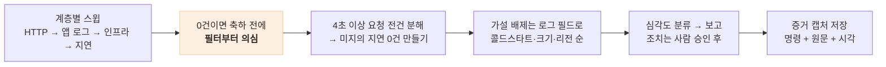

# 운영에도 활용하기 — 읽기 전용으로 맡기고, 조치는 사람이 결정합니다

> 1인 운영의 관측 공백을 "읽기 전용 권한의 AI 에이전트 + 조치는 사람 승인"이라는 역할 분담으로 메운 워크플로 — 429 버스트·504 오탐 같은 발견이 전부 이 플로우에서 나왔다

## 한눈에

| | |
|---|---|
| **문제** | 1인 운영이라 대시보드를 상시 보는 사람이 없다 — 문제는 사용자 제보로만 발견됐다 |
| **해법** | AI 에이전트에게 **읽기 전용** 로그 접근을 주고 수집·집계·가설 배제를 맡김. 조치 결정은 사람 |
| **성과** | 첫 스윕에서 발견 7건 — 429 버스트 인과 규명, 콜드 스타트 상관 96% 증명, 504 오탐 판정 등 |
| **부산물** | 에이전트의 명령·출력 기록이 그대로 트러블슈팅 문서의 **증거**가 됐다 |

## 역할 분담 — 권한의 비대칭이 핵심

에이전트는 로그 수백 건을 몇 분에 집계하고 가설을 배제할 수 있다. 하지만 운영 환경을 건드릴 권한까지 주는 것은 위험이 비대칭이다. 그래서 선을 이렇게 그었다.

| 단계 | 담당 |
|---|---|
| 권한 부여 (클라우드 로그인·토큰 발급) | 사람 |
| 로그 조회·집계·가설 배제 | 에이전트 (읽기 전용 명령만) |
| 심각도 분류와 보고 | 에이전트 — 심각 건은 **조치 전에 먼저 보고** |
| 조치 여부·방향 결정 | 사람 |
| 조치 후 재검증 | 에이전트 (같은 쿼리 재실행으로 전/후 비교) |

배포·설정 변경·DB 명령은 에이전트 금지 목록이다. 실제로 운영 DB 마이그레이션과 배포는 매번 사람 승인을 거쳤다.

## 트리아지 절차 — 0건을 의심하는 것까지

"0건을 의심한다"는 규칙은 실전에서 나왔다 — 에러 레벨 필터로 0건이 나와 "에러 없음"으로 넘어갈 뻔했는데, 로깅 라이브러리의 출력이 클라우드 로그 심각도에 매핑되지 않는 것이었고, 필드 기준으로 다시 조회하자 숨어 있던 기록이 나왔다. **관측 도구의 공백과 서비스의 무결은 구분해야 한다.**

## 첫 스윕의 실제 성과

- 30일 5xx **0건**, 미지의 앱 에러 **0건**(전부 설계된 거부·봇 스캔으로 분류), 크래시프리 **99.72%** — "무장애 운영" 주장이 처음으로 로그 실측이 됐다
- 4초 이상 요청 전건을 분해해 **미지의 지연 0건** — 남은 것은 전부 원인이 규명된 항목
- 그중 둘이 실제 개선으로 이어졌다: 푸시 429 버스트(고쳐서 28→0건), Sentry 504(오탐 판정으로 종결)

## 남은 한계

- 읽기 전용 준수가 현재는 약속 기반 — 로그 열람 전용 계정으로 구조적으로 강제하는 것이 다음 단계
- 로그 보존 30일 — 장기 추세는 주기 스윕의 축적이 필요하다
- 요청 지연에 클라이언트 구간이 섞이는 등 **지표의 해석 함정**은 여전히 사람이 알아야 한다 — 에이전트는 속도를 주지, 판단의 책임을 대신하지 않는다
