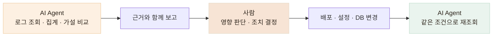

# 운영에도 활용하기 — AI는 관측하고, 조치는 사람이 결정합니다

> 1인 운영에서 생기는 관측 공백은 AI가 읽기 전용으로 메우고, 서비스에 영향을 주는 판단과 조치는 사람이 맡깁니다.

## 한눈에

| | |
|---|---|
| **문제** | 1인 운영이라 모든 로그와 대시보드를 상시 확인하기 어렵습니다 |
| **AI 역할** | 읽기 전용 로그 조회 · 집계 · 이상 징후 탐색 · 가설 비교 |
| **사람 역할** | 원인 판단 · 수정 방향 결정 · 배포 및 운영 변경 |
| **활용 사례** | 429 버스트 발견 · 504 오탐 판정 · 지연 원인 분석 |

1인으로 서비스를 운영하다 보면 로그와 대시보드를 항상 지켜볼 수는 없습니다. 그래서 AI Agent에게 운영 로그를 읽고 집계하는 일을 맡기되, **배포·설정 변경·DB 조작처럼 실제 서비스에 영향을 주는 행동은 직접 판단하고 수행**하도록 역할을 나눴습니다.

## 운영에서는 이렇게 역할을 나눕니다

| | 역할 |
|---|---|
| **AI Agent** | 로그 조회 · 집계 · 이상 징후 탐색 · 가설 비교 · 조치 후 재검증 |
| **사람** | 접근 권한 부여 · 심각도 판단 · 수정 방향 결정 · 배포 및 운영 변경 |

에이전트는 **읽기 전용으로 관측과 분석까지만** 수행합니다. 문제가 발견되면 원인과 근거를 먼저 정리해 보고하고, 실제 조치는 제가 확인한 뒤 진행합니다.

조치가 끝난 뒤에는 **같은 조건으로 로그를 다시 조회해 문제가 실제로 사라졌는지도 확인**합니다.

## 실제 운영에서 찾은 문제

이 방식으로 로그를 훑으면서 자동 모니터링만으로는 알아채기 어려웠던 문제들을 발견했습니다.

- 푸시 알림 직후 요청이 몰리며 발생하던 **429 버스트**를 발견해 원인을 추적하고 개선
- Sentry에서 장애처럼 보이던 **504 기록을 실제 서버 장애가 아닌 오탐으로 판정**
- 느린 요청들을 나눠 살펴보며 **콜드 스타트와 지연 사이의 관계를 확인**

단순히 에러 개수를 세는 것이 아니라, **어떤 조건에서 문제가 발생하는지까지 로그로 좁히는 데 AI를 활용**했습니다.

## ‘0건’도 그대로 믿지 않습니다

운영 로그를 조회했는데 에러가 0건이라고 해서 바로 정상이라고 판단하지 않습니다.

위 결과도 서비스가 무조건 정상이라는 결론이 아니라, **다음 가설을 확인하기 위한 근거 하나**로 봅니다.

실제로 에러 로그를 조회했을 때 처음에는 0건이 나왔지만, **로그가 없었던 것이 아니라 에러 로그가 일반 로그로 분류되어 검색에서 빠지고 있었습니다.** 조회 기준을 바꿔 다시 확인하면서 실제 기록을 찾을 수 있었습니다.

이 경험 이후에는 **“문제가 없는 것”과 “관측되지 않는 것”을 구분해서 확인**하는 것을 운영 규칙으로 두고 있습니다.

## 운영 분석 결과도 기록으로 남깁니다

AI Agent가 실행한 조회 명령과 결과를 함께 남기기 때문에,

**어떤 로그를 보고 → 어떤 가설을 세웠고 → 무엇을 수정했으며 → 수정 후 어떻게 달라졌는지**를 다시 확인할 수 있습니다.

덕분에 AI의 분석을 그대로 믿는 것이 아니라, **사람이 다시 확인할 수 있는 운영 기록으로 남겨 활용**하고 있습니다.

## 아직 사람이 판단해야 하는 영역

AI가 로그를 빠르게 읽고 패턴을 찾는 데는 도움이 되지만, **지표가 실제 서비스에서 어떤 의미인지 판단하는 책임까지 맡기지는 않습니다.**

현재는 다음 원칙을 유지하고 있습니다.

- 에이전트는 **운영 환경을 변경하지 않음**
- 배포·설정·DB 작업은 **직접 검토 후 수행**
- 이상 징후가 발견되면 **조치 전에 먼저 보고**
- 수정 후에는 **동일한 기준으로 재검증**

앞으로는 로그 조회 권한 자체도 별도의 **읽기 전용 계정으로 분리해 구조적으로 제한**할 계획입니다.
