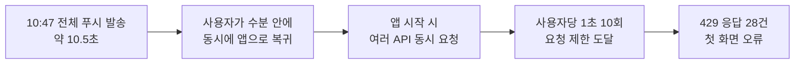

# 푸시 발송 직후 몰리던 요청을 분산해 오류를 줄였습니다

> 운영 로그에서 푸시 직후 요청 거부가 몰리는 현상을 발견하고, 발송 시간을 분산한 뒤 다음 전체 발송에서 같은 지표를 다시 측정한 기록입니다.

## 한눈에

| | |
|---|---|
| **발견** | 30일간 429 응답 42건 중 28건이 한 시간대에 몰렸습니다 |
| **원인** | 전체 푸시 발송 직후 사용자가 동시에 돌아와 앱 시작 요청이 1초 10회 제한에 도달했습니다 |
| **해법** | 관리자 요청에는 202를 바로 응답하고, 100명 단위 발송 사이에 0.5초 간격을 뒀습니다 |
| **결과** | 응답 11.43초→0.18초, 발송 직후 429 28건→0건, Sentry 당일 오류 32건→0건 |

## 429는 평소가 아니라 푸시 직후에 몰렸습니다

30일 운영 로그에서 429 응답 42건을 시간대별로 나누자 네 구간에 몰려 있었습니다. 가장 큰 구간의 28건은 공지·메시지처럼 앱을 열 때 호출하는 API였고, User-Agent는 iOS 요청 15건과 Android 요청 13건으로 실제 앱에서 발생했습니다.

같은 시각의 운영 기록을 대조하자 10시 47분 전체 푸시 발송 직후였습니다. 당시 발송은 약 10.5초 안에 끝났고, 푸시를 받은 사용자가 수분 안에 앱으로 돌아오면서 시작 요청이 한꺼번에 발생했습니다.

서버의 429 기록과 앱의 Sentry 오류가 같은 시각에 증가해 원인을 교차 확인했습니다. 서버를 보호하려고 둔 제한이 푸시를 받고 돌아온 사용자의 첫 화면을 막고 있었습니다.

## 발송 요청도 사용자 수만큼 느려지고 있었습니다

관리자 발송 API는 Expo Push 전송이 모두 끝날 때까지 응답하지 않았습니다. 최근 네 번의 발송 시간은 **8.72초 → 10.49초 → 10.80초 → 11.43초**로 늘었고, 한 묶음 전송이 실패하면 뒤의 발송도 중단되는 문제가 있었습니다.

| 후보 | 판단 |
|---|---|
| 요청 제한을 높이기 | 서버 보호 범위를 줄이므로 실제 부하를 더 확인하기 전에는 적용하지 않았습니다 |
| 앱 시작 요청을 하나로 합치기 | 효과는 크지만 앱 업데이트가 필요해 장기 과제로 남겼습니다 |
| **푸시 발송 시간 분산 + 관리자에게 즉시 응답** | 서버만 바꿔 구버전에도 적용할 수 있어 **채택했습니다** |
| 앱에서 429 요청 다시 시도 | 조회 요청에만 적용하는 추가 보호로 구현했습니다 |

서버는 관리자에게 202를 바로 반환하고, 100명 단위 발송 사이에 0.5초 간격을 두도록 바꿨습니다. 한 묶음이 실패해도 다음 발송은 계속 진행하고, 전체 결과는 별도 기록으로 남겼습니다.

## 다음 전체 발송으로 다시 측정했습니다

| 지표 | 변경 전 | 변경 후 |
|---|---|---|
| 관리자 발송 요청 응답 | 11.43초 | **0.18초 · 202** |
| 발송 직후 429 | 28건 | **0건** |
| Sentry 당일 오류 | 32건 | **0건** |
| 전체 발송 완료 기록 | 없음 | **2,320명 · 24묶음 · 33.6초 · 실패 0** |

변경 후에도 유입은 분당 6건에서 205건으로 증가했습니다. 트래픽 자체를 없앤 것이 아니라 발송 시점을 33.6초에 걸쳐 나눈 결과, 같은 요청 제한에서도 사용자가 거부되지 않았습니다.

## 남은 과제

- 0.5초 간격은 첫 운영 결과를 기준으로 잡은 값이므로 사용자가 늘면 다시 조정해야 합니다.
- 푸시 서비스가 발송 요청을 받았다는 사실과 실제 단말에 도착했다는 사실은 다르며, 수신 결과 추적은 아직 없습니다.
- 발송과 무관했던 나머지 429 구간 2개의 원인은 별도로 확인해야 합니다.
