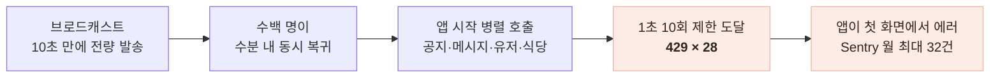

# 푸시를 보내면 서버가 사용자를 거부하고 있었다

> 운영 로그에서 429 버스트를 발견하고, 발송 이력과 대조해 인과를 규명하고, 고치고, 다음 발송에서 전/후 실측까지 — 한 사건의 풀사이클 기록

## 한눈에

| | |
|---|---|
| **발견** | 30일간 429(요청 거부) 42건 중 28건이 **한 시간대**에 몰려 있었다 |
| **원인** | 푸시 브로드캐스트 → 수분 내 동시 복귀 → 앱 시작 병렬 호출이 1초 10회 제한 도달 |
| **해법** | 202 즉시 응답 + 청크 간 지연을 둔 **점진 발송** (+ 앱은 GET 한정 백오프 재시도) |
| **결과** | 발송 응답 **11.43초 → 0.18초**, 발송 직후 429 **28건 → 0건**, Sentry 스파이크 **32건 → 0건** |

## 발견 — 429는 상시가 아니라 버스트였다

운영 로그 30일 스윕에서 429가 42건 나왔다. 시간 버킷으로 집계하자 분포가 이상했다 — 4개 시간대에 몰려 있고, 최대 버스트(28건)의 대상은 공지·메시지 등 **앱을 켤 때 호출되는 API들**, UA는 iOS·Android 실사용자였다.

같은 시간대의 이벤트를 찾자 그림이 완성됐다: **10:47 푸시 브로드캐스트(전량 발송에 10.5초) 직후**였다.

뼈아픈 지점: rate limit은 서버를 지키라고 넣은 건데, **푸시를 받고 모처럼 돌아온 사용자의 첫 화면을 막고 있었다.** 서버 로그의 429 42건과 앱 측 Sentry의 "429" 에러 31건이 정합해 인과가 3중으로 확인됐다.

## 원인은 하나 더 있었다 — 발송 자체도 병들어 있었다

발송 코드를 보니 관리자 요청이 Expo 발송 전체를 동기로 기다리고 있었고, 소요가 사용자 증가에 비례해 자라고 있었다(8.7초 → 11.4초). 게다가 **한 청크가 실패하면 나머지 발송 전체가 중단되는 결함**도 함께 있었다.

## 해법 — 유입을 시간축으로 분산

| 후보 | 판단 |
|---|---|
| rate limit 완화 | 방어선 약화 — 부하 실측 후에만 |
| 앱 시작 호출 통합 | 효과 크지만 앱 릴리즈 필요 — 장기 과제 |
| **점진 발송 + 202 비동기화** | 서버만으로 즉시 적용, 구버전 앱에도 효과 — **채택** |
| **앱 429 백오프 재시도** | 잔여 429를 조용히 흡수 — **함께 채택** (GET 한정 — 쓰기는 중복 위험) |

발송을 100명 단위 청크 사이에 0.5초 지연을 두고 백그라운드로 진행하게 바꿨다. 관리자에게는 202를 즉시 돌려주고, 청크 실패는 격리하고, 발송 결과는 기록으로 남긴다.

## 검증 — 다음 브로드캐스트가 재현 실험이었다

배포 후 실제 전량 발송(2,320명)에서 측정했다.

| 지표 | 이전 (실측) | 이후 (실측) |
|---|---|---|
| 발송 요청 응답 | 11.43초 | **0.18초 · 202** |
| 발송 직후 429 | 28건 | **0건** — 유입 피크(분당 205 요청)에도 |
| Sentry 당일 에러 | 32건 스파이크 | **0건** |
| 발송 완주 | 기록 없음 | 24청크 · 33.6초 · 실패 0 (결과 로그) |

트래픽 폭증 자체는 그대로였다(분당 6 → 205 요청). **발송을 33초에 걸쳐 분산한 것만으로** 개별 사용자가 제한에 걸리지 않게 된 것 — 문제를 정확히 겨눈 해법이었다는 증거다.

## 후속 — 비동기화의 부작용까지

202로 바꾸자 관리자가 발송 완료를 알 수 없게 됐다. 발송 진행을 DB에 기록하고 어드민에 진행 바를 붙였는데, 배포 직후 진행 조회가 500으로 터졌다 — 추적해 보니 "부팅 시 마이그레이션 실행"이라는 문서와 실제 배포 구성이 달랐던 것. 테이블이 없는 동안에도 **발송 자체는 무중단이었다**(기록 실패를 격리해 둔 설계가 운영에서 증명된 순간). 개선이 만든 새 문제까지 같은 방법 — 로그로 찾고, 실측으로 닫기 — 로 처리했다.

## 남은 한계

- 청크 간 지연 0.5초는 첫 실측 기준 값 — 사용자가 늘면 발송 총 시간과의 트레이드오프 재조정 필요
- 앱 백오프 재시도는 다음 스토어 릴리즈부터 합류 — 서버 개선만으로 429가 0이 되어 효과를 따로 잴 기회가 없을 수도 있다
