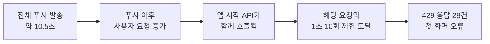

# 푸시 발송 직후 몰리던 요청을 분산해 429 오류를 줄였습니다

> 30일 운영 로그에서 푸시 발송 직후 `429` 응답이 몰리는 패턴을 찾고, **푸시를 나누어 보내도록 변경한 뒤 다음 전체 발송에서 같은 지표를 다시 측정**했습니다.

## 한눈에

| | |
|---|---|
| **발견** | 30일간 `429` 42건 중 31건이 전체 푸시 발송 시간대와 겹쳤고, 가장 큰 한 구간에서 28건이 발생했습니다 |
| **원인** | 전체 푸시 직후 사용자 요청이 짧은 시간에 몰리면서, 앱 시작 시 호출되는 API가 요청 제한에 걸렸습니다 |
| **변경** | 푸시 메시지를 100개씩 나누어 0.5초 간격으로 보내고, 관리자 요청에는 `202`를 바로 응답했습니다 |
| **결과** | 발송 직후 `429`는 28건에서 0건으로, 관리자 응답은 11.43초에서 0.18초로 줄었습니다 |

## 푸시 직후 429가 몰리는 패턴을 발견했습니다

`429` 응답 42건을 시간대별로 나누자 평소에 고르게 발생한 것이 아니라 **네 시간대에만 몰려 있었습니다.** 가장 큰 구간은 7월 23일 10시대 UTC(한국 시각 19시대)의 28건이었고, 같은 시간대에 10시 47분 UTC 전체 푸시 발송이 있었습니다. 7월 14일의 3건도 전체 발송 시각과 겹쳐, **42건 중 31건이 푸시를 보낸 시간대와 일치했습니다.**

서버 로그뿐 아니라 Sentry에서도 같은 시간대에 오류가 급증했습니다. **7월 23일 10:30~11:00 UTC 구간에 앱 오류 27건이 집중**돼, 푸시 발송 직후 앱에서도 동일한 이상 패턴이 나타난 것을 확인했습니다.

가장 큰 구간에서 거부된 요청은 공지·메시지처럼 **앱을 열 때 함께 호출하는 API**였습니다. 요청 환경도 iOS 15건, Android 13건으로 실제 앱 사용과 일치했습니다.

## 원인은 푸시 이후 요청이 한 시점에 몰리는 것이었습니다

당시 전체 푸시는 약 10.5초 안에 전송됐고, 직후 앱 시작 API 요청이 같은 시간대에 몰리면서 **해당 요청에 적용된 1초 10회 제한에 걸렸습니다.**

**서버 로그의 발생 시각·요청 API·요청 환경과 Sentry의 앱 오류 기록을 함께 대조해**, 푸시 이후 몰린 앱 시작 요청 일부가 서버의 요청 제한에 걸리고 있음을 확인했습니다.

## 기존 발송 구조에는 두 가지 문제가 있었습니다

| 문제 | 영향 |
|---|---|
| **푸시가 짧은 시간에 몰려 발송됨** | 푸시 이후 앱 시작 요청도 같은 시간대에 집중됐습니다 |
| **관리자 요청이 전체 발송 완료까지 대기함** | 대상이 늘면서 응답 시간이 8.72초 → 10.49초 → 10.80초 → 11.43초로 증가했습니다 |

| 후보 | 판단 |
|---|---|
| 요청 제한을 높이기 | 가장 간단하지만 서버의 보호 범위를 줄이므로 먼저 적용하지 않았습니다 |
| 앱 시작 요청을 하나로 합치기 | 요청 수를 직접 줄일 수 있지만 앱 업데이트가 필요해 장기 과제로 남겼습니다 |
| **푸시 발송 분산 + 관리자 응답 분리** | 서버만 바꿔 구버전 앱에도 적용할 수 있어 **채택했습니다** |

요청 제한을 바로 높이는 대신, **푸시 발송은 시간에 나누고 관리자 응답은 즉시 돌려주는 방식으로 각각 개선했습니다.**

## 푸시는 나누어 보내고 관리자 응답은 분리했습니다

| 변경 | 내용 |
|---|---|
| **발송 분산** | 푸시 메시지를 100개씩 나누고 묶음 사이에 0.5초 간격을 뒀습니다 |
| **관리자 응답 분리** | 발송 ID를 만든 뒤 `202 Accepted`를 바로 반환했습니다 |
| **실패 처리** | 일부 묶음이 실패해도 나머지 발송은 계속 진행하도록 오류를 분리했습니다 |

이후 앱에서도 조회 요청에 한해 `429` 재시도를 추가로 적용했습니다.

## 다음 전체 발송에서 같은 지표를 다시 확인했습니다

변경 후 개발자 본인 한 명에게 먼저 보내 `202` 응답 뒤에도 발송이 끝까지 진행되는지 확인했습니다. 이어 2,320개 푸시 메시지를 보내는 다음 전체 발송에서 이전과 같은 로그를 다시 조회했습니다.

| 지표 | 변경 전 | 변경 후 |
|---|---:|---:|
| **관리자 응답 시간** | 11.43초 | **0.18초 · `202`** |
| **발송 직후 `429`** | 28건 | **0건** |
| **전체 푸시 발송** | 완료 기록 없음 | **2,320개 · 24묶음 · 실패 0** |

변경 후에도 분당 요청은 6건에서 최대 205건까지 증가했습니다. **사용자 요청이 크게 늘어난 상황에서도 발송 직후 `429`는 발생하지 않았습니다.**

Sentry에서도 같은 시점에 오류가 확인되지 않았지만 수집 지연 가능성이 있어, **서버의 `429` 로그와 발송 완료 기록을 주요 검증 기준**으로 사용했습니다.

## 남은 과제

- 현재의 0.5초 간격은 첫 전체 발송 결과를 기준으로 정했기 때문에, **발송 대상과 사용자 유입이 늘어나면 다시 측정해 조정할 필요가 있습니다.**
- 전체 푸시와 무관하게 발생한 나머지 `429`는 **별도 패턴으로 분리해 원인을 추적할 예정입니다.**
