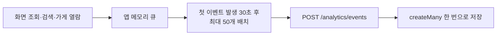

# 이후 추가한 이용 통계도 요청마다 전송하지 않도록 설계했습니다

> 화면 조회·검색·가게 열람 이벤트를 행동마다 전송하지 않고 **메모리 큐에 모아 첫 이벤트 발생 30초 후 최대 50개씩 전송**했습니다. 서버에서도 한 배치를 `createMany()` 한 번으로 저장해 HTTP 요청과 DB 쓰기가 이벤트 수만큼 늘어나지 않도록 했습니다.

## 한눈에

| | |
| --- | --- |
| **상황** | 화면 이동·검색·가게 열람 등 서비스 이용 현황을 집계할 필요가 있었습니다. |
| **문제** | 이벤트가 발생할 때마다 전송하면 화면을 이동할수록 HTTP 요청과 DB 쓰기가 함께 늘어납니다. |
| **설계** | 앱에서는 메모리 큐와 30초 지연 배치를 사용하고, 서버에서는 최대 50개를 한 번에 저장했습니다. |
| **보호 장치** | 큐와 배치 크기에 상한을 두고, 통계 전송 실패가 사용자 기능에 영향을 주지 않도록 분리했습니다. |

## 이벤트마다 요청하면 같은 요청 증폭이 다시 생길 수 있었습니다

화면 조회, 검색어 제출, 가게 상세 열람 같은 이벤트는 사용자가 앱을 이동할 때마다 발생합니다. 이를 즉시 전송하면 이벤트 하나가 HTTP 요청 하나와 DB 쓰기 하나로 이어져, **사용량을 관찰하기 위한 기능이 오히려 앱 시작과 화면 전환의 요청 집중을 키울 수 있습니다.**

이용 통계는 일부가 유실되더라도 핵심 기능에는 영향이 없는 데이터입니다. 따라서 실시간 전송보다 **사용자 기능에 부하를 더하지 않는 것**을 우선했습니다.

## 앱에서는 이벤트를 메모리 큐에 먼저 모았습니다

`logEvent()`는 네트워크 요청을 보내지 않고 `{ type, name }` 형태의 이벤트를 메모리 큐에 추가합니다. 화면 전환이나 검색 직후 실행되는 작업은 큐에 값을 넣는 것으로 끝나므로, 해당 시점에는 통계 API 요청이 발생하지 않습니다.

| 단계 | 구현 | 요청에 미치는 영향 |
| --- | --- | --- |
| **이벤트 기록** | `logEvent()`가 메모리 큐에 이벤트 추가 | 화면 전환·검색 직후 네트워크 요청 없음 |
| **지연 배치** | 첫 이벤트가 들어오면 30초 뒤 전송 예약 | 짧은 구간의 이벤트를 한 요청으로 모음 |
| **배치 전송** | 큐에서 최대 50개를 꺼내 한 번에 전송 | 이벤트 여러 개를 HTTP 요청 하나로 처리 |
| **백그라운드 전환** | 앱이 `background` 또는 `inactive` 상태가 되면 남은 큐 전송 | 앱이 멈추기 전에 남은 이벤트 전송 시도 |

## 상시 타이머 대신 이벤트가 있을 때만 전송을 예약했습니다

30초마다 계속 실행되는 `setInterval`을 두지 않고, **큐에 첫 이벤트가 들어왔을 때만 `setTimeout`을 한 번 예약**했습니다. 이미 타이머가 있으면 새 타이머를 만들지 않으며, 전송 뒤 큐에 이벤트가 남아 있을 때만 다음 전송을 예약합니다.

| 제한 | 값 | 이유 |
| --- | ---: | --- |
| **메모리 큐** | 최대 100개 | 무제한 메모리 증가 방지·초과 시 오래된 이벤트부터 제거 |
| **전송 배치** | 최대 50개 | 서버의 배치 수집 상한과 일치 |
| **전송 시점** | 첫 이벤트 발생 30초 후 | 앱 실행 직후의 요청 집중과 분리 |

## 서버에서도 이벤트마다 DB를 쓰지 않았습니다

앱은 최대 50개의 이벤트를 `POST /analytics/events` 요청 하나로 보냅니다. 서버는 항목을 검증한 뒤 `createMany()` 한 번으로 저장해, **이벤트 수만큼 개별 DB 쓰기가 발생하지 않도록** 했습니다.

## 통계 실패가 사용자 기능에 영향을 주지 않도록 했습니다

통계 전송은 공용 API 클라이언트와 분리해 세션 복구, 429 재시도, Sentry 리포팅이 붙지 않도록 했습니다. 세션이 아직 준비되지 않았다면 이벤트를 큐에 되돌리지만, 네트워크 전송에 실패하면 해당 배치는 버립니다. **통계의 일부 유실을 허용하는 대신 사용자의 화면 이동과 핵심 기능은 영향을 받지 않도록 한 선택**입니다.

## 결과와 남은 한계

- 화면에서 이벤트가 발생해도 즉시 네트워크 요청으로 이어지지 않고, 최대 50개가 요청 하나와 배치 저장 한 번으로 처리되는 구조를 코드로 확인했습니다.
- 앱 실행 직후의 요청 집중에 통계 요청을 보태지 않으면서 화면·검색·가게 이용 현황을 수집할 수 있게 됐습니다.
- 큐가 메모리에만 있어 앱이 예기치 않게 종료되면 전송 전 이벤트가 사라질 수 있습니다. 통계 유실을 허용한 현재 정책에서는 감수한 한계입니다.
- 전후 네트워크 요청 수와 DB 쓰기 횟수를 별도로 계측한 수치는 아직 없습니다.
