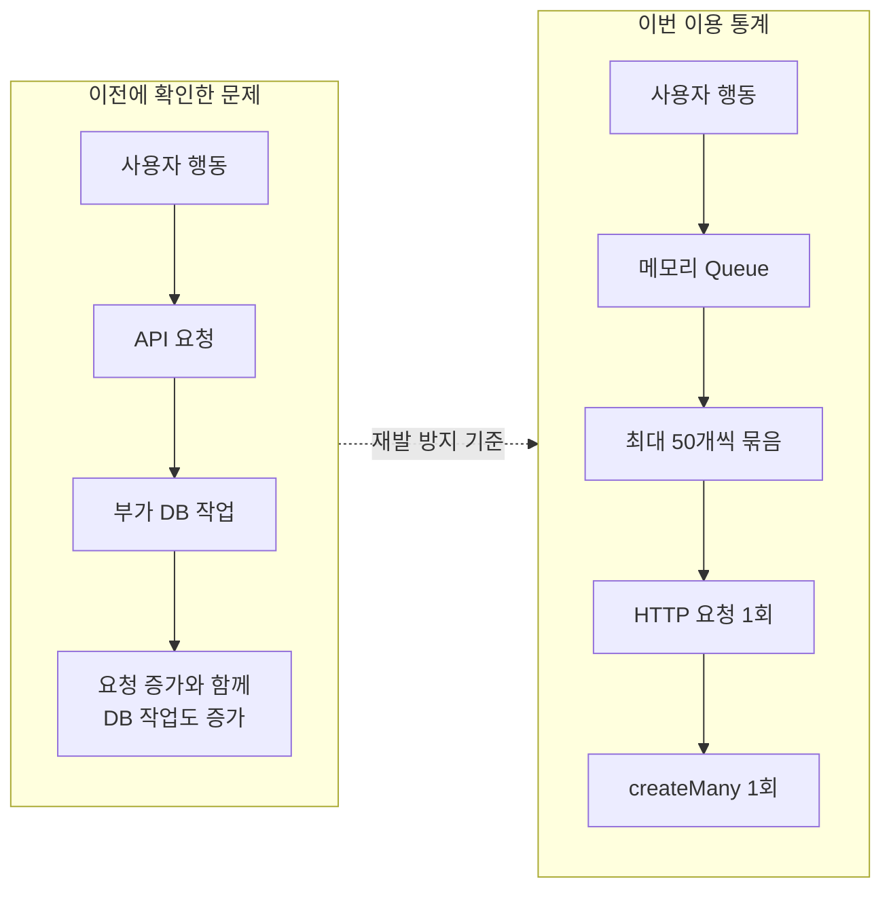
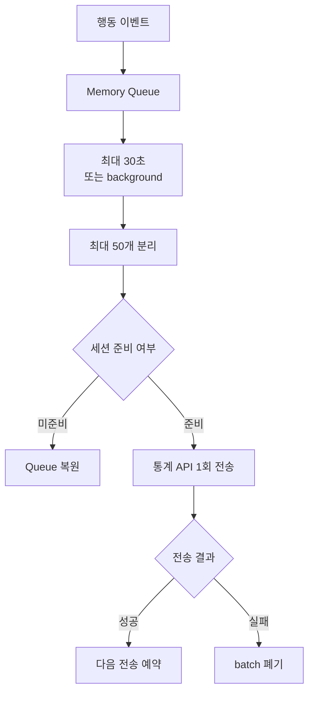
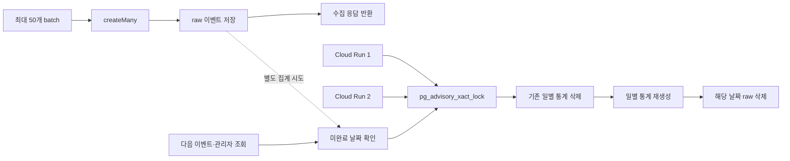

# 이용 통계 수집이 서비스 부하로 이어지지 않도록 배치 수집 구조로 설계했습니다

기존에는 접속 세션 기록을 바탕으로 일별 사용자 수 정도만 확인할 수 있었습니다. 사용자가 **어떤 화면을 보고, 무엇을 검색하며, 어느 지역에서 어떤 가게를 조회하는지**는 알 수 없어 서비스 개선에 활용할 데이터가 부족했습니다.

그래서 화면·검색·접속 지역·가게 조회를 수집하되, **raw 이벤트에는 원본 `userId`를 저장하지 않도록** 설계했습니다. 일별 순 사용자 계산에 필요한 해시만 사용하고, 집계가 끝나면 상세 이벤트와 해시를 삭제해 날짜별 이용 통계만 남깁니다.

이 기능을 도입하면서 행동마다 통계 API를 호출하면 앞서 겪었던 요청 증폭 구조가 다시 생길 수 있다는 점을 확인했습니다. 이를 **앱의 배치 전송과 서버의 일괄 저장으로 풀어낸 과정**을 정리했습니다.

|          |                                                                                        |
| -------- | -------------------------------------------------------------------------------------- |
| **문제** | 행동마다 통계를 전송하면 이벤트 수만큼 HTTP 요청과 DB 저장이 늘어날 수 있었습니다.     |
| **앱**   | 이벤트를 최대 30초 동안 모아 최대 50개씩 전송했습니다.                                 |
| **서버** | 한 배치를 `createMany()` 한 번으로 저장하고 일별 집계는 수집 응답과 분리했습니다.      |
| **결과** | 최대 50개의 이벤트를 **HTTP 요청 1회와 `createMany()` 1회**로 처리하도록 구성했습니다. |

## 1. 이전 문제를 새 설계 기준으로 바꿨습니다

앞선 지연 문제에서는 API 요청마다 활동 기록과 세션 갱신이 붙으면서 **요청 증가가 DB 작업 증가로 이어졌습니다.** 이용 통계를 추가하면서 같은 구조를 반복하지 않도록 행동 이벤트를 바로 저장하지 않고 묶어서 처리하기로 했습니다.

> **설계 판단**
>
> 통계의 실시간성과 완전한 수집보다 **핵심 기능에 추가 부하를 만들지 않는 것**을 우선했습니다.

## 2. 앱에서는 이벤트를 모아 한 번에 전송했습니다

앱에서는 이벤트가 발생해도 바로 네트워크 요청을 보내지 않습니다.

> **최대 30초** 동안 모으고 · **최대 50개**씩 전송하고 · **최대 100개**까지만 메모리에 보관

| 설정             |                         기준 | 이유                                               |
| ---------------- | ---------------------------: | -------------------------------------------------- |
| **전송 시점**    |       첫 이벤트 후 최대 30초 | 짧은 시간의 여러 행동을 한 요청으로 묶음           |
| **Batch**        |                    최대 50개 | 한 번에 보내는 요청 크기를 제한                    |
| **Memory Queue** |                   최대 100개 | 전송이 지연돼도 메모리가 계속 늘어나지 않도록 제한 |
| **앱 상태 변경** | background 진입 시 전송 시도 | 예약 시각 전이라도 남은 이벤트의 전송 기회를 확보  |

이벤트를 기록하는 `logEvent()`는 네트워크를 호출하지 않고 메모리 Queue에 값만 추가합니다. Queue가 100개를 넘으면 오래된 이벤트부터 제거하고, 이미 전송 타이머가 있다면 새 타이머를 만들지 않습니다. 같은 화면이 연속으로 감지된 경우도 중복 기록하지 않았습니다.

전송은 다음 순서로 처리합니다.

1. Queue 앞에서 최대 50개를 batch로 분리합니다.
2. 세션이 아직 준비되지 않았다면 API를 호출하지 않고 batch를 Queue에 되돌립니다.
3. 전송에 성공하고 이벤트가 남아 있다면 다음 전송을 예약합니다.
4. 네트워크 오류나 timeout이 발생하면 해당 batch는 재시도하지 않고 폐기합니다.

> **설계 판단**
>
> 세션 미준비는 앱 시작 중 일시적으로 발생할 수 있어 batch를 보존했습니다. 반면 네트워크 오류까지 계속 재시도하면 통계 요청이 다시 늘어날 수 있어 **일부 유실을 허용했습니다. 핵심 데이터가 아닌 통계이기 때문에 가능한 선택**입니다.

통계 요청은 일반 API와 분리했습니다. **429 재시도와 세션 자동 복구를 적용하지 않아**, 통계 요청 하나의 실패가 다시 추가 요청을 만드는 구조를 막았습니다.

### 불필요한 이벤트 자체도 줄였습니다

- **화면 조회** — 같은 화면의 연속 기록 제외
- **검색** — 제출된 검색만 기록하고 입력 중간값·자동완성 제외
- **가게·콘텐츠 조회** — 실제 상세 열람만 기록하고 목록 노출은 제외
- **지역** — 기존 위치 권한이 있는 경우 하루 한 번, 시·도 단위만 기록

지역 통계에서도 **위경도는 서버에 전송하지 않고**, 기기에서 `서울`·`경기` 같은 광역 단위로 변환한 라벨만 보냅니다.

## 3. 서버에서는 저장과 집계를 분리했습니다

앱은 최대 50개의 이벤트를 수집 API 한 번으로 보냅니다. 서버는 각 항목을 확인해 잘못된 값만 건너뛰고, 유효한 이벤트를 **`createMany()` 한 번으로 저장**합니다.

개별 이벤트 하나가 잘못됐다고 batch 전체를 실패시키지 않으며, 50개를 초과한 요청도 앞의 50개는 처리합니다.

> **설계 판단**
>
> 통계 데이터 일부의 오류가 **batch 전체의 실패로 번지지 않도록** 했습니다.

### 일별 집계도 수집 응답에서 분리했습니다

수집 API는 raw 이벤트를 저장한 뒤 **일별 집계가 끝날 때까지 기다리지 않습니다.**

Cloud Run은 요청이 없으면 인스턴스를 0대까지 줄이기 때문에 서버 내부의 자정 cron에 의존하지 않았습니다. 대신 통계 이벤트가 들어올 때 **인스턴스별로 최대 1시간에 한 번** 미완료 집계를 시도하고, 관리자 조회 시에도 끝나지 않은 날짜를 다시 확인합니다.

여러 Cloud Run 인스턴스가 같은 날짜를 동시에 집계할 수 있으므로 PostgreSQL의 `pg_advisory_xact_lock`으로 **동일 날짜에 대한 집계는 하나의 트랜잭션만 진행되도록** 했습니다.

집계는 **하나의 트랜잭션 안에서 기존 통계 삭제 → 재생성 → raw 삭제** 순으로 처리해, 중간에 실패한 뒤 다시 실행해도 같은 날짜의 결과가 중복되지 않도록 했습니다.

### 집계에 필요한 사용자 정보만 남겼습니다

raw 이벤트에는 원본 `userId` 대신 `sha256(userId:KST 날짜:salt)` 형태의 **일별 회전 해시**를 저장합니다. 같은 날에는 순 사용자를 계산할 수 있지만 날짜가 바뀌면 같은 사용자도 다른 값을 갖습니다.

집계가 끝나면 해시가 포함된 raw 이벤트를 삭제하고 **날짜·이벤트 종류·이름·횟수·일별 순 사용자 수**만 남깁니다.

## 4. 구조상 요청 수를 이렇게 줄였습니다

같은 batch 구간에 이벤트가 40개 발생했다고 가정하면 다음과 같습니다.

> **즉시 전송 구조**
>
> `40 events → HTTP 요청 최대 40회 + 개별 DB 저장 최대 40회`
>
> ↓ **Batch 적용**
>
> **현재 구조**
>
> `40 events → HTTP 요청 1회 + createMany() 1회`

### 자동화 테스트에서는 주요 경계를 확인했습니다

- 잘못된 이벤트나 50개를 넘긴 batch가 전체 요청을 실패시키지 않는지
- 원본 `userId` 대신 일별 회전 해시가 저장되는지
- 완료된 날짜의 raw 이벤트가 일별 통계로 교체된 뒤 삭제되는지
- 인증되지 않은 통계 수집과 관리자 요청을 차단하는지

### 의도적으로 감수한 한계도 있습니다

| 한계                  | 현재 판단                                                                 |
| --------------------- | ------------------------------------------------------------------------- |
| **Memory Queue 유실** | 앱이 강제 종료되면 전송 전 이벤트가 사라질 수 있음                        |
| **전송 실패 시 유실** | 재시도로 요청을 늘리지 않기 위해 실패한 batch는 폐기                      |
| **일별 집계 지연**     | Cloud Run이 유휴 상태면 늦어질 수 있으나 다음 요청에서 미완료 집계를 재처리 |

## 결론

이전 지연 문제에서 확인한 **사용자 행동만큼 부가 요청과 DB 작업이 늘어나는 구조를 반복하지 않는 것**을 기준으로 삼았습니다. 이벤트는 앱에서 묶어 전송하고 서버에서 한 번에 저장했으며, 일부 통계 유실을 허용하는 대신 **통계 기능이 핵심 서비스 요청에 추가 부하를 만들지 않도록** 설계했습니다.
