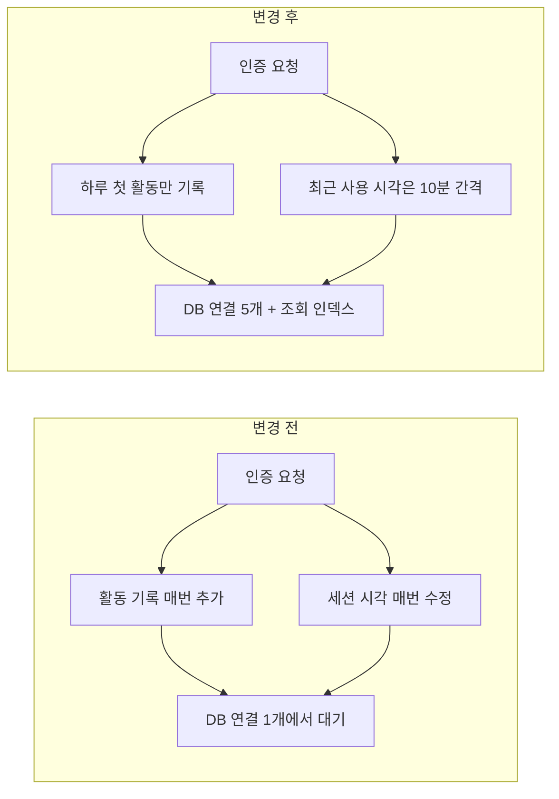

# 앱 전반의 지연 원인을 찾아 DB 요청 구조를 개선했습니다

> 여러 화면이 함께 느려진 상황에서 가장 단순한 404 응답부터 측정해 인프라 가설을 배제하고, 인증 요청마다 발생하던 DB 쓰기·연결 1개·인덱스 누락을 찾아 개선한 기록입니다.

## 한눈에

| | |
|---|---|
| **증상** | 식당 목록 0.7~1.0초, 지역 목록 0.6~0.9초로 주요 화면이 함께 느려졌습니다 |
| **단서** | 존재하지 않는 경로의 404 응답은 0.07~0.08초여서 서버·네트워크 전체 지연은 아니었습니다 |
| **원인** | 인증마다 DB 쓰기 발생 + 인스턴스당 DB 연결 1개 + 조회 인덱스 누락이 겹쳤습니다 |
| **결과** | 3개월 뒤 식당 목록 로그에서 p50 0.24초·p95 0.51초를 확인했습니다 |

## 가장 싼 측정부터 시작했습니다

앱 전체가 느리면 Cloud Run이나 네트워크 문제를 먼저 의심할 수 있습니다. 하지만 인프라 전체가 느리다면 DB를 사용하지 않는 단순한 404 응답도 함께 느려야 합니다.

404가 빠르게 응답해 조사 범위를 DB 접근과 각 API의 쿼리로 좁혔습니다.

## 세 가지 문제가 함께 있었습니다

| 발견 | 근거 |
|---|---|
| 인증할 때마다 활동 기록 추가와 세션 수정 | 활동 기록 89,390행으로 사용자 데이터 1,813행의 49배였고 하루 최대 15,663행이 늘었습니다 |
| 인스턴스당 DB 연결이 1개 | 동시에 실행된 쿼리가 한 연결 앞에서 순서대로 기다렸습니다 |
| 기록 수 조회 인덱스 누락 | `tasting_notes.restaurant_id`를 조회하면서 해당 인덱스가 없었습니다 |

탭을 한 번 열 때 여러 API가 동시에 호출되면서 DB 쓰기도 여러 번 발생했고, 읽기와 쓰기가 하나의 연결을 두고 기다리는 구조였습니다.

## 수정 과정에서 통계의 의미도 함께 바뀌었습니다

처음에는 매 요청마다 추가되던 활동 기록을 없앴습니다. 그러자 이 테이블을 기준으로 계산하던 관리자 DAU 통계까지 사라졌습니다. 하루 뒤 **KST 날짜가 바뀐 뒤 첫 활동에서만 한 번 기록**하도록 보완했습니다.

세션의 최근 사용 시각은 매 요청이 아니라 10분 간격으로만 갱신하고, 응답은 갱신 완료를 기다리지 않도록 했습니다. DB 연결은 1개에서 5개로 늘렸으며, 인덱스는 운영 테이블이 오래 잠기지 않도록 `CREATE INDEX CONCURRENTLY`로 추가했습니다.

## 변경 전후의 요청 구조

## 3개월 뒤 운영 로그로 다시 확인했습니다

| 시점 | 식당 목록 API |
|---|---|
| 조사 당시 단발 요청 | 0.7~1.0초 |
| 3개월 뒤 24시간 로그 23건 | **p50 0.24초 · p95 0.51초** |

측정 방식이 단발 요청과 로그 백분위로 달라 정확한 전후 비교에는 한계가 있습니다. 다만 개선 뒤에도 응답 상태가 유지되고 있다는 사후 확인으로 사용했습니다.

## 남은 과제

- 식당 목록 응답 크기 448KB는 아직 줄이지 못했습니다.
- DB 연결 5개는 인스턴스당 값이므로 서버가 늘어날 때 전체 연결 수를 다시 계산해야 합니다.
- 왜 연결 수가 1로 설정됐는지 추적할 절차가 없었던 점은 설정 검토 과정의 문제로 남겼습니다.
