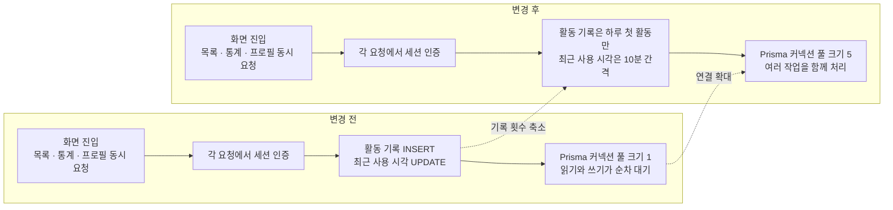

# 앱 전반의 지연 원인을 찾아 DB 요청 구조를 개선했습니다

> 여러 화면이 함께 느려진 상황에서 가장 단순한 `404` 응답을 비교 기준으로 삼아 조사 범위를 좁혔습니다. 이후 **인증 요청마다 발생하던 DB 쓰기와 크기가 1로 설정된 Prisma 커넥션 풀이 겹치는 구조**를 찾아 개선했습니다.

## 한눈에

|          |                                                                                                                      |
| -------- | -------------------------------------------------------------------------------------------------------------------- |
| **증상** | 식당 목록은 700–1,000ms, 지역 목록은 600–900ms가 걸리며 여러 화면이 함께 느려졌습니다                                |
| **단서** | DB를 사용하지 않는 `404` 응답은 70–80ms여서 서비스 전체가 똑같이 느린 상황은 아니었습니다                            |
| **원인** | 인증 요청마다 활동 기록과 세션 수정이 발생했고, 여러 DB 작업이 크기가 1인 Prisma 커넥션 풀을 두고 기다렸습니다       |
| **변경** | 활동 기록은 하루 첫 활동에만 남기고 세션 수정은 10분 간격으로 줄였으며, Prisma 커넥션 풀 크기를 1에서 5로 늘렸습니다 |
| **확인** | 식당 목록 운영 로그에서 p50 240ms·p95 510ms를 확인했습니다                                                           |

## 가장 단순한 응답을 기준으로 조사 범위를 좁혔습니다

특정 화면 하나가 아니라 홈·커뮤니티·기록·랭킹처럼 여러 API를 함께 호출하는 화면이 전반적으로 느려졌습니다. 당시 사용자는 하루 약 250명이었고, 주요 화면의 응답 시간은 다음과 같았습니다.

| 요청               |       응답 시간 | 특징                         |
| ------------------ | --------------: | ---------------------------- |
| 존재하지 않는 경로 |     **70–80ms** | `404` 즉시 응답·DB 접근 없음 |
| 공지 목록          |        약 390ms | 단순한 목록 조회             |
| 지역별 식당 목록   |   **600–900ms** | 약 68KB 응답                 |
| 전체 식당 목록     | **700–1,000ms** | 약 448KB 응답                |

DB를 사용하지 않는 `404` 응답은 70–80ms로 빠르게 돌아왔습니다. 그래서 **모든 요청에 공통으로 발생하는 지연보다는 DB 접근과 API별 처리 구조를 우선 조사**했습니다.

## 읽기 요청에도 반복적인 DB 쓰기가 붙어 있었습니다

앱은 탭 하나를 열 때 통계·목록·프로필처럼 여러 API를 함께 요청합니다. 그런데 인증된 API를 하나 호출할 때마다 세션을 조회하는 것에 더해, **활동 기록을 새로 추가하고 세션의 최근 사용 시각도 수정**하고 있었습니다.

| 확인한 내용                      | 근거와 영향                                                                    |
| -------------------------------- | ------------------------------------------------------------------------------ |
| **인증 요청마다 활동 기록 추가** | 사용자 1,813명에 활동 기록은 89,390행이었고, 하루 최대 15,663행이 추가됐습니다 |
| **인증 요청마다 세션 시각 수정** | 데이터를 읽는 API에도 매번 세션 `UPDATE`가 함께 발생했습니다                   |
| **Prisma 커넥션 풀 크기 1**      | 한 화면에서 동시에 시작된 DB 작업도 하나의 연결 앞에서 순서대로 기다렸습니다   |

문제는 특정 SQL 하나가 느린 것이 아니라, **한 화면에서 여러 API가 동시에 호출되는 상황에서 각 인증 요청마다 DB 쓰기가 추가되고, 그 작업들이 제한된 DB 연결을 함께 사용하던 구조**였습니다.

## DB 쓰기를 줄이자 운영 통계도 함께 사라졌습니다

첫 수정에서는 인증할 때마다 추가되던 활동 기록을 제거했습니다. DB 쓰기는 줄었지만, 이 테이블을 사용하던 관리자 DAU 통계도 더 이상 새 활동을 집계하지 못했습니다.

하루 뒤 이를 보완해 **KST 날짜가 바뀐 뒤 처음 활동할 때만 기록**하도록 바꿨습니다. 기존에는 한 사용자의 API 호출마다 여러 행이 쌓였지만, 변경 후에는 사용자별 일간 활동을 남기는 기준으로 기록 단위도 함께 정리됐습니다.

단순히 쓰기를 없애는 것으로 끝내지 않고, **DAU 집계에 필요한 의미는 유지하면서 기록 횟수만 줄이는 방식**으로 다시 설계했습니다.

세션의 최근 사용 시각은 매 요청이 아니라 **마지막 갱신 후 10분이 지났을 때만 수정**했습니다. 세션 유휴 만료 기준이 90일인 점을 고려해, **최근 사용 시각이 최대 10분 늦게 기록되는 것은 운영상 허용할 수 있는 범위라고 판단했습니다.**

## 인증 요청마다 발생하던 DB 작업을 줄이고, 동시에 처리할 수 있는 연결을 늘렸습니다

인스턴스당 Prisma 커넥션 풀 크기를 1에서 5로 늘려 **동시에 발생하는 여러 DB 작업이 하나의 연결을 순차적으로 기다리는 상황을 줄였습니다.**

| 변경                    | 적용 내용                                           |
| ----------------------- | --------------------------------------------------- |
| **활동 기록**           | 인증 요청마다 추가 → KST 기준 하루 첫 활동에만 추가 |
| **세션 최근 사용 시각** | 인증 요청마다 수정 → 10분 간격으로 수정             |
| **Prisma 커넥션 풀**    | 인스턴스당 크기 1 → 5                               |

## 같은 지연이 반복되지 않는지 확인했습니다

| 시점                  | 식당 목록 API             |
| --------------------- | ------------------------- |
| 조사 당시 단발 요청   | 700–1,000ms               |
| 24시간 운영 로그 23건 | **p50 240ms · p95 510ms** |

같은 API의 운영 로그를 다시 확인한 결과, **p50 240ms·p95 510ms로 당시보다 안정적인 응답 상태를 확인했습니다.**

## 남은 과제

- 전체 식당 목록의 응답 크기가 약 448KB이므로, 데이터가 더 늘어나면 **필드 축소나 조회 범위 분리도 함께 검토할 계획입니다.**
- 서버 인스턴스 증가(Cloud Run 오토스케일링)에 따라 전체 DB 연결 수도 함께 늘어나는 구조이므로, **확장 시 DB 연결 한도를 기준으로 커넥션 풀과 인스턴스 수를 함께 관리할 계획입니다.**
