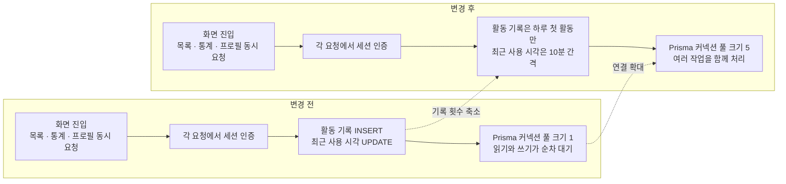

# 앱 전반의 지연 원인을 찾아 DB 요청 구조를 개선했습니다

> **여러 API가 동시에 호출될 때 인증 과정에서 반복되는 DB 쓰기와 작은 커넥션 풀이 겹쳐 지연이 커지고 있었습니다. 이를 사용자별 하루 한 번의 활동 기록, 10분 간격의 세션 갱신, 커넥션 풀 확대로 개선했습니다. 이후 추가한 이용 통계도 이벤트마다 요청하지 않고 메모리 큐에 모아 배치 전송하도록 설계했습니다.**

## 한눈에

|          |                                                                                                                      |
| -------- | -------------------------------------------------------------------------------------------------------------------- |
| **증상** | 식당 목록은 700–1,000ms, 지역 목록은 600–900ms가 걸리며 여러 화면이 함께 느려졌습니다                                |
| **단서** | DB를 사용하지 않는 `404` 응답은 70–80ms여서 서비스 전체가 똑같이 느린 상황은 아니었습니다                            |
| **원인** | 인증 요청마다 활동 기록과 세션 수정이 발생했고, 여러 DB 작업이 크기가 1인 Prisma 커넥션 풀을 두고 기다렸습니다       |
| **변경** | 활동 기록은 하루 첫 활동에만 남기고 세션 수정은 10분 간격으로 줄였으며, Prisma 커넥션 풀 크기를 1에서 5로 늘렸습니다 |
| **후속 설계** | 이용 통계는 메모리 큐에 모아 첫 이벤트 발생 30초 후 최대 50개씩 한 번에 전송하도록 구성했습니다                  |
| **확인** | 식당 목록 운영 로그에서 p50 240ms·p95 510ms를 확인했습니다                                                           |

## 가장 단순한 응답을 기준으로 조사 범위를 좁혔습니다

특정 화면 하나가 아니라 홈·커뮤니티·기록·랭킹처럼 여러 API를 함께 호출하는 화면이 전반적으로 느려졌습니다. 당시 사용자는 하루 약 250명이었고, 주요 화면의 응답 시간은 다음과 같았습니다.

| 요청               |       응답 시간 | 특징                         |
| ------------------ | --------------: | ---------------------------- |
| 존재하지 않는 경로 |     **70–80ms** | `404` 즉시 응답·DB 접근 없음 |
| 공지 목록          |        약 390ms | 단순한 목록 조회             |
| 지역별 식당 목록   |   **600–900ms** | 약 68KB 응답                 |
| 전체 식당 목록     | **700–1,000ms** | 약 448KB 응답                |

DB를 사용하지 않는 `404` 응답은 70–80ms로 빠르게 돌아왔습니다. 그래서 **모든 요청에 공통으로 발생하는 지연보다는 DB 접근과 API별 처리 구조를 우선 조사**했습니다.

## 읽기 요청에도 반복적인 DB 쓰기가 붙어 있었습니다

앱은 탭 하나를 열 때 통계·목록·프로필처럼 여러 API를 함께 요청합니다. 그런데 인증된 API를 하나 호출할 때마다 세션을 조회하는 것에 더해, **활동 기록을 새로 추가하고 세션의 최근 사용 시각도 수정**하고 있었습니다.

| 확인한 내용                      | 근거와 영향                                                                    |
| -------------------------------- | ------------------------------------------------------------------------------ |
| **인증 요청마다 활동 기록 추가** | 사용자 1,813명에 활동 기록은 89,390행이었고, 하루 최대 15,663행이 추가됐습니다 |
| **인증 요청마다 세션 시각 수정** | 데이터를 읽는 API에도 매번 세션 `UPDATE`가 함께 발생했습니다                   |
| **Prisma 커넥션 풀 크기 1**      | 한 화면에서 동시에 시작된 DB 작업도 하나의 연결 앞에서 순서대로 기다렸습니다   |

문제는 특정 SQL 하나가 느린 것이 아니라, **한 화면에서 여러 API가 동시에 호출되는 상황에서 각 인증 요청마다 DB 쓰기가 추가되고, 그 작업들이 제한된 DB 연결을 함께 사용하던 구조**였습니다.

## 활동 기록은 없애지 않고 하루 한 번만 남겼습니다

처음에는 인증 요청마다 추가되던 활동 기록을 제거해 DB 쓰기를 줄였습니다. 하지만 이 기록을 사용하던 **관리자 DAU 통계까지 함께 멈추는 문제**가 생겼습니다.

그래서 활동 기록 자체를 없애는 대신, **사용자가 KST 기준으로 그날 처음 활동했을 때만 기록**하도록 바꿨습니다. 기존에는 한 사용자의 API 호출마다 여러 행이 쌓였지만, 변경 후에는 **사용자별 하루 한 번의 활동만 남기면서 DAU 집계에 필요한 정보는 유지**했습니다.

## 세션 갱신도 매 요청에서 10분 간격으로 줄였습니다

세션의 최근 사용 시각도 인증 요청마다 수정하고 있었습니다. 이를 **마지막 갱신 후 10분이 지났을 때만 업데이트**하도록 바꿨습니다.

세션 유휴 만료 기준이 90일인 점을 고려해, **10분 정도의 기록 차이는 허용 가능한 범위로 보고 불필요한 `UPDATE` 횟수를 줄였습니다.**

## 인증 요청마다 발생하던 DB 작업을 줄이고, 동시에 처리할 수 있는 연결을 늘렸습니다

인스턴스당 Prisma 커넥션 풀 크기를 1에서 5로 늘려 **동시에 발생하는 여러 DB 작업이 하나의 연결을 순차적으로 기다리는 상황을 줄였습니다.**

| 변경                    | 적용 내용                                           |
| ----------------------- | --------------------------------------------------- |
| **활동 기록**           | 인증 요청마다 추가 → KST 기준 하루 첫 활동에만 추가 |
| **세션 최근 사용 시각** | 인증 요청마다 수정 → 10분 간격으로 수정             |
| **Prisma 커넥션 풀**    | 인스턴스당 크기 1 → 5                               |

## DB 요청 구조를 바꾼 뒤 운영 로그로 확인했습니다

| 시점                  | 식당 목록 API             |
| --------------------- | ------------------------- |
| 조사 당시 단발 요청   | 700–1,000ms               |
| 24시간 운영 로그 23건 | **p50 240ms · p95 510ms** |

같은 API의 운영 로그를 다시 확인한 결과, **p50 240ms·p95 510ms로 당시보다 안정적인 응답 상태를 확인했습니다.**

## 이후 추가한 이용 통계도 요청마다 전송하지 않도록 설계했습니다

지연 문제를 개선한 뒤 화면 조회·검색·가게 열람 같은 이용 통계 기능을 추가했습니다. 통계 이벤트를 행동이 발생할 때마다 곧바로 전송하면 화면을 이동할수록 HTTP 요청과 DB 쓰기가 다시 늘어날 수 있습니다. 그래서 이 기능은 **당시 지연의 해결책이 아니라, 같은 요청 증폭을 다시 만들지 않기 위한 후속 설계**로 적용했습니다.

| 단계 | 구현 | 요청·DB 작업에 미치는 영향 |
| --- | --- | --- |
| **이벤트 기록** | `logEvent()`는 네트워크를 호출하지 않고 메모리 큐에 이벤트만 추가 | 화면 전환·검색 직후에는 통계 요청이 발생하지 않음 |
| **지연 배치** | 첫 이벤트가 들어오면 30초 뒤 전송을 예약하고 최대 50개를 한 배치로 구성 | 여러 이벤트를 하나의 HTTP 요청으로 합침 |
| **백그라운드 전환** | 앱이 `background` 또는 `inactive` 상태가 되면 남은 큐를 즉시 전송 | 앱을 닫기 전에 남은 이벤트 전송 시도 |
| **서버 저장** | `POST /analytics/events`가 받은 이벤트를 `createMany()` 한 번으로 저장 | 이벤트마다 개별 DB 쓰기가 발생하지 않음 |

상시 반복되는 `setInterval`을 두지 않고, 큐에 첫 이벤트가 들어왔을 때만 30초짜리 `setTimeout`을 예약했습니다. 큐는 최대 100개, 한 번의 전송은 최대 50개로 제한합니다. 세션이 아직 준비되지 않았다면 이벤트를 큐에 되돌리고, 네트워크 전송에 실패하면 통계 유실을 허용해 사용자 기능과 오류 추적에 영향을 주지 않도록 했습니다.

이 구조로 **앱 실행 직후의 요청 집중에 통계 요청을 보태지 않으면서**, 여러 화면에서 발생한 이벤트를 한 번의 네트워크 요청과 한 번의 배치 저장으로 처리합니다.

## 남은 과제

- 전체 식당 목록의 응답 크기가 약 448KB이므로, 데이터가 더 늘어나면 **필드 축소나 조회 범위 분리도 함께 검토할 계획입니다.**
- 서버 인스턴스 증가(Cloud Run 오토스케일링)에 따라 전체 DB 연결 수도 함께 늘어나는 구조이므로, **확장 시 DB 연결 한도를 기준으로 커넥션 풀과 인스턴스 수를 함께 관리할 계획입니다.**
