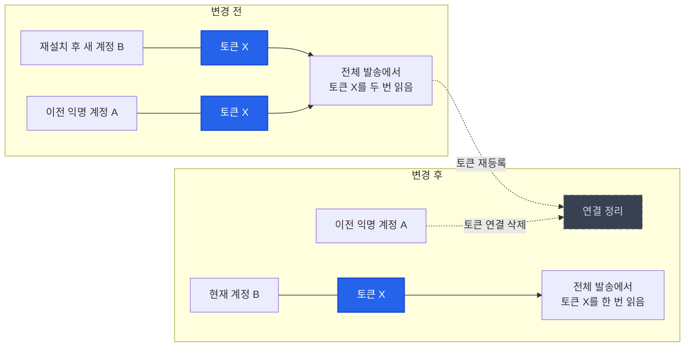

# 앱 재설치 후 중복 알림의 원인을 푸시 토큰 연결에서 찾아 수정했습니다

> 앱 재설치로 새 익명 계정이 생긴 뒤에도 이전 계정에 같은 푸시 토큰이 남아 있었습니다. **토큰을 등록할 때 이전 계정의 연결을 정리하고 현재 계정에 연결되도록 변경했습니다.**

## 한눈에

| | |
|---|---|
| **증상** | 앱을 재설치한 사용자의 한 기기에 같은 알림이 두 번 도착했습니다 |
| **원인** | 이전 계정과 재설치 후 생긴 새 계정에 같은 기기의 푸시 토큰이 각각 저장됐습니다 |
| **선택** | 발송 시 중복을 숨기지 않고, 토큰 등록 시 기존 계정과의 연결을 정리했습니다 |
| **변경** | 다른 계정의 동일 토큰을 삭제한 뒤 현재 계정에 저장하는 작업을 하나의 트랜잭션으로 묶었습니다 |
| **검증** | 다른 계정의 동일 토큰을 제거한 뒤 현재 계정에 저장되는 흐름을 단위 테스트로 확인했습니다 |

## 재설치 후 하나의 기기 토큰이 두 계정에 연결됐습니다

앱은 최초 실행 때 UUID를 한 번 생성해 `AsyncStorage`에 저장하고, 이후 동일 사용자를 식별하는 데 사용했습니다. 앱을 삭제하면 이 값도 함께 사라지기 때문에 재설치 후에는 **새 UUID와 새 익명 계정**이 만들어졌습니다. 하지만 이전 계정과 푸시 토큰은 서버 DB에 그대로 남아 있었습니다.

당시 `user_push_tokens` 테이블은 `(userId, token)` 조합만 중복을 막았습니다. 따라서 같은 기기의 토큰이라도 사용자 ID가 다르면 이전 계정과 새 계정에 각각 저장될 수 있었습니다. 전체 푸시는 두 행을 모두 읽었고, 결과적으로 같은 기기에 같은 알림을 두 번 보냈습니다.

## 발송할 때 숨기지 않고, 토큰이 저장되는 시점에 바로잡았습니다

| 후보 | 판단 |
|---|---|
| **토큰 등록 시 다른 계정의 동일 토큰 삭제** | 데이터 자체를 바로잡아 발송·알림 설정·대상 지정에 함께 적용할 수 있어 **채택했습니다** |
| 발송할 때만 중복 토큰 제거 | 잘못된 소유 관계가 계속 남고, 모든 발송 경로에 중복 제거 처리가 필요해 제외했습니다 |
| 기존 중복 일괄 정리 | 즉시 제거할 수 있지만 운영 데이터를 한 번에 변경해야 해, **신규 등록 시 자연스럽게 정리되는 방식으로 영향 범위를 제한했습니다** |

## 토큰 등록 시 이전 계정의 연결을 정리했습니다

앱이 푸시 토큰을 등록하면 서버는 하나의 트랜잭션 안에서 다음 순서로 처리합니다.

1. 같은 토큰을 가진 다른 계정의 행을 삭제합니다.
2. 현재 계정과 토큰의 조합을 새로 저장하거나 갱신합니다.
3. 두 작업이 모두 성공하면 변경 내용을 반영합니다.

삭제와 저장을 한 트랜잭션으로 묶어, 중간에 저장이 실패했을 때 삭제만 반영되어 토큰이 어느 계정에도 연결되지 않는 상황을 막았습니다. 앱 실행 때마다 같은 등록 요청을 보내도 현재 계정의 행은 갱신만 되며, 재설치로 계정이 달라진 경우에는 **기기 토큰이 새 계정에 연결**됩니다.

## 기존 앱은 바꾸지 않았습니다

API 형식을 바꾸지 않고 서버의 토큰 등록 로직만 수정했습니다. **구버전 앱도 기존과 같은 방식으로 토큰을 등록하면 다른 계정에 남은 동일 토큰이 정리됩니다.**

## 확인한 범위

- 단위 테스트로 **다른 계정의 동일 토큰 삭제 → 현재 계정 저장** 흐름을 확인했습니다.
- 기존 중복 토큰도 **해당 기기가 다시 앱을 열어 토큰을 등록하는 시점에 정리**됩니다.
