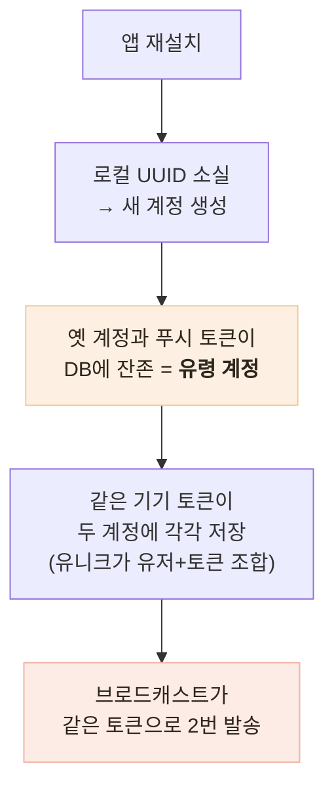

# 재설치하면 알림이 두 번 왔다

> 하나의 증상을 두 겹의 원인으로 분해하고, 세 가지 해법을 비교한 뒤 데이터 자체를 교정하는 쪽을 고른 기록

## 한눈에

| | |
|---|---|
| **증상** | 앱을 재설치한 사용자의 한 기기에 같은 알림이 2번 도착 |
| **원인** | ① 재설치가 만드는 **유령 계정** ② 푸시 토큰이 유저별로만 유니크 — 두 겹 |
| **해법** | 등록 시점 토큰 **전역 유일화** + 유저당 세션 1개 (트랜잭션) |
| **결과** | 같은 기기 중복 발송의 데이터 원인 제거 — 스키마·API 무변경 |

## 원인을 두 겹으로 분해

"알림이 2번 온다"는 하나의 증상이지만, 계정 수명 문제(①)와 데이터 모델 문제(②)가 겹쳐야 발생한다. 분해하지 않으면 어느 한쪽만 고치고 끝났을 것이다.

## 세 가지 해법 비교

| 후보 | 판단 |
|---|---|
| **등록 시 토큰 전역 유일화** | 데이터 자체를 교정 — 발송·설정·타겟팅 등 하류 전부가 정상화. 반영이 기기 재등록 시점이라는 단점은 수용 — **채택** |
| 발송 시 중복 제거 | 발송 핫패스에 영구 코드가 남고, 유령 계정이 알림 설정을 덮는 문제는 못 고침 — 기각 |
| 일회성 정리 스크립트 | 운영 데이터 직접 변경 — 보류하고 기존 중복은 재등록 시 자연 회수에 맡김 |

근본 원인(재설치 시 계정 재사용)은 이번 범위에서 뺐다 — iOS는 Keychain으로 가능하지만 **Android는 Keystore가 앱 삭제와 함께 지워져** 안정적 앵커가 없다. 플랫폼 제약을 근거로 보류를 명시했고, 이 한계는 이후 카카오 계정 백업·복구 기능으로 이어졌다.

## 구현 — 순서까지 트랜잭션으로

토큰 등록을 트랜잭션으로 묶었다: **타 유저 소유의 동일 토큰 삭제 → 현재 유저로 upsert.** 순서가 바뀌면 유니크 충돌이 나므로, 삭제가 먼저 실행된다는 것까지 테스트로 검증했다.

세션도 유저당 1개로 단일화했다 — 삭제와 생성을 한 트랜잭션에 묶어 **부분 실패로 세션이 0개가 되는 상황**을 방지했다. "UUID는 설치 1건과 같으니 삭제되는 건 기기에 이미 없는 낡은 세션뿐, 실사용자 로그아웃은 없다"는 안전 근거도 주석으로 남겼다.

스키마·API 계약은 전혀 바꾸지 않았다 — 구버전 앱 영향 0.

## 남은 한계

- 기존 중복 데이터는 기기가 재등록할 때 자연 회수 — 즉시성이 없다
- 비활성 기기의 유령 계정 행은 잔존 (정리 스크립트는 보류 상태)
- 발송 API 성공 ≠ 단말 도달 — 수신 확인(receipt) 추적은 미구현
