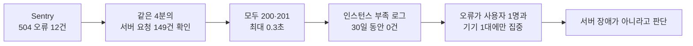

# 앱에서 발생한 504 오류가 서버 장애가 아님을 확인했습니다

> 앱에서 수집된 504 오류를 서버 로그와 대조해 실제 서버 장애가 아니라고 판단하고, 근거 없는 재배포와 설정 변경을 피한 과정입니다.

## 한눈에

| | |
|---|---|
| **발견** | Sentry에 504 오류 12건이 4분 동안 집중되었습니다. |
| **확인** | 같은 시간대 서버 요청 149건은 모두 200·201이었고, 가장 느린 응답도 0.3초였습니다. |
| **판단** | 서버 자체의 장애가 아니라 특정 사용자의 요청 경로에서 발생한 문제일 가능성이 높다고 판단했습니다. |
| **결과** | 재배포나 인스턴스 증설을 하지 않았고, 이후 30일 동안 같은 504 오류는 다시 수집되지 않았습니다. |

## 장애처럼 보인 신호

Sentry를 확인하던 중 `status code 504` 오류 12건을 발견했습니다. 모두 한 날짜의 18:01~18:05 UTC, 한국 시각으로 새벽 3시대의 4분 동안 발생했습니다.

짧은 시간에 같은 오류가 반복됐기 때문에 서버가 일시적으로 요청을 처리하지 못했을 가능성을 먼저 확인했습니다. 그러나 같은 30일 동안 서버 요청 로그에서 5xx 응답은 발견되지 않았습니다. 앱에는 504가 남았지만 서버는 504를 반환한 기록이 없는 상황이었습니다.

## 같은 시간대의 기록을 대조했습니다

확인한 근거는 다음과 같습니다.

| 확인한 내용 | 결과 |
|---|---|
| **같은 4분의 서버 요청** | 149건이 모두 200·201이었고, 가장 느린 응답도 0.3초였습니다. |
| **인스턴스 부족 여부** | `no available instance` 로그가 30일 동안 없었습니다. |
| **발생 범위** | 오류 12건이 사용자 1명과 기기 1대에만 집중되었습니다. |
| **같은 사용자의 다른 요청** | 504와 정상 응답이 함께 기록되어 있었습니다. |

여러 사용자에게 동시에 발생한 서버 장애였다면 같은 시간대 서버 로그에도 실패나 지연이 남아야 합니다. 하지만 서버 요청은 정상 처리됐고 오류도 한 사용자에게만 집중됐습니다. 따라서 서버 자체가 멈춘 것이 아니라, 앱에서 서버 응답을 받기까지의 경로에서 504가 발생했을 가능성이 높다고 판단했습니다.

정확히 어느 구간에서 504가 반환됐는지는 확인할 수 없었으므로 이동통신망이나 Google 앞단 중 하나로 단정하지 않았습니다.

## 조치하지 않는 것도 운영 판단이었습니다

Sentry의 오류만 보고 재배포하거나 인스턴스를 늘렸다면 원인과 관계없는 변경이 됐을 것입니다. 서버 로그와 발생 범위를 확인한 뒤에는 서비스 설정을 바꾸지 않고 관찰을 이어갔습니다.

이후 30일 동안 같은 504 오류가 다시 수집되지 않아 별도 조치 없이 종료했습니다. 이 경험 이후에는 클라이언트에서 수집된 오류를 바로 서버 장애로 판단하지 않고, 같은 시간대의 서버 응답과 영향을 받은 사용자 수를 함께 확인하고 있습니다.

## 남은 한계

- 504를 실제로 반환한 네트워크 구간은 해당 계층의 로그에 접근할 수 없어 확정하지 못했습니다.
- 이후 30일 동안 재발하지 않았다는 사실만으로 원인이 제거됐다고 볼 수는 없습니다. 여러 사용자에게 같은 문제가 다시 발생하면 서버 앞단까지 조사 범위를 넓혀야 합니다.
