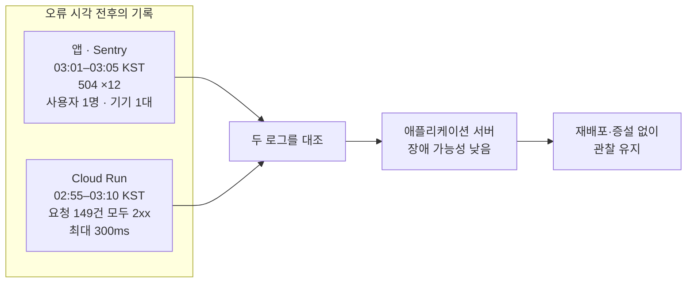

# 504 오류를 서버 장애로 단정하지 않고 로그로 원인 범위를 좁혔습니다

> Sentry에 짧은 시간 동안 집중된 `504` 오류를 같은 시간대의 Cloud Run 요청 로그와 대조했습니다. **애플리케이션 서버 장애 가능성이 낮다고 판단하고, 원인과 관계없는 재배포나 인스턴스 증설을 하지 않은 과정**입니다.

## 한눈에

|          |                                                                                                     |
| -------- | --------------------------------------------------------------------------------------------------- |
| **발견** | 조사한 4분 구간에서 Sentry의 `504` 오류 12건이 한 사용자에게 집중됐습니다                           |
| **대조** | 앞뒤를 포함한 15분간 서버 요청 149건은 모두 `200·201`이었고, 가장 느린 응답도 300ms였습니다         |
| **판단** | 애플리케이션 서버 자체의 장애 가능성은 낮다고 보고, 실제 504 반환 위치는 특정하지 않았습니다        |
| **결정** | 재배포나 인스턴스 증설 없이 관찰하고, 클라이언트 오류를 서버 로그와 교차 확인하는 기준을 남겼습니다 |

## 앱에는 504가 있었지만 서버 로그에는 없었습니다

**Sentry에서 오류 알림 메일을 받고 확인해보니**, AxiosError: Request failed with status code 504가 특정 시간대에 반복되고 있었습니다. 당시 확인한 12건은 **4분 동안 한 사용자와 기기 1대에 집중**돼 있었고, 이 구간을 기준으로 서버 로그를 대조했습니다.

이후 Sentry 집계 범위가 더 넓어졌기 때문에, **이번 분석은 당시 확인한 12건의 4분 구간에 한정**했습니다.

짧은 시간에 같은 오류가 반복돼 서버가 일시적으로 요청을 처리하지 못한 상황을 먼저 의심했습니다. **Sentry에는 `504`가 남았지만, 같은 시간대 Cloud Run 요청 로그에서는 대응되는 `5xx` 기록을 찾지 못했습니다.**

## 오류 시각 전후의 서버 로그를 전부 대조했습니다

오류 발생 전후를 포함한 17:55~18:10 UTC의 Cloud Run 요청 로그 149건을 확인했습니다.

| 확인한 내용                    | 결과                                                                   |
| ------------------------------ | ---------------------------------------------------------------------- |
| **오류 전후 15분의 서버 요청** | 149건 중 `200` 148건·`201` 1건이었고, 최대 응답 시간은 300ms였습니다   |
| **발생 범위**                  | `504` 12건이 사용자 1명과 OnePlus 8 Pro 기기 1대에 집중됐습니다        |
| **같은 세션의 다른 요청**      | 공지 요청은 `200`이었지만 식당·사용자 요청에는 `504`가 섞여 있었습니다 |

### 해당 4분 구간의 원인을 두 가지로 좁혔습니다

| 가설                                                        | 판단                 | 근거                                                                                                   |
| ----------------------------------------------------------- | -------------------- | ------------------------------------------------------------------------------------------------------ |
| **애플리케이션 외부의 게이트웨이·프록시 등 요청 경로 문제** | **가능성을 높게 봄** | 한 사용자·기기에서 4분 동안만 발생했고, 같은 시간대 Cloud Run 요청 149건은 모두 정상 처리됐습니다      |
| **Cloud Run 요청 시간 초과**                                | **가능성을 낮게 봄** | 시간 초과 시 `504`가 발생할 수 있지만, 같은 시간대 Cloud Run 로그에서 대응되는 `5xx`를 찾지 못했습니다 |

이를 바탕으로 **애플리케이션 처리 지연보다는 외부 요청 경로에서 일시적으로 발생했을 가능성을 더 높게 봤습니다.** 다만 해당 구간의 로그에는 접근할 수 없어 실제 `504` 반환 위치까지는 특정하지 못했습니다. ([**Cloud Run 로그 문서**](https://docs.cloud.google.com/run/docs/logging?hl=en), [**Cloud Run 요청 시간 제한 문서**](https://docs.cloud.google.com/run/docs/configuring/request-timeout), [**Cloud Run 504 오류 문제 해결 문서**](https://docs.cloud.google.com/run/docs/troubleshooting?hl=en#gateway_timeout_error))

## 조치하지 않는 것도 운영 판단이었습니다

당시에는 Sentry 오류만 보고 서버를 재배포하거나 인스턴스를 늘리지 않았습니다. **같은 시간대의 서버 응답과 영향 범위를 확인한 뒤 서비스 설정은 그대로 두고 관찰을 이어갔습니다.**

이후에는 클라이언트 오류를 바로 서버 장애로 판단하지 않고, **같은 시간대의 서버 응답·지연·영향받은 사용자 범위를 함께 확인**하고 있습니다.
