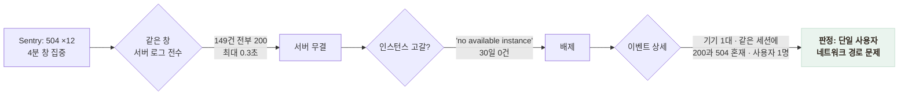

# 장애처럼 보였지만 장애가 아니었다 — 504 오탐 판정

> 모니터링에 잡힌 5분짜리 "장애 신호"를 서버 로그 149건 전수 대조로 단일 사용자의 네트워크 문제로 판정한, 조치를 "안 한 것"이 결론인 기록

## 한눈에

| | |
|---|---|
| **신호** | Sentry에 504 에러 12건 — 전부 새벽 3시(KST) **4분 창**에 집중. 부분 장애의 전형적 모양 |
| **모순** | 같은 30일간 서버 요청 로그의 5xx는 **0건** |
| **판정** | 같은 창의 서버 로그 전수 + 이벤트 상세 대조 → **단일 사용자의 네트워크 경로 문제** |
| **가치** | 원인 없는 조치(재배포·설정 변경)를 하지 않았다 — 신호를 사실로 승격하기 전에 교차 검증 |

## 신호는 그럴듯했다

앱 측 에러 리포트(Sentry)를 훑다가 `status code 504` 12건을 발견했다. 시각 분포를 보니 전부 한 날짜의 18:01~18:05 UTC — 4분 창에 몰려 있었다. 여러 요청이 한 구간에서 일제히 실패하는 모양은 **서비스 순단**의 교과서적 신호다.

그런데 서버 쪽 요청 로그에는 같은 기간 5xx가 0건이었다. 앱은 받았다는데 서버는 낸 적이 없다 — 둘 중 하나가 아니라, **서버 앞 어딘가**가 답일 수 있다.

## 교차 검증 — 세 겹의 근거

결정타는 이벤트 상세였다. 문제의 12건은 전부 **한 대의 기기**(Android)에서 나왔고, 같은 세션의 breadcrumb에 200과 504가 섞여 있었다 — 서비스가 죽은 게 아니라 그 사용자의 경로(이동통신망 프록시 등)가 간헐적으로 504를 돌려준 것이다. 새벽 3시라는 시간대도 단일 사용자 가설과 맞았다.

## 조치하지 않은 것이 결론이다

| 만약 신호만 믿었다면 | 실제로 한 것 |
|---|---|
| 재배포, 인스턴스 증설, 설정 변경 — **원인 없는 변경** | 오탐 판정 후 종결, 절차만 남김 |

원인 없는 변경은 그 자체가 다음 장애의 씨앗이다. 이 사건 이후 운영 절차에 규칙을 넣었다: **클라이언트 신호는 서버 로그와 교차 검증하기 전까지 장애로 분류하지 않는다.** 반대 방향의 교차 검증도 같은 날 실효를 확인했다 — 서버의 429 버스트를 앱 측 Sentry 수치로 상호 확인한 것.

## 남은 한계

- 정확한 504 반환 지점(이동통신망 프록시인지 구글 프런트엔드인지)은 해당 계층 로그에 접근할 수 없어 미확정 — 단일 사용자 판정에는 영향 없음
- 같은 패턴이 **여러 사용자**에게 나타나면 그때는 진짜 경로 장애다 — 판정 기준에 사용자 수를 포함해 둔 이유
