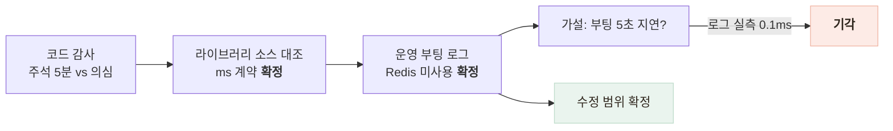

# 5분인 줄 알았던 캐시가 0.3초였다

> 라이브러리 메이저 업그레이드가 조용히 바꾼 TTL 단위를 코드 감사로 발견하고, 설치된 패키지 소스로 검증하고, 고쳐서 배포 후 HIT 실측까지 닫은 기록 — 세웠다가 기각한 가설 하나 포함

## 한눈에

| | |
|---|---|
| **발견** | `@CacheTTL(300)` 주석은 "5분 캐싱" — 실제 동작은 **0.3초**. 448KB 목록 응답이 사실상 매번 DB 조회 |
| **원인** | cache-manager 메이저 업그레이드로 TTL 해석이 초→**밀리초**로 변경 — 코드는 옛 단위 그대로 |
| **수정** | MINUTE 상수로 단위 명시 + 클래스 전체 캐싱 → 공개 GET 선별 + 쓰기 시 무효화 + 미사용 Redis 분기 제거 |
| **실측** | 배포 후 동일 URL 2회: 목록 MISS 0.253초 → **HIT 0.101초** (왕복 지연 제외 시 서버 처리 사실상 0) |

## 발견 — 주석과 동작이 달랐다

캐싱 구현을 감사하다가 의존성 버전과 코드가 어긋나 있는 것을 발견했다. 설치된 라이브러리(`@nestjs/cache-manager` 3.x + `cache-manager` 7.x)의 실제 소스를 열어 세 가지를 확정했다.

| 주장 | 검증 방법 | 판정 |
|---|---|---|
| TTL이 ms로 해석된다 | 인터셉터 소스: `@CacheTTL` 값을 변환 없이 `set(key, value, ttl)`에 전달 | 확정 — 300 = 0.3초 |
| Redis 설정이 무시된다 | provider 소스: `stores`(복수형)만 읽음 — `{ store }` 반환은 사용되지 않음 | 확정 — 잠복 결함 |
| 캐시가 전 GET에 걸린다 | 컨트롤러 클래스 레벨 `@UseInterceptors` | 확정 — 검색까지 기본 TTL로 캐싱 |

결과는 **의도의 반전**이었다: 5분을 의도한 목록·상세는 0.3~1.8초로 거의 무력화됐고, 캐싱할 생각이 없던 검색은 기본 TTL로 캐싱되고 있었다.

## 운영 분기 확정 — 그리고 가설 하나를 기각했다

"Redis가 무시된다"의 실제 영향을 판정하려면 운영이 어느 분기로 도는지 알아야 했다. 운영 부팅 로그를 조회하자 전 부팅이 `ECONNREFUSED 127.0.0.1:6379` — **운영은 애초에 Redis가 없었다.** 그래서 Redis 무시 버그는 "실행된 적 없는 잠복 결함"으로 분류했다 (나중에 Redis를 붙이는 순간 성공 로그를 내며 조용히 인메모리로 동작할 함정).

이 과정에서 가설 하나를 세웠다 기각했다: "부팅마다 Redis 연결 타임아웃 5초를 기다리는 것 아닌가 — 콜드 스타트 지연의 범인?" 로그의 타임스탬프를 재 보니 localhost 연결 거부는 **0.1ms 미만**으로 즉시였다. 그럴듯한 가설도 측정 앞에서는 버린다.

## 수정 — 실사용자에게 영향이 안 가는 순서로

운영 중 서비스라 수정 자체보다 "무엇이 바뀌어 보일까"를 먼저 따졌다. 유일한 실질 변화는 **데이터 신선도**(그동안 사실상 실시간이던 응답이 TTL만큼 묵음)였고, 이를 두 겹으로 상쇄했다.

| 조치 | 내용 |
|---|---|
| TTL 단위 명시 | `MINUTE` 상수(ms) 기반 — 목록 1분·상세 2분·정적 5분, 원 의도(5~30분)보다 **보수적으로 시작**해 실측 후 상향 |
| 쓰기 시 무효화 | 관리자가 가게를 등록·수정·삭제하면 캐시 즉시 클리어 — "등록했는데 앱에 안 떠요" 차단. 무효화 실패는 격리(쓰기를 막지 않음) |
| 대상 선별 | 클래스 전체 → 공개 데이터 GET에만 라우트 단위 적용. 검색은 쿼리 다양성·실시간성 때문에 캐시 제외. 인증 라우트는 POST뿐이라 유저별 응답 유출 없음도 재확인 |
| 죽은 코드 제거 | 미사용 Redis 분기·의존성 삭제 — 수정인데 코드가 **204줄 순감소** |
| 회귀 테스트 14종 | "TTL은 ms 단위 1분 이상"을 메타데이터로 고정 — 초 단위 값이 재유입되면 테스트가 잡는다 |

## 실측 — 배포 후 같은 URL을 두 번 불렀다

| 엔드포인트 | MISS (DB 조회) | HIT (캐시) |
|---|---|---|
| 목록 (448KB) | 0.253초 | **0.101초** |
| 가게 상세 | 0.292초 | **0.089초** |

왕복 지연이 약 0.08초이므로 HIT의 서버 처리 시간은 사실상 0 — 0.3초짜리 캐시로는 존재할 수 없던 수치다. 부팅 로그의 Redis 시도 소멸과 배포 후 1시간 에러 0건까지 함께 확인했다.

## 남은 한계

- TTL 보수값(1~5분)은 시작점 — 운영 백분위 추이를 보고 원 의도 수준으로 상향 판단이 남아 있다
- 무효화가 전체 클리어 방식 — 캐시 항목이 소수라 단순함을 택했지만, 캐시 대상이 늘면 키 단위 무효화로 정교화 필요
- 인스턴스 메모리 캐시라 스케일아웃 시 인스턴스 간 비공유 — 그때가 Keyv 어댑터로 Redis를 "제대로" 붙일 시점이다
