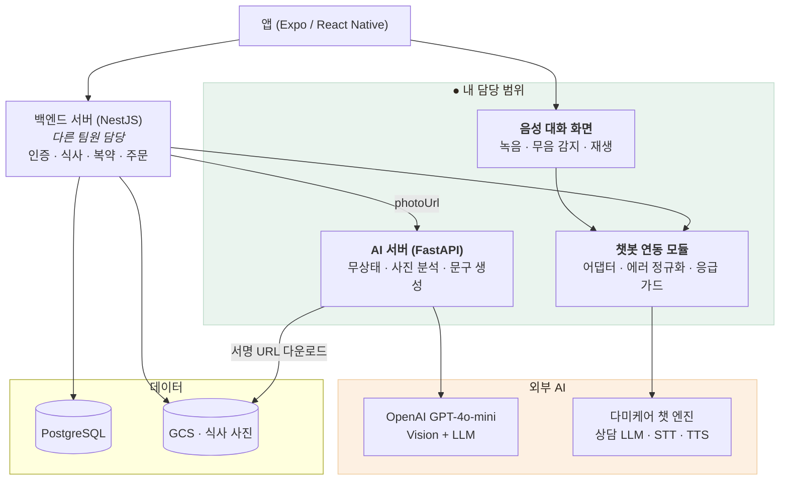

# 전체 아키텍처 — AI 서버를 분리한 이유

> 앱 뒤에 **백엔드 서버(NestJS, 팀원 담당)** 와 **AI 서버(FastAPI, 내 담당)** 가 있고,
> 백엔드 안의 **챗봇 연동 모듈**과 앱의 **음성 대화 화면**도 AI 영역이라 제가 담당했습니다.

## 시스템 구성

식사 사진은 백엔드가 GCS에 올리고, AI 서버는 **서명된 URL만 받아** 다운로드 → 분석 → 결과 반환합니다.
음성 대화는 앱 → 챗봇 연동 모듈 → 벤더 엔진 경로로 흐르고, 응급 가드·에러 정규화가 그 경계에 있습니다.

## AI 서버를 별도 프로세스로 분리한 이유

같은 서버에 다 넣을 수도 있었습니다. 나눈 근거는 **자원 프로필과 상태 보유 여부가 정반대**라는 점입니다.

| | 백엔드 서버 | AI 서버 |
|---|---|---|
| 상태 | DB·세션·파일 보유 | **완전 무상태** |
| 자원 | 상시 저부하, I/O 바운드 | 요청당 고부하, CPU/GPU 바운드 |
| 확장 | 수직 확장으로 충분 | **인스턴스 수로만** 확장 (GPU 모드는 1워커 강제) |
| 배포 주기 | 기능 단위로 잦음 | 모델·프롬프트 단위로 드묾 |

같은 프로세스에 두면 **분석 한 건이 로그인 응답까지 느리게 만듭니다.** GPU 모드는 워커마다 모델을
따로 로드하므로 멀티워커가 불가능한데, 그 제약이 백엔드까지 전파되면 안 됩니다.

## 트레이드오프

나눈 대가로 **모든 문맥을 요청에 실어야 합니다.** 백엔드가 부족 영양소·프로필을 매번 전달하고
AI 서버는 아무것도 기억하지 못합니다. 페이로드가 커지고 왕복이 한 번 늘어나지만,
**확장 · 프라이버시 · 책임 경계**를 얻는 쪽이 낫다고 판단했습니다.

## 규모

| 대상 | 코드 | 검증 |
|---|---|---|
| AI 서버 | 약 2,400줄 | pytest **105 passed**(키·GPU·네트워크 없이) + 계약 하네스 34~37 + 부하·동시성 5시나리오 |
| 챗봇 연동 모듈 | 백엔드 저장소 내 | Jest **377 passed**(챗봇 41개) + 검증 하네스 19케이스 |
| 설계 문서 | AI 서버 13편 + 챗봇 2편, 약 380KB | mermaid 40+ |
