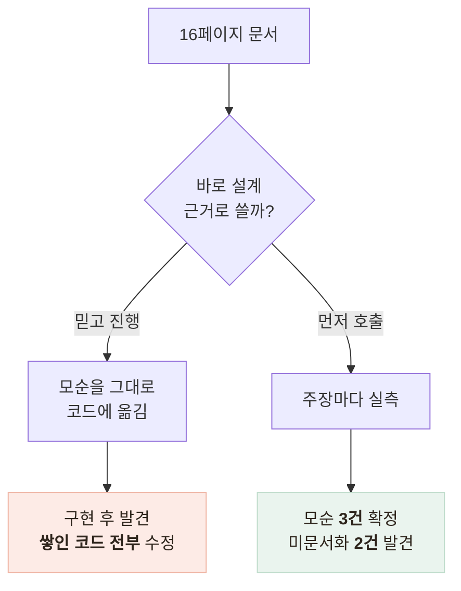
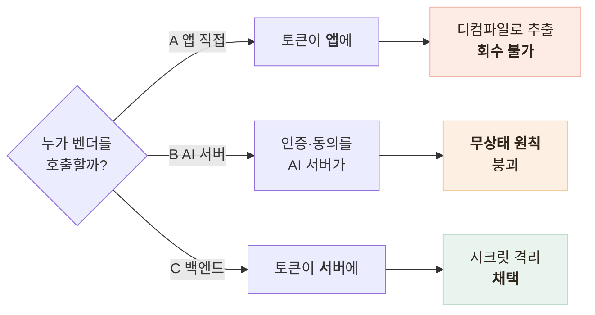

# 벤더 챗봇을 어디에 붙일까 — 연동 위치를 정한 것은 토큰의 성격이었다

> 문서를 믿지 않고 먼저 호출해 확인한 뒤, 그 결과로 연동 위치와 에러 처리를 정한 기록

<!-- 사진 자리: 앱 · 백엔드 프록시 · 벤더 챗 엔진을 나란히 놓고 벤더 토큰이 어디에만 존재하는지 표시한 구조 그림 -->

## 한눈에

| | |
|---|---|
| **문제** | 납품물이 HTTP API 하나와 16페이지 문서뿐인데 그 안에 **자기모순**이 있었다 |
| **근거** | 연동 코드를 쓰기 전에 실호출로 대조 — 모순 3건, 미문서화 동작 2건 |
| **판단** | 백엔드 서버가 프록시한다 — 벤더 토큰은 유출돼도 회수할 수 없는 시크릿이다 |
| **결과** | 설계 4곳이 바뀌었고, 앱은 벤더의 존재를 모른다 |

## 문서를 설계 근거로 쓰기 전에 호출했다

문서에는 필수 동의가 2종이라고도 4종이라고도 적혀 있었다. 모순을 그대로 코드로 옮기면 구현이 쌓인 뒤에 전부 고쳐야 한다.

| 문서 주장 | 실제 | 설계에 반영한 것 |
|---|---|---|
| 필수 동의 2종 / 4종 (모순) | **2종** 확정 | 동의 확인 조건 확정 |
| 에러는 공통 포맷 + 스키마 배열 | 사실 — 다만 **요청 본문을 되돌려준다** | 응답 본문 통째 로깅 금지 |
| 프로필은 발화 원문, 코드는 빈 값 | 사실 — `"고혈압 있어요"` | 원문은 격리 저장하고 사람이 확인 |
| (문서에 없음) | **CDN이 403으로 막는다** | 서버·검증 도구에 User-Agent 명시 |
| (문서에 없음) | 왕복 1.3~1.9초, 음성 인식 3.3초 | 음성 경로 타임아웃 분리 |

가장 위험했던 발견은 스키마 오류 응답이 **요청 본문을 그대로 되돌려준다**는 것이다. 빈 객체를 보내면 빈 객체가 오지만, 어르신의 건강 응답을 담아 보낸 요청에서 스키마가 틀리면 **그 응답 전체가 에러 본문에 실려 온다.** 문서의 "대화 원문은 감사 로그에 남지 않는다"는 벤더 쪽 보장이고, 우리 로그는 우리가 막아야 한다.

## 갈림길 — 토큰이 어디에 놓이나

셋을 가른 것은 부하가 아니다. 벤더 토큰은 사용자 것이 아니라 서비스 하나에 발급된 시크릿이고 재발급이 수동이라, 앱에 심으면 유출돼도 앱 업데이트 없이 거둬들일 수 없고 그 토큰으로 **월 200만 토큰** 한도를 태울 수 있다.

- 벤더 문서의 "앱이 헤더로 주입" 권장은 **위치 권고**일 뿐이다
- 포기한 것은 **지연 1홉**인데 LLM 응답이 수 초라 무시할 수준이다

## 에러 세 포맷을 우리 코드 하나로 접었다

접는 기준은 상태 코드가 아니라 **앱이 할 일**이다.

| 벤더가 낸 것 | 앱이 받는 것 | 이유 |
|---|---|---|
| 인증 실패 401 | `CHATBOT_UNAVAILABLE` 503 | 401을 흘리면 인터셉터가 **어르신을 로그아웃**시킨다 |
| 스키마 오류 배열 | `INTERNAL_ERROR` 500 | 400은 "입력을 고쳐라"인데 고칠 것이 없다 — **우리 버그**다 |
| 한도 초과 429 | `CHATBOT_BUSY` 429 | 대기 안내는 사용자에게 의미가 있다 |

- 벤더에는 **랜덤 UUID**만 나간다 — 이메일 해시는 사전 공격이 성립해 폐기했다
- 동의는 새 테이블 대신 **기존 동의 테이블**을 확장했다 — 진실이 둘이면 갈린다
- 토큰 만료는 **D-14**부터, 사용량은 **소진율 80%**부터 경고한다

## 남은 한계

| 항목 | 상태 |
|---|---|
| 실측 결과 | 한 시점의 스냅샷이다 — 벤더가 배포하면 달라지는데 **검증 도구의 정기 실행이 수동**이다 |
| 프록시 지연 | "1홉은 무시할 수준"으로 판단했지만 **추가 지연을 재지 않았다** |
| 배포 환경변수 | 문서 체크리스트뿐 — **파이프라인이 강제하지 않는다** |
| 한도 공유 | 파일럿 규모에서만 안전하다 — 증가 전 재협의가 먼저다 |

## 배운 점

- 문서는 가설이고 **실측이 사실**이라는 것 — 모순은 회의가 아니라 호출이 정리한다
- 개인정보는 정상 경로가 아니라 **에러 경로**로 샌다는 것
- 연동 위치는 성능이 아니라 **토큰의 성격**으로 정한다는 것
- 외부 에러 코드를 그대로 흘리면 **의도치 않은 지점**에서 장애가 난다는 것
</content>
