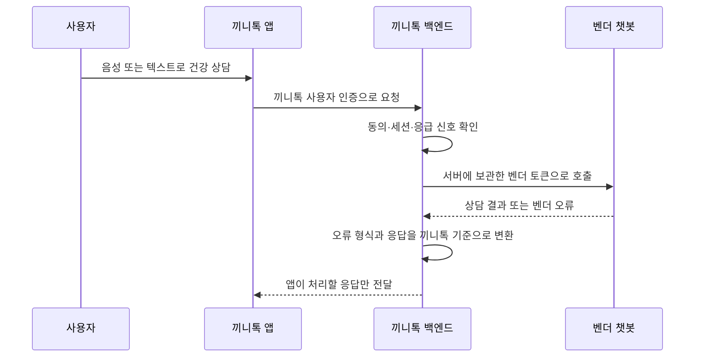

# 서비스 토큰을 보호하기 위해 챗봇을 백엔드에서 연동했습니다

> 외부 건강 상담 챗봇을 연동하기 전에 실제 API를 호출해 문서와 다른 동작을 확인하고, 서비스 토큰과 건강정보가 앱 밖으로 노출되지 않는 구조를 정했습니다.

## 한눈에

| | |
|---|---|
| **상황** | 외부 업체가 제공한 건강 상담·음성 API를 끼니톡 앱에 연결해야 했습니다. |
| **위험** | 사용자별 토큰이 아닌 서비스 공용 토큰을 앱에 넣으면 추출·오용될 수 있었습니다. |
| **선택** | 백엔드가 벤더 API를 대신 호출하고, 앱은 끼니톡 API만 사용하도록 구성했습니다. |
| **확인** | 문서의 동의 조건과 실제 응답을 대조하고, 오류 응답에 건강정보가 포함될 수 있는 경로도 확인했습니다. |

## 문서대로 구현하기 전에 실제 API를 호출했습니다

제공받은 문서는 16페이지였지만, 필수 동의가 2종인지 4종인지 서로 다른 설명이 있었습니다. 구현을 시작하기 전에 각 주장을 실제 API 호출로 확인했습니다.

| 확인한 항목 | 실제 응답 | 반영한 내용 |
|---|---|---|
| 필수 동의 2종 / 4종 | `health_collect`, `delegation` 2종으로 `required_ok=true` | 앱의 필수·선택 동의를 구분했습니다. |
| 스키마 오류 | `422` 응답의 `input`에 잘못 보낸 요청값이 포함됐습니다. | 벤더 오류 본문 전체를 로그에 남기지 않았습니다. |
| 앱 채널 지원 | 문서 예시는 `web`뿐이지만 `app`도 저장·반환됐습니다. | 앱에서 발생한 동의를 구분할 수 있게 했습니다. |
| 기본 HTTP 클라이언트 | 특정 User-Agent는 앞단에서 `403`으로 차단됐습니다. | 서버와 검증 도구에 User-Agent를 명시했습니다. |

가장 주의한 부분은 `422` 오류였습니다. 요청 형식이 틀리면 어르신의 건강 응답이 오류 본문에 다시 포함될 수 있었습니다. 따라서 정상 응답뿐 아니라 **오류를 기록하는 과정에서도 건강정보가 남지 않도록** 요청·응답 본문 전체 로깅을 피했습니다.

## 공용 토큰을 앱에 넣지 않았습니다

벤더 토큰은 사용자마다 발급되는 값이 아니라 서비스 전체가 공유하는 시크릿이었습니다. 앱에 포함하면 설치 파일에서 추출될 수 있고, 유출 뒤에는 이미 배포된 앱에서 즉시 회수하기 어렵습니다.

세 가지 위치를 비교했습니다.

| 연동 위치 | 판단 |
|---|---|
| 앱에서 직접 호출 | 공용 토큰이 앱에 포함되므로 제외했습니다. |
| 식단 분석 AI 서버에서 호출 | 무상태로 유지하던 서버가 사용자 인증·동의·상담 세션까지 알아야 하므로 제외했습니다. |
| **백엔드에서 호출** | 토큰을 서버에 보관하고 기존 인증·동의 정책을 함께 적용할 수 있어 선택했습니다. |

프록시를 한 번 더 거치는 지연은 생기지만, 서비스 토큰을 보호하고 벤더 변경을 앱에 노출하지 않는 쪽을 우선했습니다.

## 벤더 오류를 앱이 해야 할 일에 맞춰 바꿨습니다

벤더는 일반 JSON, 스키마 오류 배열, HTML 차단 응답처럼 서로 다른 오류 형식을 반환했습니다. 앱이 이 형식을 모두 알지 않도록 백엔드에서 끼니톡 오류 코드로 변환했습니다.

| 벤더 응답 | 앱에 전달 | 이유 |
|---|---|---|
| 토큰 인증 실패 `401` | `CHATBOT_UNAVAILABLE` `503` | 벤더 토큰 문제로 사용자가 로그아웃되지 않게 했습니다. |
| 사용량 한도 초과 `429` | `CHATBOT_BUSY` `429` | 잠시 뒤 다시 시도할 수 있는 상태로 안내했습니다. |
| 잘못된 세션 `404` | `CHATBOT_SESSION_EXPIRED` `409` | 앱이 상담을 새로 시작하도록 구분했습니다. |
| 스키마 오류 `422` | `INTERNAL_ERROR` `500` | 사용자가 고칠 입력이 아니라 서버 연동 코드의 문제로 처리했습니다. |

또한 벤더에는 끼니톡 사용자의 DB 식별자 대신 별도로 만든 랜덤 UUID만 전달했습니다. 토큰은 부팅 시 `/usage`를 호출해 유효성을 확인하고, 만료 시점과 사용량 경고도 서버에서 확인하도록 했습니다.

## 확인한 범위와 남은 과제

- API 동작은 연동 당시 한 시점에 직접 호출해 확인한 결과입니다. 벤더가 배포한 뒤에도 같은지 확인하는 도구는 있지만 정기 실행은 자동화하지 못했습니다.
- 백엔드를 한 번 더 거치는 추가 지연은 별도로 분리해 측정하지 못했습니다.
- 벤더가 돌려주는 건강 프로필은 발화 원문과 `미확인` 상태이므로, 현재는 식단 판정에 바로 사용하지 않습니다. 보호자가 검토·정정한 뒤 반영하는 화면은 아직 남아 있습니다.
