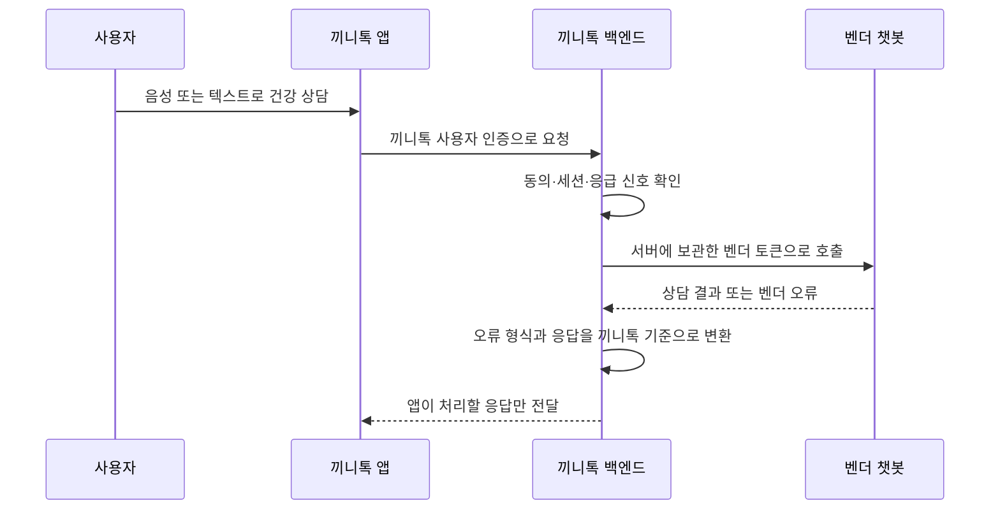

# 외주로 제작한 건강 상담 챗봇을 검증해 서비스에 연동했습니다

> 끼니톡에서 사용할 건강 상담 챗봇을 외부 업체에 요청하고, 전달받은 API를 실제 호출해 검증한 뒤 인증·동의·오류 처리·음성 대화까지 서비스에 연결했습니다. 공용 서비스 토큰과 건강정보가 앱에 직접 노출되지 않도록 연동 구조도 함께 설계했습니다.

## 한눈에

| | |
|---|---|
| **목표** | 어르신의 건강 상태를 음성 대화로 파악하고 식단 분석·추천에 연결할 챗봇이 필요했습니다. |
| **역할** | 챗봇의 서비스 역할을 정의하고, 외주 업체가 전달한 API를 실제 호출해 검증했습니다. |
| **연동** | 건강 상담 API를 끼니톡의 인증·동의 정책과 연결하고, STT/TTS 기반 음성 대화 화면까지 구현했습니다. |
| **구조** | 공용 토큰과 건강정보를 앱에 두지 않고, 백엔드가 벤더 API를 대신 호출하도록 구성했습니다. |

  

챗봇 상담 결과는 **기존 건강 프로필과 분리된 검토 대기 데이터로 저장하고, 보호자 확인 전까지 추천 음식과 복약 주의사항에 반영하지 않는 흐름**으로 구성했습니다. 현재 식단 추천과 복약 안내에는 검증된 건강 프로필과 복약 정보만 사용합니다.

## 어떤 챗봇이 필요한지부터 정의했습니다

 외주 개발을 요청할 때부터 단순한 건강 상담보다, **대화를 통해 어르신의 건강 상태를 파악하고 식단 추천에 활용할 프로필을 만드는 것**을 목표로 했습니다.\
\
초기 상담에서 지병·복약·연하 능력·식습관·영양 상태를 확인하고, 이후 짧은 체크인으로 정보를 보완하도록 했습니다. **건강 상담 → 프로필 생성 → 식단 분석·추천으로 이어지는 흐름** 안에서 챗봇의 역할을 정의했습니다.

| 단계 | 외주 요청 당시 정의한 역할 |
|---|---|
| **온보딩 상담** | 지병·복약 현황·연하 능력·식습관·현재 영양 상태를 음성 대화로 확인합니다. |
| **건강 프로필 생성** | 상담 내용을 지병·복약·연하·식습관·영양 상태 등으로 나눠 건강 프로필로 저장하고, 이후 식단 추천에 활용할 수 있도록 요청했습니다. |
| **지속적인 체크인** | 이후에는 변화한 건강 상태를 짧은 대화로 업데이트합니다. |
| **식사 피드백** | 식사 분석 결과를 바탕으로 음성으로 간단한 피드백을 제공합니다. |

이 요구사항을 바탕으로 외주 제작을 진행했고, 제작이 완료된 뒤 **건강 상담 챗봇과 16페이지의 API 명세를 인계받았습니다.**

## API 문서의 모순을 실제 요청으로 확인했습니다

연동 전에 API 명세를 읽던 중, 같은 동의 기능에 대해 **필수 동의가 2종이라고 설명된 부분과 4종이라고 설명된 부분이 함께 존재**하는 것을 확인했습니다.

문서만 보고 어느 쪽을 기준으로 구현하지 않고, 실제 API 요청을 보내 **어떤 입력에서 어떤 응답이 돌아오는지 먼저 확인**했습니다.

| 확인한 내용 | 실제 호출에서 확인 | 서비스에 반영 |
|---|---|---|
| **필수 동의 기준** | `health_collect`, `delegation` 2종 동의 시 `required_ok=true` | 필수 2종과 선택 동의를 앱에서 구분했습니다. |
| **스키마 오류 `422`** | 잘못 보낸 요청값이 오류 응답에 포함되는 경우를 확인했습니다. | 건강정보가 남지 않도록 오류 본문 전체 로깅을 제외했습니다. |
| **앱 채널** | 문서 예시는 `web`이지만 `app`도 저장·반환됐습니다. | 앱에서 받은 동의임을 구분했습니다. |
| **HTTP 요청** | 일부 기본 User-Agent에서 `403`이 발생했습니다. | 서버와 검증 도구에서 User-Agent를 명시했습니다. |

특히 `422` 응답은 단순한 오류 메시지가 아니라 **사용자가 보낸 건강 관련 입력을 다시 포함할 수 있었습니다.** 그래서 성공 응답뿐 아니라 오류 처리 과정에서도 민감한 내용이 로그에 남지 않도록 **벤더 요청·응답 본문 전체를 기록하지 않는 방식**으로 처리했습니다.

## 공용 서비스 토큰을 앱에 두지 않았습니다

명세에서는 운영 앱이 Bearer 토큰을 헤더에 넣는 방식을 안내했지만, **서비스 전체가 공유하는 토큰을 모바일 앱에 배포하지 않는 것이 더 안전하다고 판단했습니다.** 앱에 포함하면 설치 파일에서 추출될 수 있고, 유출 뒤에는 이미 배포된 앱에서 즉시 회수하기 어렵기 때문입니다.

세 가지 위치를 비교했습니다.

| 연동 위치 | 판단 |
|---|---|
| 앱에서 직접 호출 | 공용 토큰이 앱에 포함되므로 제외했습니다. |
| 식단 분석 AI 서버에서 호출 | 무상태로 유지하던 서버가 사용자 인증·동의·상담 세션까지 알아야 하므로 제외했습니다. |
| **백엔드에서 호출** | 토큰을 서버에 보관하고 기존 인증·동의 정책을 함께 적용할 수 있어 선택했습니다. |

벤더에는 이름·전화번호나 끼니톡의 내부 사용자 ID를 보내지 않고, **상담 연동용으로 별도 생성한 랜덤 UUID만 전달했습니다.** 서비스 토큰도 백엔드에만 보관하고, 서버 시작 시 유효 여부와 사용량을 확인하도록 했습니다.

프록시를 한 번 더 거치는 지연은 생기지만, **공용 토큰과 사용자 정보를 앱에서 분리하고 벤더 변경이 앱까지 번지지 않는 구조**를 우선했습니다.

## 벤더 오류를 앱이 해야 할 일에 맞춰 바꿨습니다

벤더는 일반 JSON, 스키마 오류 배열, HTML 차단 응답처럼 서로 다른 오류 형식을 반환했습니다. 앱이 이 차이를 모두 알지 않도록 **백엔드에서 끼니톡이 처리할 수 있는 오류 형태로 변환**했습니다.

| 벤더 응답 | 앱에 전달 | 이유 |
|---|---|---|
| 토큰 인증 실패 `401` | `CHATBOT_UNAVAILABLE` `503` | 벤더 토큰 문제로 사용자가 로그아웃되지 않게 했습니다. |
| 사용량 한도 초과 `429` | `CHATBOT_BUSY` `429` | 잠시 뒤 다시 시도할 수 있는 상태로 안내했습니다. |
| 잘못된 세션 `404` | `CHATBOT_SESSION_EXPIRED` `409` | 앱이 상담을 새로 시작하도록 구분했습니다. |
| 스키마 오류 `422` | `INTERNAL_ERROR` `500` | 사용자가 고칠 입력이 아니라 서버 연동 코드의 문제로 처리했습니다. |

## 상담에서 추출한 건강정보를 기존 프로필과 분리해 저장했습니다

상담이 끝나면 벤더가 지병·복약·연하·식습관 등으로 나눈 건강정보를 반환했습니다. 다만 `혈압이랑 당뇨가 있어요`처럼 **어르신의 발화를 바탕으로 추출된 정보**였기 때문에, 기존 건강 프로필에 바로 반영하지 않았습니다.

대신 상담 결과를 **별도의 검토 대기 데이터로 저장해 식단 추천과 분리**했습니다. 보호자가 확인·수정한 정보만 기존 건강 프로필에 반영하는 흐름을 전제로 했습니다.

**현재 구현: 상담 → 건강정보 추출 → 검토 대기 저장 → 식단 추천과 분리**
