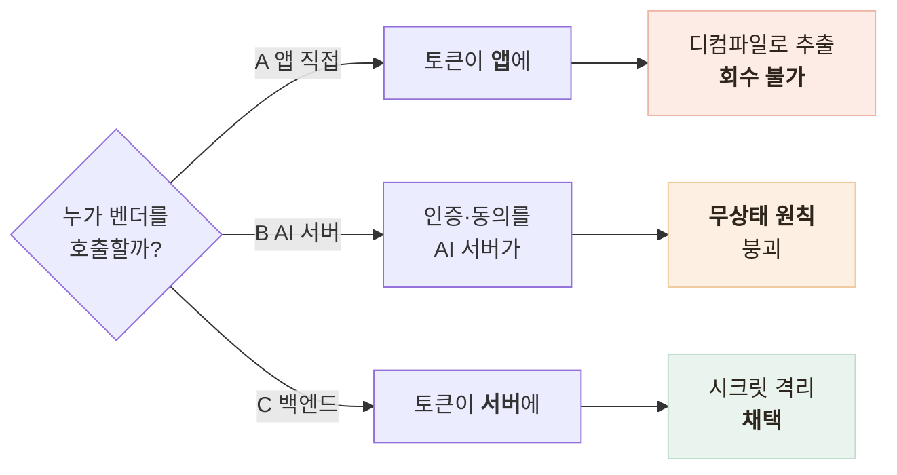
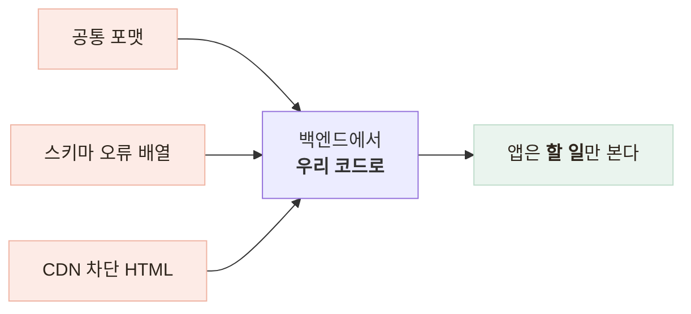

# 벤더 챗봇을 어디에 붙일까 — 앱 직접 호출 vs AI 서버 vs 백엔드 프록시

> 연동 위치를 정한 것은 성능이 아니라 토큰의 성격이었고, 그 결정이 이후 모든 경계를 정했다

<!-- 사진 자리: 앱 · 백엔드 프록시 · 벤더 챗 엔진을 나란히 놓고 벤더 토큰이 어디에만 존재하는지 표시한 구조 그림 -->

## 한눈에

| | |
|---|---|
| **문제** | 납품물이 HTTP API 하나라 누가 호출할지부터 정해야 했다 |
| **판단** | 백엔드 서버가 프록시한다 |
| **근거** | 벤더 토큰은 서비스 단위 시크릿이라 유출돼도 회수할 수 없다 |
| **결과** | 앱은 벤더의 존재를 모른다 — 우리 API와 우리 에러 코드만 안다 |

## 갈림길 — 토큰이 어디에 놓이나

셋을 가른 것은 부하가 아니다. 벤더 토큰은 사용자 것이 아니라 서비스 하나에 발급된 시크릿이고 재발급이 수동이라, 앱에 심으면 유출돼도 앱 업데이트 없이 거둬들일 수 없고 그 토큰으로 **월 200만 토큰** 한도를 태울 수 있다.

- 벤더 문서의 "앱이 헤더로 주입" 권장은 **위치 권고**일 뿐이다
- 포기한 것은 **지연 1홉**인데 LLM 응답이 수 초라 무시할 수준이다

## 에러 세 포맷을 우리 코드 하나로 접었다

접는 기준은 상태 코드가 아니라 **앱이 할 일**이다.

| 벤더가 낸 것 | 앱이 받는 것 | 이유 |
|---|---|---|
| 인증 실패 401 | `CHATBOT_UNAVAILABLE` 503 | 401을 흘리면 인터셉터가 **어르신을 로그아웃**시킨다 |
| 스키마 오류 배열 | `INTERNAL_ERROR` 500 | 400은 "입력을 고쳐라"인데 고칠 것이 없다 — **우리 버그**다 |
| 한도 초과 429 | `CHATBOT_BUSY` 429 | 대기 안내는 사용자에게 의미가 있다 |

## 경계와 감시

- 벤더에는 **랜덤 UUID**만 나간다 — 이메일 해시는 사전 공격이 성립해 폐기했다
- 동의는 새 테이블 대신 **기존 동의 테이블**을 확장했다 — 진실이 둘이면 갈린다

| 감시 항목 | 기준 |
|---|---|
| 토큰 만료 | 부팅 시와 하루 한 번 확인, **D-14**부터 경고 |
| 공유 한도 | 상담 1건이 6~8 왕복 — **동시 15명**이면 분당 한도 |
| 사용량 | **소진율 80%** 경고, 사용자당 동시 세션 1개 |
| 재시도 | **1회 200ms**뿐 — 음성 경로는 아예 하지 않는다 |

## 남은 한계

| 항목 | 상태 |
|---|---|
| 배포 환경변수 | 문서 체크리스트뿐 — **파이프라인이 강제하지 않는다** |
| 벤더 프로필 파기 | API가 없어 탈퇴 시 처리가 협의 항목이다 |
| 한도 공유 | 파일럿 규모에서만 안전하다 — 증가 전 재협의가 먼저다 |

## 배운 점

- 연동 위치는 성능이 아니라 **토큰의 성격**으로 정한다는 것
- 외부 에러 코드를 그대로 흘리면 **의도치 않은 지점**에서 장애가 난다는 것
- 저장소를 하나로 두는 것은 코드 편의가 아니라 **감사 가능성**의 문제라는 것
