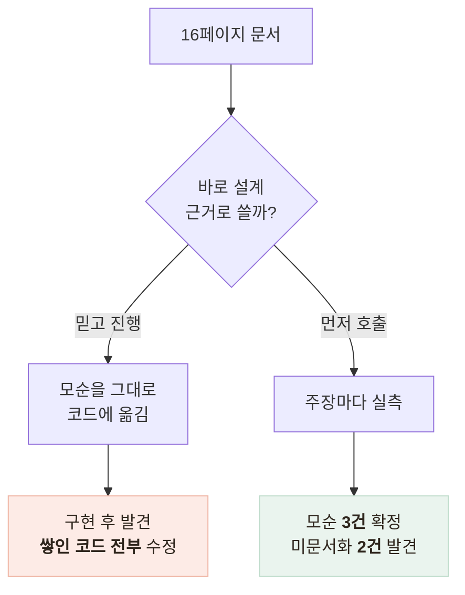

# 문서를 믿지 않고 API를 먼저 호출했다 — 모순 3건, 미문서화 동작 2건

> 16페이지 API 문서를 설계 근거로 쓰기 전에 실제로 호출해 대조한 기록, 그리고 그 결과가 설계를 바꾼 지점

<!-- 사진 자리: 실측 당시 응답 캡처 — 문서와 다른 값이 온 화면이나 스키마 오류 응답이 요청 본문을 되돌려주는 화면 -->

## 한눈에

| | |
|---|---|
| **문제** | 받은 것이 16페이지 문서뿐인데 그 안에 **자기모순**이 있었다 |
| **판단** | 연동 코드를 한 줄도 쓰기 전에 실호출로 대조한다 |
| **해법** | 문서 주장마다 응답을 받아 확정하거나 뒤집었다 |
| **결과** | 설계 4곳이 바뀌었고 실서버 검증 12건을 통과했다 |

## 두 경로



## 실측으로 확정한 것

| 문서 주장 | 실제 | 설계 반영 |
|---|---|---|
| 필수 동의 2종 / 4종 (모순) | **2종** 확정 | 동의 게이트 조건 확정 |
| 에러는 공통 포맷 + 스키마 배열 | 사실 — 다만 **요청 본문 에코** | 응답 본문 통째 로깅 금지 |
| 채널 값 예시는 하나뿐 | 앱용 값도 허용 | 그대로 사용 |
| 프로필은 발화 원문, 코드는 빈 값 | 사실 — `"고혈압 있어요"` | **격리 저장 + 사람 승인**으로 전환 |
| (문서에 없음) | **CDN 403 차단** | 서버·검증 도구에 User-Agent 명시 |
| (문서에 없음) | 왕복 1.3~1.9초, 음성 인식 3.3초 | 음성 경로 타임아웃 분리 |

## 가장 위험했던 발견 — 에러가 요청 본문을 되돌려준다

```
$ curl -X POST .../interview/start -d '{}'
{"detail":[{"type":"missing","loc":["body","profile_id"],"input":{}}]}
                                                         ^^^^^^^ 검증에 실패한 값
```

빈 객체를 보냈으니 빈 객체가 왔다. 그런데 어르신의 건강 응답을 담아 보낸 요청에서 스키마가 틀리면 **그 응답 전체**가 에러 본문에 실려 온다. 문서의 "대화 원문은 감사 로그에 남지 않는다"는 벤더 쪽 보장이고, 우리 로그는 우리가 막아야 한다.

- 벤더 응답 본문은 어떤 경우에도 **통째 로깅 금지**
- 에러 객체의 메시지에도 담지 않는다 — **스택트레이스**로 샌다

## AI 초안과 대조했다

| 판정 | 개수 | 패턴 |
|---|---|---|
| 맞음 | 5 | 프록시 위치, 비식별 ID 등 — **문서에 적혀 있는 것** |
| 질문은 옳으나 미해결 | 2 | 모순을 그대로 옮기고 "확인 필요"로 넘겼다 |
| 틀림 | 1 | 있는 동의 저장소를 두고 **새 테이블 신설** 제안 |
| 누락 | 8 | 본문 에코, 웹훅 부재, CDN 차단 등 **실측만 아는 것** |

특히 발화 원문 문제는 문서와 우리 판정 코드를 **교차**해야 보인다. 문서는 "원문으로 반환된다"고 정직하게 썼고 우리 코드는 정규화된 값을 전제로 매칭하는데, 따로 읽으면 각각 문제가 없어 보인다.

## 남은 한계

| 항목 | 상태 |
|---|---|
| 실측 결과 | 한 시점의 스냅샷이다 — 벤더가 배포하면 다시 달라진다 |
| 검증 하네스 | 만들어 뒀지만 **정기 실행이 수동**이다 |
| 문서 모순 | 우리가 고칠 수 없어 벤더 협의 항목으로 올려 뒀다 |

## 배운 점

- 문서는 가설이고 **실측이 사실**이라는 것 — 모순은 회의가 아니라 호출이 정리한다
- 개인정보는 정상 경로가 아니라 **에러 경로**로 샌다는 것
- AI 초안은 문서 요약에는 쓰이지만 **설계 근거**로는 부족하다는 것
