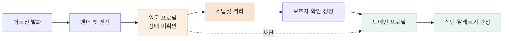

# AI가 만든 건강정보를 바로 쓰지 않는다 — 격리 저장과 보호자 승인 게이트

> 모델 출력을 되돌릴 수 없는 안전 판정에 직접 물리지 않기 위해, 즉시성을 포기하고 사람의 확인을 끼워 넣은 결정

<!-- 사진 자리: 보호자 검토 화면 구상안 — "이렇게 이해했어요, 맞나요?" 형태로 챗봇이 뽑은 지병을 확인받는 화면 -->

## 한눈에

| | |
|---|---|
| **문제** | 벤더 프로필이 정규화 코드가 아니라 **발화 원문**으로 온다 |
| **판단** | 원문은 격리하고 보호자가 확인한 값만 도메인으로 승격한다 |
| **근거** | 벤더도 상태를 "미확인"으로 주고, 안전 판정은 되돌릴 수 없다 |
| **결과** | 챗봇 출력이 식단 적합도와 알레르기 판정에 닿지 않는다 |

## 말투가 안전 판정을 갈랐다

우리 매칭은 정규화 후 양방향 포함 검사라서, 같은 어르신인데 어떻게 말했느냐로 결과가 갈린다.

| 어르신 발화 | 매칭 | 결과 |
|---|---|---|
| "고혈압 있어요" | 성공 | 저염식이 추천된다 |
| "혈압이랑 당뇨가 있어요" | 실패 | **저염식 미추천** |
| "혈압약 먹고 있어요" | 실패 | **저염식 미추천** |

- 알레르기까지 원문으로 오면 필터가 못 걸러 **안전 판정**이 degrade된다
- 더 나쁜 것은 아무 에러도 없다는 점이다 — 저장은 성공하고 로그도 조용하다

## 세 안 중 무엇을 골랐나

| 안 | 대가 |
|---|---|
| A 벤더 프로필을 그대로 저장 | 위 문제가 그대로 남는다 — **조용히 깨지는 실패** |
| B 우리가 정규화 계층을 만든다 | 계약상 **2단계 범위**를 떠안고, 틀린 코드가 판정에 들어간다 |
| **C 격리 저장 + 승인 게이트** | **즉시성**을 잃는다 — 대신 틀린 판정이 흘러가지 않는다 |

벤더 가이드의 원칙은 "질환을 확정하지 않고 코드 후보만 제시한다"다. 벤더가 미확인이라 표시한 값을 우리가 확정으로 취급하면 우리 코드 한 줄이 벤더의 **비진단 원칙**을 무효화한다.

## 격리 게이트

승격 경로가 한 곳뿐이라 우회해서 반영할 방법이 없다. 값을 옮기는 코드가 하는 일은 표기법 변환과 누락 필드 방어까지고, 여기서 문자열을 다듬으면 **격리의 의미**가 사라진다.

- 필수 동의 **2종**이 없으면 상담을 시작할 수 없고, 판정은 서버가 한다
- 스냅샷 저장이 실패해도 **대화 종결**은 성공시킨다

## 남은 한계

| 항목 | 상태 |
|---|---|
| 보호자 검토·승격 화면 | **미구현** — 챗봇 결과가 도메인에 전혀 반영되지 않는다 |
| 정정 이력·감사 로그 | 승격 UI와 함께 설계해야 판정을 설명할 수 있다 |
| 스냅샷 보관 기간 | 미정 — 원문 자체가 민감정보라 무기한 축적은 답이 아니다 |

## 배운 점

- 신뢰도가 정량화되지 않은 **모델 출력**은 되돌릴 수 없는 판정에 물리지 않는다는 것
- 외부 출력 형태는 **우리 판정 로직**과 함께 읽어야 문제가 보인다는 것
- 에러 없이 **조용히 틀리는 실패**가 가장 위험하다는 것
