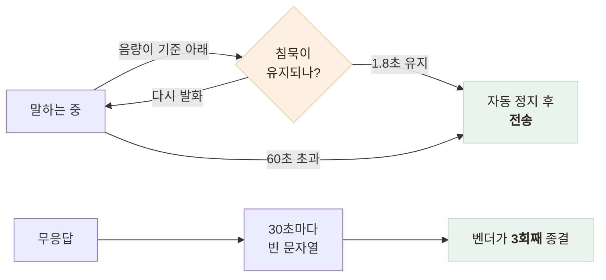

# 어르신 음성 대화 화면 — 말이 끊기면 알아서 전송되는 UX

> 버튼을 두 번 누르게 하지 않기 위해 침묵을 감지해 전송하고, 그 임계값을 어르신 말투에 맞춰 정한 기록

<!-- 사진 자리: 음성 대화 화면 캡처 — 큰 마이크 버튼과 대화 말풍선, 가능하면 응급 안내가 위에 떠 있는 상태 -->

## 한눈에

| | |
|---|---|
| **문제** | 어르신에게 "누르고 말한 뒤 다시 눌러 전송"은 그 자체가 부담이다 |
| **원인** | 녹음 표시가 없고 두 번째 누름을 요구하니 반응 없는 화면이 된다 |
| **해법** | 음량을 읽어 침묵을 감지하고 앱이 스스로 멈춰 전송한다 |
| **결과** | 마이크 한 번으로 말하고 답을 소리로 듣는 흐름 — 앱 검증 8건 통과 |

## 표시가 없던 녹음 화면

실기기 피드백은 "말 끊으면 전송이 되어야 하는데"였고 두 문제가 겹쳐 있었다. 녹음 UI가 아무 반응이 없던 원인은 렌더에서 녹음 객체의 상태 속성을 직접 읽은 것인데, 이 속성은 값이 바뀌어도 리렌더를 일으키지 않는다.

- 타입 검사와 린트를 모두 통과하는 버그라 **코드만 봐서는** 틀린 곳이 없어 보였다
- 상태를 구독하는 훅으로 바꿔 해결하고, 그다음 두 번째 누름을 없앴다

## 침묵을 감지해 전송한다

| 값 | 이유 |
|---|---|
| 무음 기준 -40 dBFS | 생활 소음은 넘기고 발화는 잡는 선 |
| 침묵 1.8초 후 전송 | **어르신은 문장 사이 쉼이 길다** — 짧으면 말 중간에 끊긴다 |
| 최소 발화 0.7초 | 버튼만 스쳐도 전송되면 안 된다 |
| 최대 녹음·타임아웃 60초 | 음성 인식과 업로드가 무한정 길어지지 않게 |

- 임계값은 코드가 아니라 **어르신의 말 습관**에서 나온 값이다
- 음량 측정을 못 하는 기기는 **수동 전송**으로 폴백해 진행은 막지 않는다

## 무응답 종결 — 되돌린 구현

문서에는 "30초 2회"로 적혀 있어 처음에는 우리가 재질문을 끼워 넣었다. 실제로 세어 보니 벤더는 빈 입력 **3회째**에 종결했고, 우리가 셀 이유가 없는 것을 세고 있었던 셈이다.

| 구현 | 왕복 | 종결까지 |
|---|---|---|
| 우리가 재질문을 끼운다 | 6번 | 3분, 문구가 번갈아 쌓인다 |
| **재질문을 벤더에 맡긴다** | 3번 | **90초**, 원래 질문을 다시 읽어 준다 |

- 계약의 핵심은 빈 문자열이 **유효한 입력**이라는 점이다
- 검증 8건 중 이 항목은 HTTP 200만 단언해 **틀린 이유로 통과**하고 있었다

## 화면에서 내린 판단

- 들어오자마자 시작하지 않는다 — 탭을 스칠 때마다 세션이 생기면 한도를 태운다
- **응급 안내**는 벤더 답변보다 위에 크게 — 참고 문구가 아니라 행동 지시다
- 음성 인식 결과를 화면에 반영한 직후 원본을 남기지 않는다

## 남은 한계

| 항목 | 상태 |
|---|---|
| 음성 경로 검증 | 수동이다 — 매 배포마다 확인할 수 없다 |
| 침묵 임계값 | 소수의 시행으로 정한 값이라 사용자가 늘면 재조정이 필요하다 |
| 음량 측정 불가 기기 | 두 번 누르는 흐름이 그대로 남아 있다 |

## 배운 점

- 타입이 맞아도 의미가 틀리는 버그가 있다는 것 — 값을 묻는 속성은 **상태**가 아니다
- 임계값은 코드가 아니라 **사용자의 말 습관**에서 나온다는 것
- 검증 항목의 이름과 단언이 어긋나면 **통과가 오히려 위험**하다는 것
