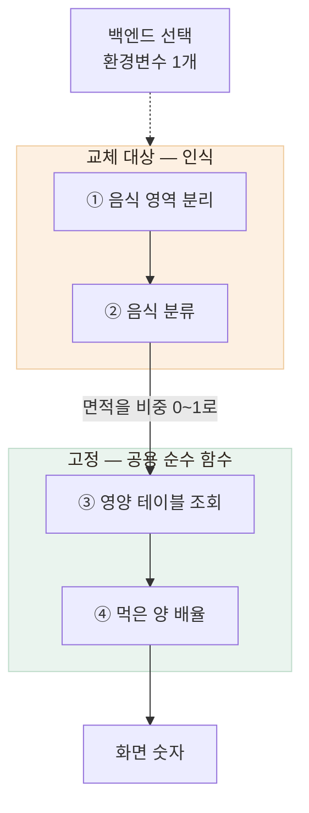

# 자체 모델과 GPT Vision 사이에서 — 건당 비용 12배를 실측해 구조를 정했다

> 자체 모델을 완성해 두고도 API로 운영하기로 한 판단, 그리고 그 판단을 되돌릴 수 있게 만든 구조

## 한눈에

| | |
|---|---|
| **문제** | 인식 모델을 무엇으로 하느냐가 곧 월 고정비를 정하는 선택이었다 |
| **판단** | 자체 모델을 완성했지만 운영은 GPT Vision으로 |
| **근거** | 건당 8.08원 → 0.68원 실측, 손익분기 월 44만 건 |
| **결과** | 환경변수 하나로 백엔드 4종 전환, 영양 계산 코드 변경 0 |

## 갈림길 — 비용이 설계 입력이었다

어르신이 하는 조작은 사진 한 장 올리기가 전부다. 그 사진에서 음식과 영양소를 뽑는 것이 AI 서버의 존재 이유이고, **인식을 무엇으로 하느냐가 월 고정비를 결정**했다.

| 후보 | 상태 | 판단 |
|---|---|---|
| 자체 모델 (SAM + Food-101) | **코드까지 완성** | GPU 8GB 이상이 상시 필요해 월 15만~38만 원이 고정으로 나간다 |
| GPT Vision | 즉시 사용 가능 | 호출당 과금이라 싸 보이지만 건당 단가를 모른다 — **먼저 재 봐야** 했다 |

## 근거 — 추정 대신 실측했다

서버와 완전히 같은 경로로 실제 호출해 응답에 실려 오는 사용량을 읽었다.

| 설정 | 입력 토큰 | 건당 비용 |
|---|---|---|
| 기본(고해상) | 37,009 | 약 8.08원 |
| **저해상 옵션** | 3,007 | **약 0.68원** |

- **약 12배 절감**인데 인식 품질은 유지됐다
- 손익분기는 **월 약 44만 건** — 그 전까지는 API가 싸다
- 절감 전 8원이면 월 3.7만 건에서 역전됐다. **12배가 아키텍처 결정을 뒤집었다**

## 되돌릴 수 있게 경계를 그었다

결론은 "지금은 API, 트래픽이 커지면 자체 모델"이었다. 그 문장을 코드 구조로 옮겼다.

백엔드마다 계산까지 구현하면 화면에 뜨는 숫자의 규칙이 4벌로 갈라진다. 그래서 인식만 갈아 끼우고 계산은 한 곳에 고정했다.

경계에서 넘기는 값을 픽셀 면적이 아니라 **면적 비중 0~1**로 정한 것이 결정적이었다 — 픽셀 면적은 자체 모델만 지킬 수 있어 후보 절반이 탈락한다. 배율은 이 비중을 기대치와 비교해 나누고, 앱 화면의 조금·보통·많이와 그대로 이어진다.

| 구간 | 판정 | 배율 |
|---|---|---|
| `ratio < 0.8` | small | ×0.65 |
| `0.8 ~ 1.2` | regular | ×1.0 |
| `ratio > 1.2` | large | ×1.35 |

되돌리는 비용을 **환경변수 한 줄과 GPU 확보**로 줄여 뒀다. 판단이 틀렸을 때 갚아야 할 금액을 미리 계산해 둔 셈이다.

## 부분 실패는 제거가 아니라 표시로

음식 하나가 영양 테이블에 없다는 이유로 분석 전체를 실패시키면 어르신은 아무 결과도 받지 못한다.
서버는 그 음식의 값을 비우고 경고만 실어 보내며 총합에서만 제외한다. 확신도가 낮은 인식도 빼지 않고 표시만 한다. 무엇을 보여줄지는 화면 맥락을 아는 앱이 정한다.

## 남은 한계

| 항목 | 상태 |
|---|---|
| 자체 모델 실추론 | **실측 전무** — 코드만 완성됐다 |
| 저해상 옵션의 품질 영향 | 관측 한 장이 근거다 — 비교 세트가 없다 |
| 추정 영양값 정확도 | 저울과 식약처 DB 기준의 대조군이 없다 |

## 배운 점

- 비용은 운영 항목이 아니라 **설계 입력**이라는 것
- 비교표를 추정으로 채우기 전에 **먼저 호출해 보는 것**이 순서라는 것
- 완성한 코드를 인터페이스 뒤에 남기면 매몰 비용이 아니라 **준비된 선택지**가 된다는 것
</content>
