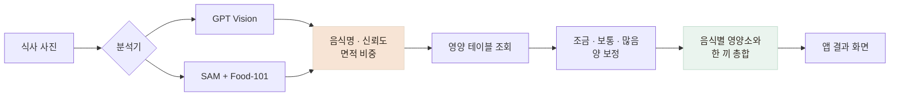
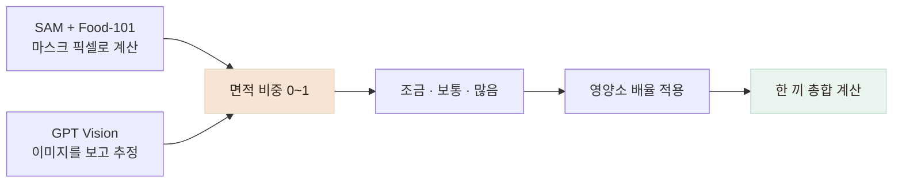

# 식사 사진을 영양 정보로 바꾸는 AI 분석 서버를 만들었습니다

> 식사 사진에서 음식과 양을 분석하고 영양 정보를 계산하는 AI 서버를 만들었습니다. 초기 운영은 실제 비용을 비교해 GPT Vision으로 시작하되, 이후 로컬 분석 모델로 교체할 수 있도록 분석과 영양 계산을 분리했습니다.

## 한눈에

| | |
|---|---|
| **초기 계획** | SAM + Food-101을 조합한 로컬 분석 경로를 만들고, 데이터가 쌓이면 직접 고도화하려 했습니다. |
| **고민** | 초기 트래픽이 적은 상황에서 GPU를 운영하는 비용과 GPT Vision 호출 비용 중 어떤 방식이 적합한지 판단해야 했습니다. |
| **측정** | 같은 식사 사진을 GPT Vision으로 직접 호출해 해상도별 토큰과 비용을 비교했습니다. |
| **선택** | 초기 운영은 GPT Vision을 사용하고, 이후 로컬 분석 모델로 바꿀 수 있도록 분석과 영양 계산을 분리했습니다. |

## 로컬 모델과 API 방식의 운영 비용을 비교했습니다

처음에는 SAM으로 음식 영역을 나누고 Food-101로 음식을 분류하는 로컬 분석 경로를 구축했습니다. 이후 서비스에서 쌓이는 식사 데이터를 활용해 모델을 지속적으로 고도화하는 방향을 생각했습니다.

하지만 서비스 초기에는 학습 데이터와 요청량이 충분하지 않은데도, 로컬 추론을 위해 GPU 인스턴스와 모델 저장 공간을 계속 운영해야 했습니다. 반면 GPT Vision은 호출할 때만 비용이 발생하므로 **직접 측정한 호출 비용과 GPU 상시 운영 비용을 기준으로 손익분기를 계산했습니다.**

저해상도 GPT Vision 호출은 당시 약 **0.68원/건**이었습니다. 검토한 T4 GPU 운영비는 월 15만~38만 원이었고, 월 30만 원의 GPU 비용과 당시 실측한 0.68원/건을 **단순 비용 기준으로 비교하면** 손익분기는 약 **44만 건/월**이었습니다. 초기 예상 사용량은 이에 미치지 않는다고 판단해 **초기 운영은 GPT Vision으로 시작하고, 사용량과 데이터가 충분히 쌓이면 로컬 모델로 전환하는 방향**을 선택했습니다.

## 사진 한 장이 영양 정보로 바뀌는 과정을 나눴습니다

 

어르신이 식사 사진 한 장을 촬영하면 분석기가 먼저 **사진 속 음식과 신뢰도, 각 음식이 차지하는 면적 비중**을 반환합니다. 이후부터는 어떤 분석기를 사용하더라도 같은 서버 로직이 영양 정보를 계산하도록 나눴습니다.

실제 기기에서는 한 장의 사진에서 밥·찌개·나물·반찬 등을 인식하고, 계산된 열량과 탄수화물·단백질·지방·나트륨을 앱에 전달합니다. 앱은 이 합산 결과가 영양 기준을 초과하면 주의 문구도 함께 보여줍니다.

분석기는 사진에서 **어떤 음식이 얼마나 보이는지**를 판단합니다. 이후 음식별 영양값 조회, 양 보정, 한 끼 총합 계산은 서버의 공통 로직이 담당합니다.

이렇게 나눈 이유는 GPT Vision의 결과에 모든 계산을 맡기지 않고, **검증 가능한 영양 데이터와 정해진 계산 규칙을 최대한 서버에서 통제하기 위해서**입니다. 동시에 분석기를 로컬 모델로 교체하더라도 이후 계산 과정은 그대로 사용할 수 있습니다.

영양 테이블에 없는 음식 때문에 사진 전체를 실패시키지는 않았습니다. 검증된 값이 있으면 이를 우선 사용하고, 분석기가 추정한 값만 존재하면 `estimated`로 출처를 구분합니다. 둘 다 없으면 해당 음식의 영양값만 비운 채 경고를 남깁니다.

## 기능 검증과 비용 측정 조건을 분리했습니다

실제 기능은 급식 사진과 단일 음식·반찬이 많은 상차림 등 여러 입력으로 확인했습니다. 다만 손익분기 계산에 사용할 정확한 단가를 비교할 때는 사진의 복잡도가 결과에 섞이지 않도록, 서버와 같은 이미지 처리 경로를 거친 동일한 돌솥비빔밥 사진을 사용하고 **비전 상세도 옵션만 변경**했습니다.

| 이미지 옵션 | 입력 토큰 | 출력 토큰 | 당시 환산 비용 |
|---|---:|---:|---:|
| 기본 고해상도 | 37,009 | 33 | 약 8.08원 |
| **저해상도** | **3,007** | 33 | **약 0.68원** |

당시 테스트한 식사 사진에서는 저해상도 옵션으로도 분석 흐름에 큰 문제가 없었고, 비용은 약 12분의 1로 줄었습니다. 그래서 **초기 운영은 저해상도를 기본값으로 채택**하고, 다양한 음식과 촬영 조건에서의 품질은 이후 계속 확인하기로 했습니다.

이후 미등록 음식의 영양소를 함께 추정하도록 응답이 길어지면서 문서상 비용은 약 0.92원으로 늘었습니다. 따라서 `0.68원`은 **분석 구조를 결정하던 당시 저해상도 전환 실측값**으로 구분해 기록했습니다.

## 분석 방식이 달라도 출력 형식은 같게 맞췄습니다

GPT Vision과 로컬 분석 경로는 사진을 해석하는 방식이 다릅니다. 로컬 경로에서는 마스크의 픽셀 면적을 얻을 수 있지만, GPT Vision에서는 음식별 면적 비중을 반환하도록 했습니다.

| | **SAM + Food-101 로컬 경로** | **GPT Vision** |
|---|---|---|
| **음식 영역 파악** | SAM이 음식 영역을 마스크로 분할합니다. | 이미지를 보고 음식 종류와 영역을 시각적으로 추정합니다. |
| **면적 계산** | 마스크의 픽셀 수를 직접 계산합니다. | 픽셀 마스크가 없어 면적 비중을 추정해 반환합니다. |
| **예시** | `250,000 ÷ 감지된 전체 음식 1,000,000 = 0.25` | `areaShare: 0.25` |
| **값의 성격** | 이미지 처리 결과에서 계산한 값입니다. | 모델이 이미지를 보고 추정한 값입니다. |

두 방식은 내부 동작이 다르지만, 이후 영양 계산에서 같은 로직을 사용할 수 있도록 출력 형식을 **음식명·신뢰도·면적 비중** `0~1`로 통일했습니다.

픽셀 수가 아닌 비율을 공통 값으로 사용해 **해상도가 달라도 같은 형식으로 다룰 수 있도록 했고**, 이후 영양 테이블 조회와 양 계산은 분석 방식과 관계없이 같은 코드가 담당합니다.

| 면적 비중과 평소 비중의 비율 | 양 판정 | 영양소 배율 |
|---|---|---:|
| 0.8 미만 | 조금 | ×0.65 |
| 0.8~1.2 | 보통 | ×1.0 |
| 1.2 초과 | 많음 | ×1.35 |

분석기 선택은 코드에 고정하지 않고 `ANALYZER_BACKEND` **환경변수로 분리**했습니다. 배포 환경에서 이 값을 바꿔 `mock`, `openai`, `gemini`, `local` 분석기를 선택할 수 있습니다. 초기 운영에서는 GPT Vision을 사용하지만, 이후 로컬 분석 모델을 충분히 검증하면 **사진 분석 부분만 교체하고 영양 계산과 앱 응답 구조는 그대로 유지**할 수 있습니다.
